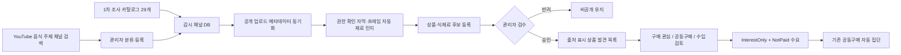

# YouTube 음식 상품 발견·공동구매 전산화

## 목표

음식 관련 YouTube 채널과 공개 영상에서 식품·식재료·생산자 후보를 발견하고, 운영자 검수 뒤 사용자가 `구매 관심`, `공동구매`, `수입 검토` 의향을 남길 수 있게 한다. 의향은 기존 공동구매 자동 집단화 흐름의 비결제 수요로만 등록된다. 이 단계에서 결제, 발주, 통관 또는 수입을 자동 실행하지 않는다.

## 조사 범위

2026-07-17 기준 공식 YouTube Data API로 채널 ID를 재확인한 29개 채널을 운영 시작용 카탈로그에 넣었다. 이는 “모든 음식 채널”을 완전 수집했다는 뜻이 아니다. 언어, 국가, 채널 생성·폐쇄가 계속 바뀌므로 정적 시작 목록과 관리자 검색을 결합해 확장한다.

### 국가별 수집 기준

채널은 ISO 3166-1 alpha-2 국가 코드로 분리한다. 운영의 첫 화면과 조회 우선순위는 `KR`(한국), `US`(미국)이며, 같은 구조로 다른 국가도 추가할 수 있다. 확인되지 않은 채널은 임의로 한국이나 미국에 넣지 않고 `ZZ`(미분류)로 보관한다.

여기서 국가 코드는 운영자가 콘텐츠와 상품을 어느 시장 묶음에서 수집·검토할지를 나타낸다. 제작자의 국적, 법인 소재지 또는 영상 속 상품의 원산지를 의미하지 않는다. 상품 원산지는 상품 후보의 `원산지국가코드`에 별도로 기록한다.

- 백그라운드 동기화는 `CountryCollectionCodes` 순서대로 국가별 채널을 독립 처리한다.
- 관리자 검색의 `regionCode=KR` 또는 `regionCode=US`는 검색 지역이면서 등록 시 적용할 수집 국가다.
- 채널 목록과 승인 상품 목록은 `countryCode`로 필터링한다.
- 국가 집계 API는 국가별 채널 수, 동기화 완료 수와 마지막 동기화 시각을 반환한다.

| 조사군 | 채널 | 주된 발견 영역 |
| --- | --- | --- |
| 국내 먹방·리뷰 | tzuyang쯔양, 맛상무, 입짧은햇님 | 간편식, 신제품, 외식 메뉴, 공동구매 반응 |
| 국내 조리·산업 | 백종원, 성시경, 육식맨, 정육왕 | 식재료, 소스, 육류, 조리도구, 공급자 |
| 한국 음식의 해외 확장 | Maangchi, Aaron and Claire, Doobydobap, Seonkyoung Longest, Future Neighbor, The Korean Vegan | 한국 식재료의 해외 수요와 대체재 |
| 길거리·생산 현장 | FoodieBoy, 야미보이 | 완제품, 장비, 대량 조리, 생산자 |
| 세계 음식 여행 | Mark Wiens, Best Ever Food Review Show, Strictly Dumpling, The Food Ranger | 현지 식품, 희소 식재료, 해외 공급 후보 |
| 국가별 상품·재료 | DancingBacons, Beryl Shereshewsky, emmymade, Chinese Cooking Demystified, Middle Eats, TabiEats | 편의점 식품, 간식, 향신료, 수입 완제품 |
| 식품 비교·산업 | Sorted Food, Insider Food, Eater | 식품·주방용품 비교, 생산과 가격 구조 |
| 교차문화 음식 | Korean Englishman | 한국·해외 식품의 교차 체험과 반응 |

채널의 성격을 확인하는 보조 자료로 [Maangchi 소개](https://www.maangchi.com/about), [Aaron and Claire 소개](https://aaronandclaire.com/about), [Beryl Shereshewsky 소개](https://www.beryl.nyc/index.php/about-2/), [emmymade 소개](https://www.emmymade.com/about/), [Sorted Food 쇼 소개](https://www.sortedfood.com/food-show), [Best Ever Food Review Show 수상 소개](https://winners.webbyawards.com/2025/video-film/series-channels/food-drink-series-channels/322943/best-ever-food-review-show)를 확인했다. 구독자 수처럼 수시로 변하는 값은 카탈로그에 고정하지 않는다.

카탈로그는 다음 분류를 조합한다.

| 코드 | 의미 |
| --- | --- |
| `ProductReview` | 포장상품·신제품·도구 비교 |
| `CookingIngredient` | 조리법과 식재료 |
| `FoodTravel` | 지역·국가별 음식 탐방 |
| `StreetFood` | 시장·길거리·대량 조리 현장 |
| `Mukbang` | 먹방과 메뉴 반응 |
| `MeatSeafood` | 육류·수산물과 정육·가공 |
| `GlobalCuisine` | 세계 음식과 교차문화 조리 |
| `FoodIndustry` | 생산자, 공급망, 외식·식품 산업 |

각 채널에는 구매 후보 발견 점수와 수입 후보 발견 점수를 0~100으로 별도 기록한다. 점수는 순위나 품질 평가가 아니라 운영 검토 우선순위다.

## 데이터와 검수 경계

`youtube_watched_channels`에는 음식 채널 여부, 핸들, 국가·언어, 분류, 두 발견 점수와 조사 근거를 저장한다. `youtube_channel_videos`의 제목, 설명, 썸네일 URL, 게시 시각은 YouTube API가 준 원본 메타데이터를 유지한다.

`youtube_video_product_candidates`에는 다음을 별도 보관한다.

- 상품키·상품명·브랜드·원산지와 HS 코드 후보
- 포장상품, 식재료, 요리, 생산자·공급자 중 후보 유형
- 영상 구간, 발견 근거, 추출 방식과 신뢰도
- 대기, 승인, 반려 검수 상태와 검수자·시각
- 협찬 표시 확인 상태, 검증된 공식 구매 URL
- 허용할 구매 관심·공동구매·수입 검토 유형

영상과 상품 후보를 분리했기 때문에 YouTube 제목이나 설명을 상품 사실로 곧바로 확정하지 않는다. 후보는 기본 `Pending`이며, 영상 자체도 `공개` 상태이고 상품 후보도 `Approved`인 경우에만 주문자 API에서 보인다.

## 자동 영상 식재료 인지

자료를 모으는 목적은 영상을 그대로 보관하는 데 그치지 않고, 구매·수입 검토로 이어질 수 있는 식재료를 시스템이 먼저 알아차리게 하는 데 있다. 자동 인지 결과는 사실 확정값이 아니라 `근거 + 영상 구간 + 신뢰도`를 가진 검수 후보다.

현재 구현은 다음 입력을 함께 분석한다.

- 이미 동기화한 영상 제목과 설명
- 콘텐츠 분석 권한을 확인한 제공 자막
- 콘텐츠 분석 권한을 확인한 JPEG, PNG 또는 WEBP 프레임과 선택적인 초 단위 영상 시각

관리자는 `POST /api/v1/admin/content/youtube-food/videos/{videoId}/ingredient-recognition`에 `multipart/form-data`로 다음 필드를 보낸다.

| 필드 | 필수 | 설명 |
| --- | --- | --- |
| `ContentAnalysisAuthorized` | 예 | 자막과 프레임을 분석할 권한이 있음을 확인하는 `true` 값 |
| `Transcript` | 조건부 | 권한이 확인된 자막. 프레임이 없으면 필수 |
| `Frames` | 조건부 | 분석할 대표 프레임. 자막이 없으면 1장 이상 필요 |
| `FrameTimestampsSeconds` | 아니오 | 프레임 순서에 맞춘 쉼표 구분 초 값. 예: `10,45,120` |

서버는 이미지 형식·크기·해상도를 검사한 뒤 JPEG로 다시 인코딩해 메타데이터를 제거한다. 기본 한도는 요청당 프레임 4장, 프레임당 4 MiB, 각 변 2,048픽셀, 자막 12,000자다. 프레임 원본이나 재인코딩 결과는 DB에 저장하지 않으며 AI 요청에도 `store=false`를 사용한다. AI는 이미지와 텍스트를 함께 받고 JSON Schema 구조화 출력으로 식재료명, 표준명, 근거 유형, 근거, 영상 시각과 신뢰도를 반환한다. 구현 형식은 [OpenAI 이미지·비전 입력 안내](https://developers.openai.com/api/docs/guides/images-vision)와 [Structured Outputs 안내](https://developers.openai.com/api/docs/guides/structured-outputs)를 따른다.

기본 신뢰도 기준 `0.55` 이상인 항목만 같은 영상의 표준 재료명 해시로 중복을 제거해 `Pending` 상품 후보로 등록한다. 자동 결과는 구매 URL, 브랜드, 원산지, HS 코드 또는 공급자를 임의로 확정하지 않고 운영자 검수 전에는 주문자 화면에 공개하지 않는다.

기능은 비용과 권리 확인을 위해 기본 비활성화한다. 로컬 또는 운영 비밀 설정에서 `YouTube:AutomaticIngredientRecognitionEnabled=true`와 `HIOPSAI:Enabled=true`를 함께 켜고 HIOPS AI API 키를 별도로 설정해야 한다. 한도는 `MaxIngredientRecognitionFrames`, `MaxIngredientRecognitionFrameBytes`, `MaxIngredientRecognitionTranscriptCharacters`, `MinimumIngredientRecognitionConfidence`로 조정한다.

2026-07-17 운영 결정으로 자막 취득 비용과 이용 조건이 별도로 승인될 때까지 이 기능을 활성화하거나 실영상에 실행하지 않는다.

## Apify 자막 기반 식재료·HS 코드 후보화

> 상태: `ApifyYouTubeTranscript` Adapter를 구현했지만 기본 비활성이다. 관리자 단건 자막 조회와 기존 재료 인지 입력 연결만 제공한다.

현재 Adapter는 [pintostudio/youtube-transcript-scraper Actor](https://apify.com/pintostudio/youtube-transcript-scraper)를 사용한다. Actor에 `videoUrl`과 `targetLanguage`를 보내고, 서버는 timestamp 세그먼트와 길이 제한된 전사를 반환한다. 모듈 경계와 설정은 [Apify YouTube 자막 Adapter](../Architecture/ApifyYouTubeTranscriptResearch.md)에 정리한다.

향후 처리 흐름은 다음 순서로 제한한다.

1. 운영자가 분석할 `VideoId`와 자막 언어를 선택하고 자막 취득·분석 가능 여부를 확인한다.
2. 서버가 `POST /api/v1/admin/content/youtube-food/videos/{videoId}/transcript`로 비밀 저장소의 Apify 토큰과 설정된 Actor ID를 사용해 단건 작업을 실행한다.
3. 서버가 영상 ID, 자막 언어, 타임스탬프 구간과 정규화된 전사를 반환한다.
4. LLM이 자막에 명시된 식품·식재료, 가공 상태, 포장·용도 표현을 근거 구간과 함께 구조화한다.
5. 내부 품목분류 자료를 조회해 `HS 코드 후보`, 후보 근거, 신뢰도와 추가 확인이 필요한 정보를 만든다.
6. 운영자 또는 관세 전문가가 상품의 성분함량표·제조공정·용도·포장 상태를 확인한 뒤 후보를 승인하거나 수정한다.

LLM이 반환할 최소 항목은 `재료표준명`, `자막근거구간`, `영상시각`, `가공·보존상태`, `HS코드후보`, `분류근거`, `누락정보`, `신뢰도`다. 같은 식재료라도 신선·냉동·건조·분말·조제품 여부와 성분·용도에 따라 분류가 달라질 수 있으므로, 영상 자막만으로 HS 코드를 확정하지 않는다. 관세청도 품목분류 사전심사에 물품설명서, 성분함량표와 제조공정도 등을 요구하므로 최종 코드는 [관세청 품목분류 사전심사](https://www.customs.go.kr/download/_down/SS02_01.pdf) 또는 통관 검토에서 확정한다.

도입한다면 다음 안전장치를 먼저 둔다.

- `Enabled=false` 기본값과 관리자 수동 실행만 허용하고 전체 채널 자동 수집은 별도 승인 전 금지
- Apify 비용과 LLM 비용을 분리 집계하고 월 한도·건당 한도·최대 영상 수 설정
- Apify 토큰과 LLM 키는 비밀 저장소에만 두고 로그·URL·DB에 기록하지 않음
- 원문 자막은 기본적으로 영구 저장하지 않고 필요한 최소 근거 구간과 출처·해시만 보관
- 실패 재시도 횟수, 타임아웃, Actor 버전 고정과 결과 스키마 검증 적용
- YouTube, 자막 권리자, Apify Actor의 이용 조건과 데이터 보관 정책을 도입 시점에 다시 확인

## 사용자 의향과 기존 엔진 연결

사용자 의향 등록은 `공동구매자동수요등록Command`로 변환하되 항상 다음 값으로 고정한다.

- `수요유형 = InterestOnly`
- `결제상태 = NotPaid`
- `예약결제금액 = null`
- 후보의 HS 코드·온도·물류 방식은 확정값이 아닌 검토 입력으로 전달
- 사용자별 멱등키는 `candidateId + SHA-256(userId)`로 만들고 원문 사용자 ID를 외부 응답과 출처키에 넣지 않음

같은 사용자가 같은 후보의 의향을 바꾸면 동일 출처키의 수요를 갱신한다. 한 사용자가 여러 의향을 선택해 집계 건수를 부풀리는 것을 막기 위한 정책이다. 공개 응답에는 자동집단 ID, 상태, 수요 건수와 총희망수량만 포함하고 다른 참여자의 명단·주소·결제 정보는 포함하지 않는다.

## API

| 권한 | Method | Path | 용도 |
| --- | --- | --- | --- |
| 서버 관리자 | `GET` | `/api/v1/admin/content/youtube/channels?countryCode=KR` | 한국 등 지정 국가의 감시 채널 목록 |
| 서버 관리자 | `GET` | `/api/v1/admin/content/youtube/channels/search?query=food&regionCode=US` | 미국 등 지정 지역의 음식 주제 채널 검색 |
| 서버 관리자 | `POST` | `/api/v1/admin/content/youtube/sync?countryCode=KR` | 지정 국가 채널만 수동 동기화 |
| 서버 관리자 | `PUT` | `/api/v1/admin/content/youtube/channels/{channelId}/food-profile` | 채널 분류·점수·조사 근거 설정 |
| 서버 관리자 | `GET` | `/api/v1/admin/content/youtube-food/product-candidates` | 상품 후보 검수 목록 |
| 서버 관리자 | `POST` | `/api/v1/admin/content/youtube-food/product-candidates` | 영상에 상품 후보 등록 |
| 서버 관리자 | `POST` | `/api/v1/admin/content/youtube-food/videos/{videoId}/ingredient-recognition` | 권한 확인 자막·프레임에서 식재료를 자동 인지해 검수 대기 후보 등록 |
| 서버 관리자 | `PUT` | `/api/v1/admin/content/youtube-food/product-candidates/{candidateId}/review` | 후보 승인·반려와 협찬·구매 URL 검수 |
| 인증 주문자 | `GET` | `/api/v1/orderer/youtube-food-discovery/countries` | 한국·미국 등 국가별 음식 채널 집계 |
| 인증 주문자 | `GET` | `/api/v1/orderer/youtube-food-discovery/channels?countryCode=US` | 지정 국가의 음식 채널 목록 |
| 인증 주문자 | `GET` | `/api/v1/orderer/youtube-food-discovery/products?countryCode=US` | 지정 국가 채널에서 발견한 승인 상품 후보 목록 |
| 인증 주문자 | `POST` | `/api/v1/orderer/youtube-food-discovery/products/{candidateId}/intents` | 구매·공동구매·수입검토 의향 등록 |

주문자 API는 기존 `GroupPurchaseImportWorkflow` 기능 플래그를 사용한다.

## YouTube 정책과 운영 주의

채널 탐색은 `search.list`에 `type=channel`과 음식 주제 ID `/m/02wbm`를 적용한다. 검색은 운영자가 필요할 때만 수행하고 영상 동기화는 기존 업로드 재생목록을 사용한다. 현재 공식 문서상 `search.list`는 별도 일일 호출 한도가 있으므로 무제한 크롤러로 사용하지 않는다. 자세한 매개변수와 비용은 [Search: list](https://developers.google.com/youtube/v3/docs/search/list)와 [쿼터 계산 안내](https://developers.google.com/youtube/v3/determine_quota_cost)를 따른다.

YouTube 메타데이터에는 공식 시청 URL과 채널 출처를 함께 표시하고, 제목·썸네일을 상품 광고처럼 변조하지 않는다. 화면은 YouTube를 대체하는 영상 서비스가 아니라 상품 발견 색인으로 한정한다. 수집과 표시 기준은 [YouTube API 개발자 정책](https://developers.google.com/youtube/terms/developer-policies) 및 [정책 준수 가이드](https://developers.google.com/youtube/terms/developer-policies-guide)를 따른다. 웹 페이지 무단 스크래핑이나 영상 파일 복제는 이 설계에 포함하지 않는다.

따라서 현재 수집된 공개 영상의 영상·음성 파일을 서버가 임의로 다운로드해 일괄 분석하지 않는다. 자막도 일반 공개 영상에서 자유롭게 내려받는 방식이 아니라, 소유·협력 채널 등 OAuth 사용자가 해당 영상을 편집할 권한을 가진 경우의 공식 [Captions: download](https://developers.google.com/youtube/v3/docs/captions/download) 또는 권리자가 직접 제공한 자료만 자동 인지 입력으로 사용한다. 소유·협력 채널용 자막·대표 프레임 공급 어댑터가 연결되면 동일한 인지 엔진을 배치 작업으로 호출할 수 있다.

식품의 실제 수입 가능 여부, 표시사항, 검역, HS 품목분류, 원산지와 공급자 적격성은 사용자 관심이 모인 뒤 별도의 통관·식품안전 검토에서 확정한다.
