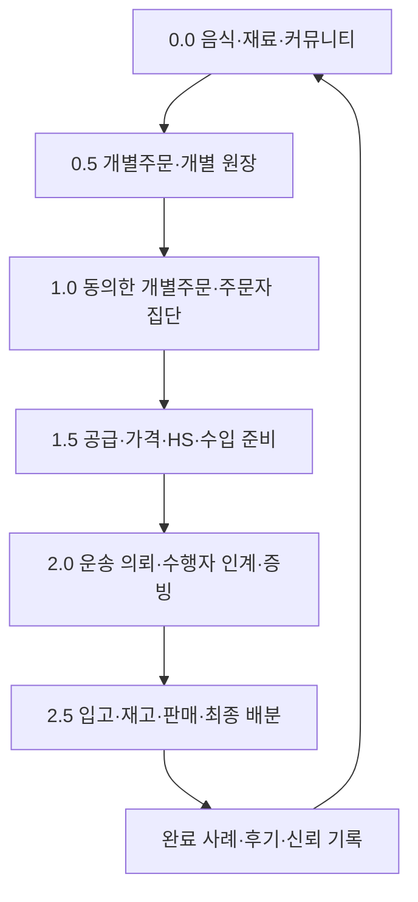
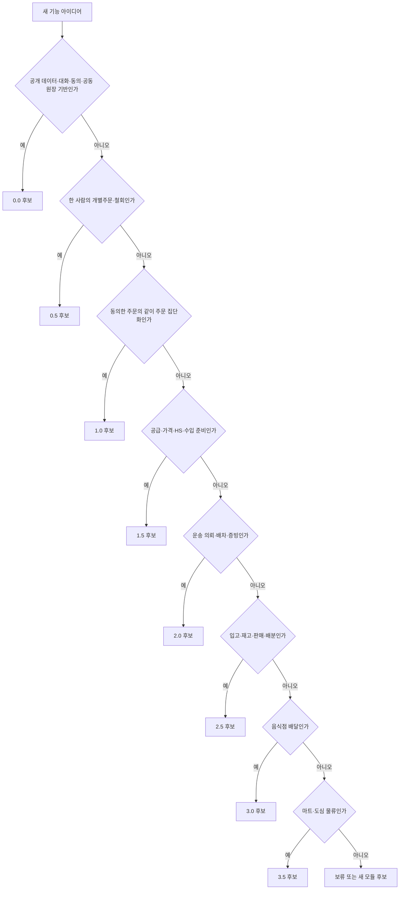

# 버전 릴리즈 계획 및 구성 관리

이 문서는 `0.0`부터 `3.5`까지의 제품 방향과 단계적 공개 계획을 함께 설명하는 **버전 기준 문서**입니다. 여기서 버전은 기능을 만들지 말지를 정하는 단계가 아니라, 완성된 기능을 어떤 선행조건과 릴리즈 게이트를 거쳐 사용자에게 개방할지를 나타내는 릴리즈 구간입니다.

Ssalddel은 소스 프로젝트를 버전별로 복제하지 않습니다. 실행 코드는 앱·도메인 경계로 유지하고, 제품 버전은 문서, 메타데이터, 기능 플래그, 마이그레이션과 릴리즈 게이트로 관리합니다.

## 현재 결정

`0.0`부터 `1.5`까지의 제품군 이름은 **문화교통**입니다. 현재 기본 공개 기준은 **`문화교통 0.0 커뮤니티·공공데이터 기반`**, 전체 제품 목표는 **`살뜰 3.5 마트·도심 물류`**입니다.

개발은 3.5 전체 기능을 만든다는 전제에서 페이지·업무 node 단위로 계속 진행합니다. 다만 구현 완료, 내부 검증, 사용자 공개와 실제 외부 효과 허용은 서로 다른 상태입니다. 준비된 기능은 앞뒤 버전의 전체 구현이 끝날 때까지 묶어 두지 않고, 자신의 선행조건과 릴리즈 게이트를 통과하는 순서대로 단계적으로 개방합니다.

```text
문화교통 0.0 커뮤니티·공공데이터 기반 ← 현재 기본 공개
  → 문화교통 0.5 개별주문·개별 원장
  → 문화교통 1.0 같이 주문·주문자 집단화
  → 문화교통 1.5 공급·가격·무역 준비
  → 2.0 국내 화물·운송 이행
  → 2.5 창고·판매 이행
  → 3.0 음식점 배달
  → 3.5 마트·도심 물류 ← 전체 제품 목표
```

이 순서는 개발을 직렬로 제한하는 순서가 아니라 사용자 여정의 인계와 공개 의존성을 나타냅니다. 예를 들어 3.0 음식점 화면을 구현·검증할 수는 있지만, 실제 주문·배달 외부 효과는 필요한 주문·운송·권한·운영 게이트를 통과한 뒤에만 개방합니다.

## 구현과 공개 단계

```text
페이지·업무 node 구현
  → 내부 검증
  → Simulation 체험
  → 제한 공개
  → 역할·지역별 운영 공개
  → 기본 공개
```

- 기능은 `0.0`부터 `3.5`까지 페이지 하나, 원장 하나, 상태 전이 하나씩 세로로 완성합니다.
- 공개 단위는 버전 전체만이 아니라 독립적인 page capability와 workflow가 될 수 있습니다.
- 조회·설명 기능은 외부 효과 기능보다 먼저 개방할 수 있습니다.
- 결제, 계약, 신고, 유상 주선, 자동 배차, 실제 보관과 정산은 별도 운영 요건을 충족해야 합니다.
- 공개 뒤에도 기능 플래그로 중단·축소·재개할 수 있어야 합니다.

## 핵심 사용자 여정



국내 같이 주문은 통관이 필요하지 않으면 `1.5`의 수입 검토 일부를 생략할 수 있습니다. 그러나 공급자, 가격, 수량과 책임 주체의 근거 없이 운송을 자동 생성하지 않습니다.

## 버전별 목표

| 버전 | 공개 계획 | 제품 이름 | 관리 폴더 | 핵심 목표 | 다음 단계로 넘기는 결과 |
| --- | --- | --- | --- | --- | --- |
| `0.0` | **현재 기본 공개 기준** | 문화교통 | [v0.0](./v0.0/README.md) | 커뮤니티, 공공 음식·재료 데이터, 참여 동의와 공동 원장 | 출처가 있는 탐색 자료와 책임 있는 참여 기록 |
| `0.5` | 준비된 capability부터 순차 공개 | 문화교통 | [v0.5](./v0.5/README.md) | 철회 가능한 개별주문 의향과 본인 소유 개별 원장 | 같이 주문 참여 여부가 분리된 개별주문 원장 |
| `1.0` | 준비된 capability부터 순차 공개 | 문화교통 | [v1.0](./v1.0/README.md) | 같이 주문 제안, 동의한 개별주문 집단화, 모집·협의 | 품목·지역·수령 조건별 주문자 집단과 같이 주문 원장 |
| `1.5` | 준비된 capability부터 순차 공개 | 문화교통 | [v1.5](./v1.5/README.md) | 공급자·기업 근거, 견적, 원가, HS·HTS와 수입 준비 | 거래·수입·운송 검토에 사용할 준비 원장 |
| `2.0` | 운영 요건을 갖춘 capability부터 공개 | 살뜰 | [v2.0](./v2.0/README.md) | 운송 의뢰, 허가된 수행자 인계, 배차, 증빙과 정산 준비 | 완료 증빙이 있는 운송 원장 |
| `2.5` | 운영 요건을 갖춘 capability부터 공개 | 살뜰 | [v2.5](./v2.5/README.md) | 입고, 재고, 피킹, 포장, 판매채널과 최종 배분 | 구매자에게 인도 가능한 이행 원장 |
| `3.0` | 준비된 음식점·배달 capability부터 공개 | 살뜰 | [v3.0](./v3.0/README.md) | 음식점 일반 음식 배달 | 조리·픽업·배송 완료 원장 |
| `3.5` | **전체 제품 통합 공개 목표** | 살뜰 | [v3.5](./v3.5/README.md) | 마트와 도심 즉시배송 | 재고·피킹·포장·배송 완료 원장 |

## 기능을 어느 버전에 둘지 판단하는 순서



### 1.0 참여자 개요

| 참여자 | 핵심 정보 | 주요 책임 |
| --- | --- | --- |
| 주문자 | 음식·재료, 희망 수량, 지역·수령 조건, 참여·철회 상태 | 개별주문 뒤 같이 주문 참여를 별도로 선택 |
| 같이 주문 대표 | 목표 수량, 모집 기간, 공급 조건, 이견과 합의 | 모집과 협의 내용을 같이 주문 원장에 기록 |
| 생산자·공급자 | 공급 가능 물량, 포장, 일정과 가격 근거 | 공급 근거와 비구속 제안 제공 |
| 플랫폼 운영자 | 집단화 규칙, 중복 방지, 공개 집계와 개인정보 경계 | 자동 확정 없이 후보와 운영 검토 제공 |

## 경계 원칙

- `0.5`는 개인의 주문 의향과 원장을 관리하지만 결제, 매매 계약과 배송을 확정하지 않습니다.
- `1.0`은 같이 주문 참여에 동의한 개별주문만 모으며 결제, 매매 계약, 수입 신고와 자동 배차를 확정하지 않습니다.
- `1.5`는 HS·HTS 후보와 준비 자료를 제공하지만 전문 품목분류, 수입 적격성 또는 신고 판단을 대신하지 않습니다.
- `2.0`은 허가·제휴·보험·약관 준비가 확인되기 전 유상 주선 또는 자동 배차를 운영하지 않습니다.
- `2.5`는 계약된 창고·판매자·수행 주체의 책임 범위를 서버 원장에 명시합니다.
- 국적, 언어, 인종, 성별 같은 속성은 주문자 집단화의 자격·순위·가격 차별 기준으로 사용하지 않습니다.
- 커뮤니티는 `0.0`에서 독립적으로 시작해 이후 버전의 대화, 동의, 원장, 신고, 후기와 관계 기록을 지지합니다.
- 제품 버전과 성장·운영 지표는 분리하고 실제 외부 효과는 기능 플래그와 `SsalddelExecution:Mode`로 통제합니다.

## 형상 관리 원칙

| 원칙 | 설명 |
| --- | --- |
| 소스는 역할별 유지 | `DriverApp`, `SsalddelApp`, `WarehouseManagerApp`, `Ssalddel.Domain`을 버전 때문에 복제하지 않습니다. |
| 버전은 릴리즈 구간 | 각 버전 폴더에 목표, 범위, 체크리스트, 마이그레이션과 공개 게이트를 기록합니다. |
| 외부 효과는 별도 승인 | 제품 버전, 기능 플래그와 `SsalddelExecution:Mode`를 모두 통과해야 외부 효과를 검토합니다. |
| 전체 기능은 지속 구현 | 3.5 전체 범위의 기능을 페이지·원장 단위로 구현하되 공개와 외부 효과는 별도로 승격합니다. |
| 단일 코드 기준 | 코드의 버전 순서는 `SsalddelProductRoadmapCatalog`를 기준으로 합니다. |
| 현재 공개와 목표 분리 | `CurrentDeliveryVersion`은 현재 기본 공개 기준, `DeploymentTargetVersion`은 전체 제품 목표를 나타냅니다. |

페이지 하나가 전체 로드맵 안에서 입력·결과·후속 인계를 유지하는 기준은 [전체 로드맵 조화형 페이지 원칙](../Architecture/WholeRoadmapPagePrinciple.md)을 따릅니다.

## 운영 문서

- [2026-07-23 배포 준비도 평가](./deployment-readiness-assessment-2026-07-23.md)
- [통합 구축 로드맵](./integrated-build-roadmap.md)
- [문서 생명주기 통합과 앱별 배치 제안](./document-lifecycle-app-placement-proposal.md)
- [릴리즈 게이트](./release-gates.md)
- [기능 플래그 정책](./feature-flags.md)
- [주문자 집단 공동구매·커머스 흐름](../ProjectOverview/orderer-group-commerce-flows.md)
