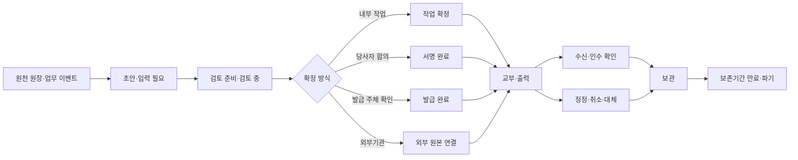
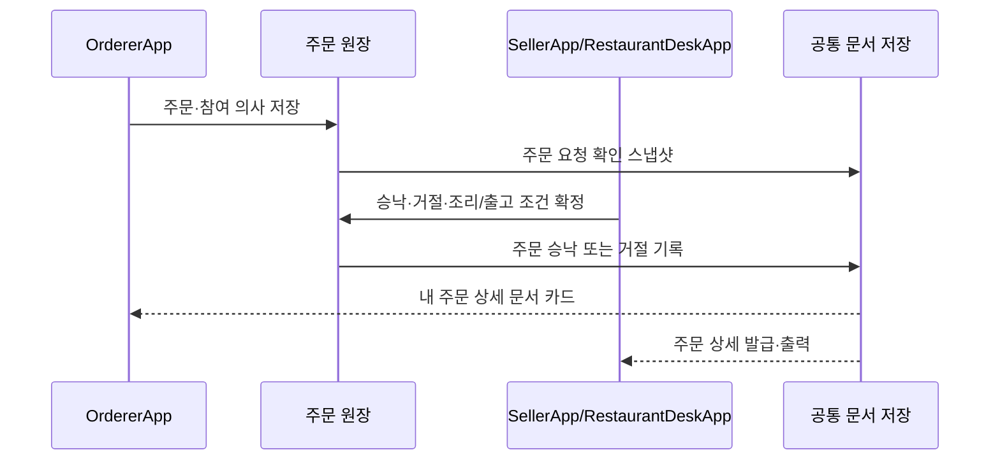
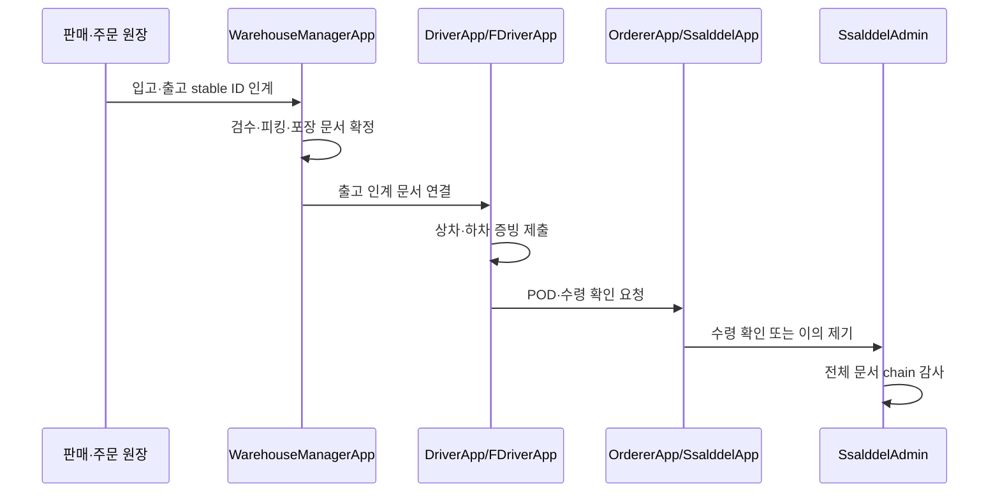

# 문서 생명주기 통합과 앱별 배치 제안

상태: P0 완료·P1 주문 확인·피킹·포장·출고·수령 확인 관계 추적 구현, 역할 앱별 문서함·외부 발급 연계는 후속

범위: 공통 문서 생명주기, 앱별 문서 진입점·출력 책임, 단계별 수렴 순서

1차 구현 범위: 공통 분류·상태 전이, 원천 원장 스냅샷 메타데이터, SHA-256 무결성, 대체 관계, 관리자 관제, 원장 관행 문서와 창고→운송 증빙 연결

이 문서는 현재 분리되어 있는 원장 관행 문서 초안, 공통 출력 문서, 서버 문서관리 정책과 전자서명 증적을 하나의 문서 생명주기로 수렴시키고, 역할별 앱에서 문서를 어디에 배치할지 제안한다.

업무 상태와 앱 간 인계는 [워크플로우 앱 화면 지도](../ProjectOverview/workflow-app-screen-map.md), 구현 우선순위는 [플랫폼 앱 완성도 수렴 계획](platform-app-completion-plan.md), 모바일 관리 책임은 [모바일 관리자 앱 제안](mobile-admin-app-proposal.md)을 따른다. 문서 때문에 별도의 업무 상태 머신을 만들지 않고 기존 원장 상태와 stable ID를 참조한다.

## 구현 현황 (2026-07-28)

이번 1차 구현은 기존 모듈을 교체하지 않고 다음 세로 흐름을 연결했다.

- 공통 계약에 7개 문서 분류와 `Draft`부터 `Disposed`까지의 허용 상태 전이를 정의했다.
- 서버 문서관리 모듈이 원천 원장 ID·종류·Revision, 원천 문서 종류, 템플릿 버전, 생성 모드, 발급 주체, 구조화 스냅샷과 관련 stable ID를 보관한다.
- 생성 시 원문 SHA-256을 기록하고 다운로드 시 다시 검증한다. 같은 원천 Revision·문서 종류·템플릿·내용의 재처리는 기존 스냅샷을 반환한다.
- 확인·서명·발행 이후에는 수정 가능 상태가 아니며, 정정은 관리자 API에서 대체 문서 관계로 연결한다.
- 원장 관행 문서 보관은 실제 커뮤니티 원장 Revision과 초안 준비 상태를 전달한다.
- 주문 결제 완료 시 `주문확인서`, 창고 피킹·포장 완료 시 `피킹완료표`와
  `포장완료표`를 각 업무 이벤트에서 자동 생성한다. 작업 재처리는 같은
  문서 스냅샷을 재사용한다.
- 주문자가 입고를 확인하면 `수령확인서`를 주문 참조와 입고 요청 stable
  ID에 연결한다.
- 창고 출고 인계 준비 시 `출고예정목록`, 기사 인계 완료 시 `출고인계확인서`, 기사 상차·인수 완료 시 기존 상차 확인서·인수증이 같은 문서관리 모듈에 축적된다.
- 관리자 문서 화면은 분류, 원천 원장 Revision, 생명주기, 내용 해시와 접근 정책을 함께 보여 주고 허용된 상태 전이를 수행한다.
- `OrderReference`, `WarehouseInboundRequest`, `WarehouseInventory`, `WarehouseOutboundPlan`, `TransportRequest`, `TransportExecution`처럼 원장 종류가 포함된 stable ID를 보존한다. 관리자 관계 API와 모바일 화면은 하나의 stable ID에서 연결 문서를 탐색해 주문→입고→출고→운송 순으로 복구한다.
- 문서 정책·메타데이터·감사 로그와 자동 생성 Outbox를
  `App_Data/documents/metadata.json`에 원자 교체 방식으로 보존한다. 서버
  재시작 후 대기 작업을 복구하며, 자동 생성 실패는 최대 5회까지 30초
  간격으로 다시 처리한다.
- 주문·피킹·포장·출고 인계·기사 상차·인수·주문자 수령의 자동 문서
  handler는 파일을 직접 생성하지 않고 같은 문서 생성 Outbox를 사용한다.
  내용 SHA-256을 중복 방지 key에 포함하고, 생성 완료 뒤 payload를
  정리한다.

아직 역할 앱별 통합 문서함, 운송장·수령 확인까지 포함한 다중 앱 E2E,
창고 원장의 명시적 Revision 컬럼, 서명 증적의 공통 문서 관계, 외부기관
발급 원본 등록·진위 확인, 다중 서버용 영속 DB·Object Storage 기반 문서
저장 전환은 후속 범위다. 현재 메타데이터 저장은 단일 서버의 로컬 영속
경계이며 공유 스토리지나 다중 writer를 전제로 하지 않는다.

`주문확인서`는 기존 물류 예정 생성과 동일한 `주문결제완료됨Event` 소비
경계를 재사용한다. 현재 저장소 안에는 해당 이벤트의 주문 결제 producer가
확인되지 않았으므로, 배포 전 실제 결제 Outbox 또는 내부 publisher가 이
contract를 발행하는지 닫아야 한다.

## 1. 현재 기준선

현재 문서 자산은 이미 있으나 서로 다른 책임으로 나뉘어 있다.

| 현재 자산 | 확인된 책임 | 통합 시 위치 |
| --- | --- | --- |
| [`원장관행문서카탈로그`](../../Ssalddel.Contracts/Common/Documents/ConventionalLedgerDocumentCatalog.cs) | 같이 주문·같이 수입의 RFQ, 구매주문서, 상업송장, 포장명세서 등 검토 초안 12종 | 문서 종류·발급 주체·공식 원본 대체 가능 여부를 정의하는 카탈로그 |
| [`원장관행문서초안UseCase`](../../Ssalddel/Services/Community/원장관행문서초안UseCase.cs) | 원장 Revision을 읽어 HTML·텍스트 검토 초안 생성 | 도메인 원장을 고정 문서 스냅샷으로 변환하는 생성기 |
| [`문서관리Service`](../../Ssalddel/Services/Documents/문서관리Service.cs) | 문서 정책, 보관, 암호화, 다운로드, 감사 로그 | 공통 문서 저장·접근·보관 정책 |
| [`ISsalddelDocumentOutputService`](../../Ssalddel.Ui.Common/Areas/App/Services/ISsalddelDocumentOutputService.cs) | 운송장, 입고 예정표, 출고 예정표의 화면·인쇄 출력 | 고정 문서 스냅샷을 매체별로 표현하는 출력 adapter |
| [`ContractElectronicSignature`](../../Ssalddel.Contracts/Common/ContractManagement/ContractElectronicSignature.cs) | 문서 해시, 동의문·서명 증적 해시와 서명 상태 판정 | 계약·결의 문서의 서명 증적 |
| 음식점 주문전표 factory | 음식 주문을 80mm 전표와 바코드로 표현 | 음식점 현장 출력 profile |

현재 문제는 문서 종류가 부족한 것보다 다음 연결이 약한 것이다.

1. 같은 업무 문서를 앱마다 다시 만들 가능성이 있다.
2. 초안, 서명 대상, 외부기관 발급 원본과 단순 출력물이 한 목록에서 혼동될 수 있다.
3. 문서가 어느 원장 Revision에서 만들어졌는지, 이후 원장이 바뀌었는지 공통으로 비교하기 어렵다.
4. 문서 생성·서명·교부·수신·대체·보관 상태가 하나의 이력으로 이어지지 않는다.
5. 현장 앱은 빠른 출력이 필요하고 관리 앱은 감사·보관이 필요한데 같은 화면 책임으로 취급될 수 있다.

## 2. 결정 원칙

### 2.1 하나의 문서, 하나의 발급 책임

같은 문서를 여러 앱이 독립적으로 생성하지 않는다.

| 문서 | 생성·발급 책임 | 다른 앱의 책임 |
| --- | --- | --- |
| 주문 요청·참여 확인 | 주문자 원장 UseCase | 판매자·운영자는 조회·검토 |
| 주문 승낙·거래명세 | 판매자 또는 음식점의 주문 처리 UseCase | 주문자는 수신·보관·정정 요청 |
| 창고 입고·검수·출고 증빙 | 창고 작업 UseCase | 화주·판매자·운영자는 조회 |
| 운송장·상하차·POD | 운송 실행 UseCase와 실제 수행 기사·수령 확인자 | 화주·주문자·운영자는 조회 |
| 물류대행계약·같이 수입 계약 | 계약 당사자들이 공유하는 계약 UseCase | 관리자는 상태와 증적을 감사하되 대신 서명하지 않음 |
| 세금계산서·현금영수증 | 국세청 또는 등록 발급 시스템 | 플랫폼은 발급 요청자료와 외부 발급번호를 연결 |
| B/L·AWB·공식 원산지증명 | 운송인·항공사·권한기관 | 플랫폼은 준비자료·사본·검증 상태를 연결 |

관리자는 오류를 보정하거나 외부 발급 사실을 기록할 수 있지만, 업무 당사자 대신 주문을 승낙하거나 계약·인수 문서를 임의로 확정하지 않는다.

### 2.2 원장 상태와 문서 상태를 분리하되 연결

- 원장은 현재 업무 상태를 계속 변경한다.
- 문서는 특정 원장 Revision과 당시 외부 참조를 고정한 불변 스냅샷이다.
- 확정·서명·발급된 문서는 덮어쓰지 않는다.
- 정정이 필요하면 새 버전을 만들고 `대체한 문서Id`와 `대체된 문서Id`를 연결한다.
- 문서 상태 변경이 원장 상태를 자동 확정하지 않는다. 도메인 UseCase가 권한과 업무 조건을 확인한 뒤 필요한 원장 상태를 변경한다.

### 2.3 업무 화면과 문서함을 함께 제공

문서 진입점은 세 층으로 배치한다.

1. **원장·작업 상세의 문서 카드**

   사용자가 지금 하는 업무에 필요한 문서를 생성·서명·출력한다.
2. **역할 앱의 내 문서함**

   여러 원장에 흩어진 내 문서를 상태·기간·문서 종류로 다시 찾는다.
3. **관리자 문서 관제**

   정책, 접근 감사, 실패 재처리, 만료, 보관·파기와 외부 발급 연결을 관리한다.

현장 업무에서 문서를 출력하기 위해 먼저 전체 문서함으로 이동하게 만들지 않는다. 전체 문서함은 재조회와 보관을 위한 두 번째 진입점이다.

## 3. 공통 문서 분류

| 분류 | 예시 | 확정 의미 | 기본 생명주기 |
| --- | --- | --- | --- |
| `OperationalWorksheet` 내부 작업표 | 주방전표, 피킹리스트, 적치지시서 | 작업 당시 지시·체크 상태 | 준비 → 작업확정 → 완료 → 보관 |
| `PartyAgreement` 당사자 계약 | 근로계약, 물류대행계약, 같이 수입 계약 | 당사자 합의와 서명 증적 | 초안 → 검토 → 서명대기 → 서명완료 → 활성/종료 → 보관 |
| `TransactionStatement` 거래 문서 | 견적서, 주문승낙서, 거래명세서, 상업송장 | 거래 조건·금액·품목의 당시 표시 | 초안 → 검토 → 발급 → 교부 → 대체/취소 → 보관 |
| `PerformanceEvidence` 이행 증빙 | 입고확인, 검수보고, 상차인수, POD | 실제 작업·인계·수령의 증거 | 자동초안 → 수행자확인 → 상대확인 → 교부 → 보관 |
| `FilingPreparation` 공식 제출 준비 | 4대보험, 통관, 수입식품 등록 준비자료 | 공식 제출 전 데이터 점검 | 입력필요 → 검토준비 → 전문가검토 → 내보냄 → 제출결과 연결 |
| `ExternalIssuedReference` 외부 발급 참조 | 세금계산서, B/L, AWB, 원산지증명, 신고필증 | 외부 발급기관 원본의 참조·사본 | 등록 → 진위·만료 검토 → 유효 → 대체/만료 → 보관 |
| `GovernanceRecord` 결정·감사 기록 | 투표 결의문, 역할 배정 통지, 정정·취소 이력 | 누가 무엇을 결정했는지의 증거 | 초안 → 검토 → 서명/확정 → 공개범위 결정 → 보관 |

문서명만 보고 효력을 추정하지 않도록 모든 문서에 분류, 발급 주체, 외부 원본 대체 가능 여부와 실행 경계 안내를 표시한다.

## 4. 공통 생명주기

모든 문서가 모든 상태를 거칠 필요는 없지만, 상태 의미는 앱마다 같아야 한다.



### 문서 인스턴스가 공통으로 보존할 값

- 문서 ID, 문서 종류·분류·template version
- 원천 원장 ID·종류·Revision과 관련 주문·운송·입출고 stable ID
- 생성 주체, 발급 주체, 당사자와 문서별 역할
- 생성 모드, 법적·운영 경계, 외부 원본 대체 가능 여부
- 고정된 구조화 payload와 표시용 스냅샷
- 문서 hash, 서명 요청·증적, 검토자와 검토 시각
- 교부 대상, 송신·수신·다운로드·출력 이력
- 출력 profile과 생성된 파일 참조
- 외부 발급번호·기관·발급일·만료일·검증 상태
- 접근 정책, 암호화·마스킹, 보존·파기 정책
- 선행 문서, 후속 문서, 정정·대체 관계

확정 전 미리보기는 최신 원장을 다시 읽을 수 있다. 확정 뒤 출력기는 live DTO를 다시 조합하지 않고 고정 문서 스냅샷만 렌더링한다.

## 5. 공통 화면 구조

### 5.1 원장 상세의 문서 카드

각 원장·작업 상세 하단에 다음 순서의 공통 카드를 둔다.

```text
필요 문서
→ 아직 입력할 항목
→ 검토·서명·외부 발급 상태
→ 최근 발급본과 대체 여부
→ 미리보기 / 서명 / 확인 / 출력 / 다운로드
```

- 현재 단계에서 필요한 문서만 위에 표시한다.
- 다음 단계 문서는 잠금 사유를 설명한다.
- 외부기관 발급 문서는 `준비자료 만들기`와 `외부 발급본 등록`을 분리한다.
- 사용자가 수정 권한이 없으면 `정정 요청`만 제공한다.

### 5.2 역할 앱의 내 문서함

공통 필터:

- 해야 할 일: 입력 필요, 검토 요청, 서명 요청, 수신 확인
- 업무: 주문, 판매, 계약, 창고, 운송, 인사, 통관
- 상태: 초안, 확정, 발급, 외부 원본, 대체, 만료
- 기간·상대방·원장번호·문서번호

모바일 기본 화면은 `해야 할 일 → 최근 문서 → 업무별 문서` 순서로 구성한다. 대량 다운로드와 정책 편집은 모바일 문서함에 두지 않는다.

### 5.3 현장 출력 대기함

음식점·창고처럼 연속 출력이 필요한 앱은 내 문서함과 별도로 짧은 출력 대기함을 둔다.

- 새 주문전표, 피킹리스트, 포장표, 출고인계표를 시간순으로 표시한다.
- 인쇄 성공, 재출력, 취소, printer 미연결을 구분한다.
- 재출력은 같은 문서 ID와 출력 횟수를 남기며 새 업무 문서를 만들지 않는다.
- 화면 표시 데이터와 출력 데이터가 같은 스냅샷을 사용한다.

## 6. 앱별 문서 배치

아래 route는 목표 배치 후보다. 구현 전에 현재 route와 공통 3단계 내비게이션을 다시 대조하고, 화면을 추가하지 않고 기존 상세의 탭·카드로 해결할 수 있으면 기존 화면을 우선한다.

| 앱 | 원장·작업 상세에 둘 문서 | 역할 문서함·출력 배치 | 주 행동 |
| --- | --- | --- | --- |
| `OrdererApp` | 음식·마트 주문확인, 취소·환불, 개별주문·참여·철회 확인, 같이 주문 집계·결의·계약, 같이 수입 비용·선적·통관 준비자료 | `/orders/{OrderLedgerId}`에 `문서` 탭, 목표 `/documents` | 내용 확인, 서명, 정정 요청, 다운로드, 수령 확인 |
| `SellerApp` | 견적, 주문승낙, 거래명세, 출고지시, 상업송장·포장명세, 해외 식품시설 등록 준비자료 | 판매 주문 상세에 `문서`, 목표 `/seller/documents` | 발급 초안 검토, 주문 승낙, 수출 문서 확정, 외부 발급본 연결 |
| `SsalddelApp` | 운송의뢰·운임견적, 운송장·POD, 물류대행계약·요율표·월 비용명세, 판매·창고 인계 문서 | 의뢰·물류계약·판매주문 상세에 `문서`, 목표 `/shipper/documents` | 의뢰 문서 확인, 계약 서명, POD 조회, 정산 증빙 연결 |
| `RestaurantDeskApp` | 주문접수표, 주방전표, 조리시간 변경기록, 픽업 준비표, 기사 인계표, 음식점 정산 자료 | `/orders/{OrderNo}`에 전표·문서, 홈에 `출력 대기`, 목표 `/documents` | 80mm 즉시 출력, 재출력, 기사 인계 확인, 오류 정정 요청 |
| `FDriverApp` | 음식 배달 제안 요약, 픽업 체크, 전달 증빙, 사고·예외 기록 | 현재 집중 업무 화면의 bottom sheet, 완료 업무의 문서 링크 | 화면 우선 확인, 픽업·전달 증빙 제출, 필요할 때만 PDF/공유 |
| `DriverApp` | 배차확정, 운송장, 상차인수, 하차·POD, 사고보고, 기사 정산·지급명세 | 운송 상세의 `증빙·문서`, 목표 `/driver/documents` | 서명·사진 제출, 인수증 확인, 정산서 조회·다운로드 |
| `WarehouseManagerApp` | 입고예정, 입고확인, 검수·불량, 적치, 재고조정, 피킹, 포장, 출고지시·인계, 작업·비용명세 | 각 workbench의 `작업 문서`, 홈에 `출력 대기`, 목표 `/warehouse/documents` | A4/A5 작업표·라벨 출력, 스캔 확인, 인계 서명, 재출력 |
| `HumanResourcesManagerApp` | 역할지원 접수, 배정·해제 통지, 근로계약, 급여예정·임금명세, 4대보험 검토·제출 준비 | 홈의 `계약·신고 문서`, 목표 `/hr/documents` | 민감 문서 검토, 서명 요청, 제출 준비, 접근 이력 확인 |
| `SsalddelAdminApp` | 원장별 문서 요약, 서명·외부 발급·출력 실패와 만료 경보 | 목표 `/documents`, `/documents/action-required` | 이동 중 단건 확인, 보류·재시도 요청, 담당자 배정 |
| `SsalddelAdmin` | 모든 문서의 정책·감사·보관·재처리·외부 발급 연결 | 기존 `/documents`, `/documents/policies`, `/documents/logs` 유지 | 정책 편집, 접근 감사, 실패 재처리, 만료·보존·파기, 대량 내보내기 |
| `Ssalddel.WebApp` | 관세사·전문가의 HS 검토보고, 통관·수입식품 준비자료, 외부 증명서 검토 | 원장 전문 검토 화면의 `문서`, 필요 시 `/professional/documents` | 전문가 의견, 검토 완료, 공식 제출자료 내보내기, 외부 결과 연결 |

`SsalddelRestaurantDesktop` 같은 과거·보조 표면에 별도 문서 생명주기를 만들지 않는다. 운영 표면으로 유지해야 한다면 `RestaurantDeskApp`과 같은 contract·문서 ID를 읽는 adapter만 둔다.

## 7. 업무별 교차 앱 배치

### 7.1 주문 → 판매자·음식점 → 주문자



주문자 앱이 판매자 명의 주문승낙서나 영수증을 자체 생성하지 않는다. 판매자·음식점이 확정한 문서를 같은 문서 ID로 주문자가 조회한다.

### 7.2 판매·주문 → 창고 → 기사 → 수령자



한 화면의 PDF를 다음 앱에 다시 업로드하는 방식보다 `주문번호 → 입출고 ID → 운송 ID → 문서 ID` 관계를 공유한다. 외부에서 받은 종이·PDF만 첨부 문서로 등록한다.

### 7.3 같이 수입 → 전문가·외부기관

- 주문자와 대표는 같이 수입 원장에서 비용·계약·선적 준비 상태를 본다.
- 판매자·수출자는 상업송장과 포장명세서 초안을 확정한다.
- 화주·관세사는 HS·통관·수입식품 준비자료를 검토한다.
- B/L, AWB, 원산지증명, 신고필증은 외부 발급본으로 등록한다.
- 주문자 앱에는 상세 개인정보나 내부 검토 메모 대신 `준비 중·검토 완료·외부 발급 확인·정정 필요` 상태와 공개 가능한 문서만 투영한다.

## 8. 출력 profile

| 사용처 | 기본 출력 | 보조 출력 | 원칙 |
| --- | --- | --- | --- |
| 계약·근로·정산·무역 | A4 PDF | HTML 미리보기, CSV 명세 | 확정 snapshot과 hash를 PDF 메타데이터·문서 화면에 연결 |
| 음식점 | 80mm thermal | A5/PDF 재출력 | 주문·품목 barcode, 주문번호와 재출력 횟수 표시 |
| 창고 현장 | A4/A5 작업표, 라벨 | thermal 80/58, CSV | 품목·묶음·위치 barcode와 작업 stable ID 표시 |
| 기사 | 모바일 화면, A6/PDF | 공유 링크 | 운행 중에는 화면 우선, 완료 뒤 개인정보를 최소화한 문서 제공 |
| 주문자 | 모바일 HTML/PDF | OS 공유·저장 | 본인·공개 범위 문서만 제공하고 다른 참여자 개인정보 제외 |
| 관리자 | 화면·CSV | 승인된 범위의 ZIP/PDF | 대량 내보내기는 재인증·사유·감사 로그 필요 |

인쇄용 HTML만을 장기 보관 원본으로 삼지 않는다. 구조화 스냅샷과 hash를 보존하고 PDF·HTML·CSV·thermal 출력은 같은 스냅샷의 표현으로 취급한다.

## 9. 권한과 개인정보

- 주문자는 자신의 주문과 본인이 동의한 집단 문서만 조회한다.
- 같이 주문 집계표에는 다른 참여자의 정확한 주소·연락처를 넣지 않는다.
- 음식점은 접수·조리·인계에 필요한 단계에서만 수령자 정보를 본다.
- 기사는 유효한 배차 수행 중에만 정확한 상하차·수령 정보를 본다. 완료 문서는 주소와 연락처를 기본 마스킹한다.
- 창고 작업표는 품목·수량·위치 중심이며 불필요한 주문자 개인정보를 포함하지 않는다.
- 인사 문서는 일반 운영 문서함과 접근 권한·검색 결과를 분리한다.
- 관리자라는 이유만으로 모든 원문을 기본 노출하지 않고 업무 목적, 역할, 재인증과 접근 로그를 적용한다.
- 다운로드 링크는 만료되고 문서 권한을 매번 재검사한다.
- 외부 공유는 원본 파일 URL이 아니라 수신자·만료·열람 범위가 고정된 교부 기록을 만든다.

## 10. 서버·클라이언트 책임

```text
업무 화면
→ 기존 도메인 Controller
→ UseCase/Command가 권한·현재 원장 상태 확인
→ 문서 스냅샷 생성·상태 전이
→ 문서 저장·암호화·감사·Outbox
→ 역할별 앱이 같은 문서 ID 재조회
→ 출력 adapter가 매체별 표현 생성
```

- 문서 생성·확정 Command는 주문·판매·창고·운송·인사 등 기존 도메인 Controller에서 시작한다.
- 앱이 공통 문서 API에 임의 payload를 보내 법적 문서를 확정하는 범용 쓰기 route는 만들지 않는다.
- 문서 목록·상세·다운로드는 공통 조회 경계로 모을 수 있다.
- 관리자 정책·감사는 기존 `api/v1/admin/documents` 경계를 우선 재사용한다.
- 외부 callback, 파일 전송, 전자서명 제공자 adapter는 플랫폼 기술 경계에 두되, 문서 상태 확정은 도메인 UseCase가 검증한다.
- `SsalddelExecution:Mode=Simulation`에서는 외부 발급·제출·법적 교부를 실행하지 않고 미리보기와 모의 결과만 남긴다.

## 11. 단계별 구현 제안

### P0. 공통 문서 ID·분류·스냅샷 고정

1. 기존 카탈로그와 문서 정책을 `문서 분류·발급 주체·공식 원본 대체 여부` 기준으로 정렬한다.
2. 원장 ID·Revision, 관련 stable ID, 문서 hash, template version, 대체 관계를 공통 문서 인스턴스에 둔다.
3. 초안과 확정 문서 저장을 분리하고 확정 뒤 불변 규칙을 test로 고정한다.
4. 기존 관리자 `/documents`에서 새 공통 상태를 읽을 수 있게 한다.

완료 기준: 문서번호 하나로 원천 원장 Revision, 생성자, 발급 주체, 현재 상태와 대체 관계를 추적한다.

### P1. 주문·창고·운송 한 건의 문서 chain

첫 세로 slice는 현재 원장이 비교적 잘 연결된 한 주문을 선택한다.

```text
주문확인
→ 피킹·포장
→ 출고 인계
→ 운송장
→ 상차 인수
→ POD
→ 수령 확인
```

현재 서버 slice는 `주문확인서 → 피킹완료표 → 포장완료표 → 출고예정목록
→ 출고인계확인서 → 수령확인서`까지 같은 `OrderReference`·입고·재고·출고
stable ID로 복구한다. 기존 상차 인수 확인서·인수증을 포함해 역할 앱에서
같은 문서 ID로 재조회하는 다중 앱 E2E는 다음 P1 단위다.

`OrdererApp`, `WarehouseManagerApp`, `DriverApp` 또는 `FDriverApp`, `SsalddelAdmin`이 같은 문서 ID와 상태를 재조회하는 E2E를 만든다.

### P2. 현장 출력 수렴

1. `RestaurantDeskApp` 80mm 주문전표와 재출력 이력을 공통 문서 ID에 연결한다.
2. `WarehouseManagerApp` 입고·피킹·포장·출고 출력과 barcode를 같은 snapshot으로 생성한다.
3. printer 미연결, 출력 실패, 재출력, 취소를 실제 업무 상태와 분리한다.

### P3. 계약·인사 문서

1. 물류대행계약 본문, 요율표, 서비스범위·SLA 별지를 한 문서 묶음으로 만든다.
2. 같이 주문·같이 수입 결의·계약과 전자서명 증적을 연결한다.
3. 근로계약의 법정 항목을 보완한 뒤 근로계약, 임금명세, 사회보험 준비자료를 구분한다.
4. 모바일 관리자는 서명·검토 대기만 처리하고 계약 원문 정책 편집은 데스크톱 관리자에 둔다.

### P4. 판매·무역·외부 발급 문서

1. `SellerApp`의 주문·수령인·금액·통화·세금 데이터를 보완해 주문승낙·거래명세·수출 문서를 만든다.
2. 상업송장·포장명세서와 외부 B/L·AWB·원산지증명을 같은 선적 문서 묶음으로 연결한다.
3. 세금계산서, 통관, 수입식품, 4대보험은 공식 발급·접수 번호와 상태만 연결한다.
4. 만료·정정·반려 결과를 원천 원장과 역할 앱에 다시 투영한다.

## 12. 검증 기준

### 계약·서버

- 문서 상태 전이 권한과 현재 상태 충돌
- 같은 원장 Revision의 멱등 생성
- 원장 Revision 변경 뒤 초안 재생성과 확정본 불변성
- 서명 대상 document hash 불일치 차단
- 외부 발급본과 플랫폼 준비자료의 종류·표시 분리
- Outbox 재처리와 중복 이벤트 멱등성
- 보존기간, 파기, 다운로드 만료와 접근 감사

### 앱 간 E2E

- 한 앱에서 확정한 문서를 다른 역할 앱이 같은 ID로 재조회
- 앱 종료·재로그인 뒤 해야 할 문서 복구
- 권한 상실·배차 만료 뒤 상세 개인정보 차단
- 정정본 발급 뒤 이전 문서가 `대체됨`으로 표시
- 모바일 단건 출력과 관리자 감사 로그의 출력 횟수 일치

### 실제 출력

- A4/A5/A6, 80mm/58mm layout별 잘림·페이지 나눔
- 한글·영문·숫자·통화·KAMIS 원거래 단위 표현
- barcode·QR의 실제 scan
- Android·Windows 저장·공유·인쇄 동작
- 출력 실패·printer 미연결·재출력 화면

## 13. 완료 판단

다음 조건을 모두 충족할 때 문서 생명주기 통합이 완료된 것으로 본다.

1. 동일 문서를 앱마다 새로 만들지 않고 같은 문서 ID를 역할별로 투영한다.
2. 문서에서 원천 원장과 Revision, 관련 주문·입출고·운송 stable ID를 역추적할 수 있다.
3. 초안, 당사자 확정, 이행 증빙, 공식 제출 준비와 외부 발급 원본이 화면에서 구분된다.
4. 확정·서명 문서는 불변이며 정정은 대체 버전으로 남는다.
5. 업무 상세, 역할 문서함, 관리자 관제가 같은 생명주기를 서로 다른 권한으로 보여준다.
6. 현장 출력 실패가 주문·입고·운송 완료 상태를 거짓으로 바꾸지 않는다.
7. 앱 재시작과 이벤트 재처리 뒤에도 문서와 원장 상태가 일치한다.
8. 실제 파일 다운로드·공유·인쇄와 접근 감사가 함께 검증된다.

## 제안 결론

첫 구현은 전 앱에 빈 `/documents` 화면을 한꺼번에 추가하는 방식이 아니라, **주문 한 건의 주문확인 → 창고 작업 → 운송 증빙 → 수령 확인 문서 chain**을 세로로 닫는 방식이 적합하다.

그 과정에서 공통 문서 ID·스냅샷·상태·권한을 먼저 고정하고, 각 앱은 자신이 책임지는 원장 상세에 문서 카드를 배치한다. 역할별 문서함은 이 세로 slice에서 생성된 실제 문서를 다시 찾는 화면으로 추가하며, 관리자 문서 화면은 기존 경계를 확장해 정책·감사·재처리를 담당한다.
