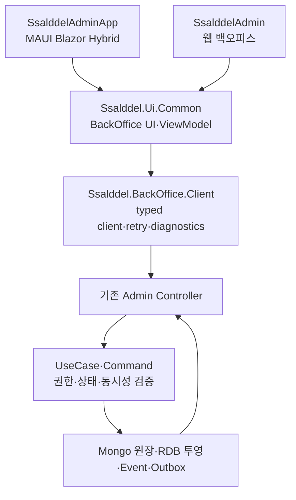

# 살뜰 모바일 관리자 앱 확장 제안서

작성일: 2026-07-28
대상: `SsalddelAdminApp` Android·Windows MAUI Blazor Hybrid
목표: 관리자가 외부에서도 플랫폼 상태를 확인하고, 제한된 운영 조정을 안전하게 수행할 수 있는 모바일 관제 앱

## 제안 결론

새 관리자 앱을 하나 더 만들기보다 기존 [`SsalddelAdminApp`](../../SsalddelAdminApp/SsalddelAdminApp.csproj)을 **플랫폼 모바일 관제 앱**으로 승격한다.

- 기존 `SsalddelAdmin` 웹 백오피스는 대량 조회, 복잡한 정책 편집, 문서 작성과 정산 검토를 담당한다.
- `SsalddelAdminApp`은 이동 중 확인, 알림 대응, 단건 승인·보류·재시도와 원장 추적에 집중한다.
- 화면마다 새 API나 로컬 상태를 만들지 않고 기존 Admin Controller, contract, UseCase와 원장을 재사용한다.
- 모바일 조작은 서버가 권한·현재 상태·동시성을 다시 검증한 뒤 수행하며, 성공 후 같은 원장을 재조회한다.
- 위험한 작업은 기본적으로 읽기 전용으로 시작하고 재인증, 사유 입력, 이중 확인과 감사 로그가 준비된 기능만 단계적으로 연다.

즉, “웹 관리자의 축소 복사본”이 아니라 **플랫폼 전체를 빠르게 살피고 필요한 한 건만 안전하게 조정하는 앱**으로 정의한다.

## 현재 저장소 기준선

| 자산 | 현재 확인된 상태 | 활용 방향 |
| --- | --- | --- |
| [`SsalddelAdminApp`](../../SsalddelAdminApp/) | Android·Windows MAUI Blazor Hybrid 프로젝트가 이미 존재한다. 로그인, 커뮤니티 운영, 자료 검토, 같이 수입 준비, 페이지 카탈로그 화면이 있다. | 새 프로젝트를 만들지 않고 앱 셸과 기능을 확장한다. |
| [`SsalddelAdmin`](../../SsalddelAdmin/) | 대시보드, 의뢰, 배차대기, 기사, 운송, 결제, 정산, 문서, POD, HS 코드와 AI 검토 화면이 있다. | 모바일 화면의 업무 의미와 route·서비스 동작을 재사용한다. |
| [`Ssalddel/Controllers/Admin`](../../Ssalddel/Controllers/Admin/) | 대시보드, 배차, 운송, 기사, 정산, 문서, 커뮤니티, 콘텐츠, 같이 주문·수입, 전통시장, 인사 등 관리자 API가 넓게 존재한다. | 새 범용 Controller 대신 기존 API를 우선 연결한다. |
| [`Ssalddel.Ui.Common`](../../Ssalddel.Ui.Common/) | 앱 공통 서비스와 BackOffice ViewModel 경계가 있다. | 카드, 상태 표현, loading·empty·error·retry와 공통 workflow를 공유한다. |
| [`Ssalddel.BackOffice.Client`](../../Ssalddel.BackOffice.Client/) | 설정과 진단 골격은 있지만 실제 관리자 typed client가 충분히 모이지 않았다. | 웹 관리자에 흩어진 순수 HTTP client를 이 프로젝트로 옮겨 웹·모바일이 함께 사용한다. |
| 모바일 푸시 설치 API | `api/v1/mobile/push/installations`가 플랫폼 API로 존재한다. | 관리자 기기 등록에도 재사용하고, 알림 본문에는 개인정보 대신 alert ID와 deep link만 넣는다. |

기존 [`Admin-Backoffice-Requirements.md`](../Admin-Backoffice-Requirements.md)는 초기 요구사항이라 현재 코드보다 오래된 “미구현” 표기가 남아 있다. 모바일 범위 판단은 실제 Controller와 contract를 기준으로 하고 해당 문서는 역사적 참고자료로만 사용한다.

## 확장 전 모바일 앱의 부족한 점

1. 앱의 기본 `/` route가 플랫폼 관제 홈이 아니라 자료 검토 화면으로 연결된다.
2. 메뉴가 커뮤니티·콘텐츠·무역 준비에 치우쳐 배차, 운송, 음식 주문, 기사, 창고, 정산 상태를 한눈에 볼 수 없다.
3. 페이지 카탈로그는 `AdminPageCatalogSampleService` 기반이어서 운영 원장과 직접 연결되지 않는다.
4. 관리자 로그인 토큰은 SecureStorage에 저장되지만 만료된 액세스 토큰을 갱신하는 공통 retry 경로가 없다.
5. 웹 관리자의 `백오피스조회Service`와 모바일 서비스가 분리돼 같은 API 의미가 중복될 가능성이 있다.
6. 전 영역의 이상 상태를 모아 보여 주는 모바일 알림함과 stable ID 통합 검색이 없다.
7. 현재 관리자 권한은 대체로 `서버관리자` 한 역할에 집중돼 있어 모바일에 모든 쓰기 기능을 그대로 노출하기에는 권한 범위가 너무 넓다.

## 2026-07-28 첫 확장 구현

이번 작업은 P0 기반과 P1 읽기 관제의 첫 부분을 기존 `SsalddelAdminApp`에 적용했다.

| 항목 | 구현 상태 |
| --- | --- |
| 기본 진입 | `/`와 `/overview`를 실제 플랫폼 운영 개요로 변경하고, 기존 자료 검토는 `/information-review`로 분리했다. |
| 실데이터 요약 | `GET api/v1/admin/dashboard`를 연결해 관리자 확인, 운송 예외, 배차 대기, 운송 중과 오늘 주문·결제·배차 지표를 표시한다. |
| 운송·기사 관제 | `/operations`에서 `GET api/v1/admin/transports`와 `GET api/v1/admin/drivers/operating`을 함께 조회해 확인 필요 운송, 최근 운송, 운행 기사를 표시한다. |
| 인증 복구 | 공용 `ClientSessionGuard`를 사용해 refresh token 만료 시각을 보존하고, API 직전 자동 갱신과 `401` 뒤 강제 갱신·1회 재시도를 적용했다. |
| 모바일 동기화 | 운영 개요와 운송·기사 현황을 30초마다 보조 조회하며, 세션 복구 실패는 로그인 상태로 오인하지 않고 다시 연결 또는 재로그인으로 분기한다. |
| 안전 경계 | 이번 운송·기사 관제는 읽기 전용이다. 기존 커뮤니티·같이 수입 관리 화면의 쓰기 범위를 넓히지 않았다. |

Windows MAUI 대상 컴파일과 구조 테스트로 연결을 확인했으며, 인증된 운영 서버 응답을 사용한 실제 기기 렌더링은 아직 남아 있다. 다음 세로 slice는 배차 대기와 음식 주문 stable ID를 운송 원장까지 추적하는 읽기 전용 상세다.

## 모바일에서 담당할 범위

### 모바일에 우선 적합한 기능

- 오늘의 핵심 수치와 운영 이상 징후 확인
- 음식 주문, 마트 주문, 같이 주문, 같이 수입 원장 검색
- 주문번호에서 배달권, 배차대기, 기사 제안, 운송과 알림 이력을 한 흐름으로 추적
- 배차대기, 진행 지연, 기사 후보 부족, 추천 만료와 전달 실패 확인
- 음식점 조리·기사 인계 상태 확인
- 문서·POD 누락, 정산 대기와 지급 승인 후보 확인
- 신고·게시글 공개 범위와 커뮤니티 운영 요청 확인
- 명시적으로 허용된 단건 보류, 재시도, 승인, 공개 범위 변경
- 모든 조정 결과와 감사 로그 재조회

### 웹 관리자에 남길 기능

- 대량 수정과 일괄 지급
- 운임·차량 단가·정책의 복잡한 편집
- 역할 부여와 계정 보안 설정
- 문서 양식 작성과 대용량 파일 관리
- 콘텐츠 장문 작성과 다중 자료 편집
- 운영 모드 변경, secret·API key 관리
- 데이터 삭제, 원장 강제 상태 변경과 DB 직접 보정

## 권장 화면 구조

기존 앱들과 같은 상단 앱바, 흰색 카드, 상태 chip, 하단 고정 행동 영역을 사용한다. 관리자 앱임을 나타내는 남색·인디고 accent만 두고 별도의 시각 체계를 새로 만들지 않는다.

### 하단 4개 영역

| 영역 | 핵심 화면 | 설명 |
| --- | --- | --- |
| 홈 | `ADM-M01 운영 개요` | 오늘 주문·배차·운송·정산 수치, 긴급 alert와 최근 변경을 보여 준다. |
| 업무 | `ADM-M02 업무함`, `ADM-M03 통합 검색`, `ADM-M04 원장 상세` | 네 주문 원장과 운송 실행 원장을 상태·유형·배달권으로 찾고 역할별 인계를 추적한다. |
| 승인 | `ADM-M05 승인 대기`, `ADM-M06 조정 확인` | 지급, 문서, POD, 커뮤니티 조치와 안전한 재시도처럼 모바일 허용 작업만 모은다. |
| 더보기 | `ADM-M07 정책·콘텐츠`, `ADM-M08 감사·계정` | 저빈도 관리 기능, 알림 설정, 기기, 세션과 감사 로그를 제공한다. |

### 대표 사용자 흐름


원장 상세는 다음 순서를 공통으로 사용한다.

```text
원천 주문
→ 플랫폼 배달권
→ 배차대기·추천
→ 운송 실행
→ 증빙·문서
→ 정산
→ 이벤트·감사 로그
```

## 기존 Controller 재사용 계획

| 모바일 기능 | 우선 재사용할 기존 API | 모바일 기본 권한 |
| --- | --- | --- |
| 운영 개요 | `GET api/v1/admin/dashboard` | 읽기 |
| 배차대기 | `api/v1/dispatch/wait` | 목록·상세 읽기, 의미가 명확한 보류·재개만 쓰기 |
| 배차계획 | `api/v1/admin/dispatch-plans` | 읽기 |
| 기사 운행 | `api/v1/admin/drivers/operating`, `api/v1/admin/drivers/{driverId}` | 읽기 |
| 운송 진행·이벤트 | `api/v1/admin/transports`, `api/v1/admin/transports/events` | 읽기, 준비된 재처리 Command만 쓰기 |
| 기사 정산·지급 | `api/v1/admin/driver-settlements`, `api/v1/admin/driver-payouts` | 조회 우선, 지급 승인은 단계적 공개 |
| 문서·POD | `api/v1/admin/documents`, `api/v1/admin/files/pod` | 조회·상태 확인, 다운로드 |
| 커뮤니티 운영 | `api/v1/admin/community-management`, `api/v1/admin/activity-logs` | 조회, 공개 범위 조정은 사유 필수 |
| 같이 주문·수입 | `api/v1/admin/orderer/...` 계열 Controller | 준비 원장과 인계 상태 읽기, 승인된 handoff만 쓰기 |
| 정책 | `api/v1/admin/view-policies`, `api/v1/admin/auxiliary-feature-settings`, `api/v1/admin/orderer/restaurant-search-policy` | 모바일 초기에는 읽기 |
| 콘텐츠·인사 | `api/v1/admin/content/...`, `api/v1/admin/hr-...` | P3 이후 선택적으로 연결 |

현재 Controller의 범용 `PUT`·`DELETE`를 모바일 버튼에 그대로 노출하지 않는다. “배차대기 보류”, “알림 재전송”, “공개 범위 변경”처럼 업무 의미가 있는 기존 Command가 없을 때만 좁은 action endpoint를 추가한다.

## 권장 코드 구조



구체적인 리팩토링 원칙은 다음과 같다.

1. `SsalddelAdmin`의 순수 HTTP 조회 코드를 `Ssalddel.BackOffice.Client`의 업무별 typed client로 옮긴다.
2. 웹과 모바일은 같은 client와 contract를 사용하고 화면 구성만 달리한다.
3. `AdminData:UseMemory`와 sample catalog는 개발 데모에서만 사용하고 모바일 운영 profile에서는 금지한다.
4. 모바일 앱은 원장 상태를 로컬에서 성공으로 바꾸지 않는다.
5. 상태 변경 성공 뒤 서버에서 같은 stable ID를 재조회한다.
6. 개인정보는 현재 처리에 필요한 단계와 역할에서만 내려 주고, 목록·푸시에는 축약 정보만 사용한다.

## 인증과 운영 안전장치

### 세션

- `Ssalddel.Client.Infrastructure.Security`의 세션 가드와 refresh-token 흐름을 재사용한다.
- 앱 시작, API 요청 직전과 `401` 응답 뒤 액세스 토큰을 자동 갱신한다.
- refresh 실패 시 SecureStorage를 비우고 원래 관리자 route를 포함해 로그인 화면으로 보낸다.
- 생체 인증은 저장된 세션의 로컬 잠금 해제에만 사용하고 서버 권한 검증을 대체하지 않는다.

### 권한

- 초기에는 `서버관리자`만 허용하되 모든 버튼을 동일 권한으로 열지 않는다.
- 이후 `운송관제`, `정산승인`, `커뮤니티안전`, `콘텐츠운영`, `문서검토`처럼 action 단위 policy를 분리한다.
- 목록 조회 권한과 상태 변경 권한을 분리한다.

### 쓰기 작업

모든 모바일 조정 요청에는 다음 정보가 필요하다.

- 대상 stable ID와 현재 version 또는 예상 상태
- 조정 사유
- idempotency key
- 관리자 user ID와 기기 설치 ID
- `traceId` 또는 correlation ID
- `Simulation` 또는 `Operational` 실행 모드

지급 승인, 개인정보 공개, 역할 변경과 운영 정책 변경은 비밀번호 또는 MFA 재인증과 이중 확인이 마련되기 전까지 모바일에서 활성화하지 않는다.

## 알림과 동기화

- 앱이 열려 있을 때는 30초 주기 보조 조회를 기본으로 한다.
- 모바일 푸시 설치 API를 재사용해 긴급 alert의 존재만 알리고 상세 정보는 앱 로그인 뒤 조회한다.
- 초기에는 push + polling으로 충분하며, 실제 누락률이 확인된 영역만 SignalR을 추가한다.
- push 누락, 앱 종료와 네트워크 중단이 원장 상태를 바꾸지 않도록 DB 원장과 Outbox를 기준으로 복구한다.
- 오프라인에서는 마지막 읽기 결과만 “오프라인 사본”으로 표시하고 쓰기 작업은 큐에 저장하지 않는다.

## 단계별 개발 제안

### P0. 기존 앱을 운영 가능한 기반으로 승격

- `/` 기본 route를 인증된 운영 개요로 변경
- 공통 관리자 앱 셸과 하단 4영역 navigation 적용
- 자동 토큰 갱신, `401` 단일 재시도와 안전한 로그아웃 적용
- `Ssalddel.BackOffice.Client`에 대시보드·배차·운송 typed client 구성
- loading, empty, error, retry, offline, 권한 없음 상태 통일
- 운영 profile에서 sample fallback 차단

완료 기준: 서버관리자 로그인 후 실제 `admin/dashboard` 응답이 보이고 앱 재실행·토큰 만료 뒤에도 세션이 안전하게 복구된다.

### P1. 읽기 전용 모바일 관제

- 운영 개요
- 배차대기와 기사 운행 현황
- 운송 목록·상세·이벤트 timeline
- 네 주문 원장과 배달권 통합 검색
- 음식 주문의 조리·배차·픽업·전달 상태
- 문서·POD와 정산 대기 요약

완료 기준: 하나의 주문번호에서 원천 주문, 배달권, 배차, 운송과 감사 이력을 실제 서버 데이터로 끝까지 추적한다.

### P2. 안전한 단건 조정

- 배차대기 보류·재개
- 실패한 알림 또는 허용된 workflow 재시도
- 커뮤니티 공개 범위 조정
- POD 검토 상태 변경
- 승인 후보 확인과 제한된 승인
- 조정 전후 상태·사유·수행자 감사 표시

완료 기준: 중복 탭, stale version과 네트워크 재시도에도 한 번만 반영되고 성공 뒤 같은 원장을 재조회한다.

### P3. 플랫폼 전 영역 확장

- 같이 주문·같이 수입 준비와 국내 운송 인계
- 마트·창고 작업과 기사 인계
- 문서 생성·다운로드 상태
- HS 코드, 콘텐츠, 전통시장 물류 거점과 인사 검토
- 업무 유형별 push alert와 deep link

완료 기준: 필요한 영역을 추가해도 새로운 앱별 상태 머신이나 범용 관리자 쓰기 API가 생기지 않는다.

## 우선 구현할 첫 세로 slice

첫 작업은 **음식 주문 한 건의 모바일 관제**가 적합하다.

1. 운영 개요에서 배차 지연 음식 주문을 선택한다.
2. 주문번호, 음식점 조리 상태, 배달권과 배차대기를 확인한다.
3. 기사 추천·수락·픽업·전달 timeline을 조회한다.
4. 후보 없음 또는 추천 만료 상태에서 허용된 재시도만 수행한다.
5. 주문자·음식점·기사 화면이 보는 동일 원장 상태를 다시 조회한다.
6. 수행자, 사유와 전후 상태를 감사 로그에서 확인한다.

이 slice가 닫히면 동일한 화면 골격을 마트 주문, 같이 주문, 같이 수입에 확장한다.

## 검증 기준

- Android 실제 기기 또는 emulator에서 로그인·재실행·토큰 만료 확인
- 390px 기준 홈→목록→상세→조정 확인 화면 capture
- 서버관리자·읽기 전용 운영자·권한 없음 역할별 API test
- 정확한 주소와 연락처의 목록·푸시 비노출 test
- 상태 변경의 expected state, idempotency와 감사 로그 test
- push 누락, 네트워크 단절, 중복 탭, 앱 강제 종료와 서버 재시작 test
- `Simulation`과 `Operational` profile 분리 확인
- `Fast → Task` 검증과 `SsalddelAdminApp` Android·Windows build

## 최종 제안

현재 저장소에는 관리자 모바일 앱의 기반과 관리자 Controller가 이미 충분히 있다. 따라서 우선순위는 화면 수를 다시 늘리는 것이 아니라 다음 세 가지다.

1. 웹 관리자와 모바일 앱이 같은 typed client와 contract를 사용하게 한다.
2. 모바일 홈을 플랫폼 전체의 읽기 전용 관제 화면으로 먼저 완성한다.
3. 실제 운영에서 자주 필요한 단건 조정만 안전장치와 감사 로그를 갖춘 뒤 순서대로 연다.

이 방향이면 다른 역할 앱과 비슷한 디자인을 유지하면서도, 관리자가 이동 중에 플랫폼 전체를 확인하고 필요한 한 건을 안전하게 조정할 수 있다.
