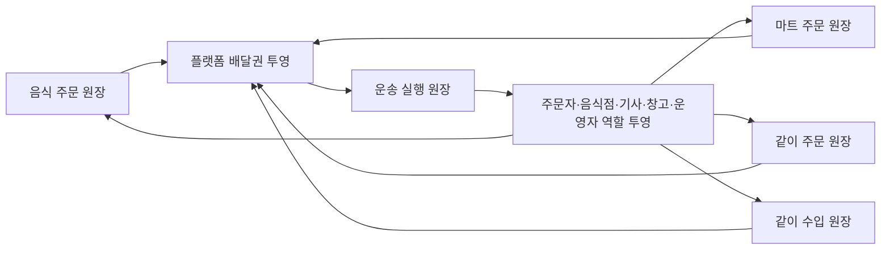

# 플랫폼 앱 완성도 수렴 계획

이 문서는 역할별 앱과 서버 기능이 넓게 구현된 현재 단계에서 화면 수를 더 늘리기보다, `배달권`과 네 가지 주문 원장을 공통 축으로 실제 사용자 여정을 닫는 보완 순서를 정한다.

기본 공개 기준은 계속 [문화교통 0.0 집중 로드맵](v0.0/focus-roadmap.md)이며, 이 문서는 `0.5`부터 최종 목표 `3.5`까지 준비된 capability를 개발·검증하는 계획이다. 기능이 구현되어 있다는 사실만으로 기본 노출이나 운영 효과를 켜지 않는다.

## 이번 점검에서 확인한 기준선

- `OrdererApp`, `RestaurantDeskApp`, `FDriverApp`, `DriverApp`, `WarehouseManagerApp`, `SsalddelApp`, `SsalddelAdmin`에 역할별 화면과 진입점이 이미 존재한다.
- 음식 주문은 서버 등록·주문자 조회, 음식점 수락, 음식 배달 기사 업무공간, 제안 수락·거절, 픽업·전달 완료 API까지 세로 흐름의 주요 자산이 있다. 다만 `OrdererApp`의 공개 음식점·메뉴 화면은 아직 등록 API를 호출하지 않는다.
- `플랫폼배달권`, `원장배달권투영`, `원장배달권투영Service`, `운송원장배달권연결Service`와 DB migration이 존재한다.
- 플랫폼 배달권 contract는 고객 업무 원장인 `음식주문`, `마트주문`, `같이주문`, `같이수입`과 실행 원장인 `운송원장`을 구분한다.
- 배차 실행 인덱스는 배달권별 기사·의뢰 후보를 빠르게 찾는 자료이고, 배차 확정 상태는 DB 운송 원장이 담당한다.
- 같이 주문과 음식점 탐색에는 기존 `배송권키` 또는 `deliveryScopeKey`가 남아 있고, 새 플랫폼 배달권 투영은 현재 운송 원장 인계에서 원천 원장으로 거슬러 연결되는 경로가 중심이다.
- `RestaurantDeskApp` 주문 수신함은 서버 재조회·재연결·30초 보완 조회로 미처리 주문을 복구한다. 다만 음식점의 거절·조리 시작·픽업 준비·기사 인계 상태 전이는 아직 수락 API 한 건으로 충분히 표현되지 않는다.
- `FDriverApp`의 native 음식 배달 업무와 `DriverApp`의 음식 배달 화면이 같은 서버 업무를 서로 다른 UI로 제공하므로 상태 판단과 Command가 앱마다 갈라지지 않게 해야 한다.
- 일부 화주·관리자 화면에는 명시적 Simulation 또는 sample fallback 자산이 남아 있다. 운영 검증에서는 fallback을 끄고 실제 서버 실패를 드러내야 한다.
- 음식 주문 등록과 음식점 조회·수락 API의 인증, 음식점 소유권, 역할 권한은 현재 서버 경계에 반영되어 있다. 다음 등록 보완에서는 클라이언트가 보낸 메뉴명·단가를 그대로 신뢰하지 않고 공개 메뉴 ID와 서버 가격을 기준으로 주문 스냅샷을 만들어야 한다.

이 기준선은 “앱이 없다”는 상태가 아니라 “기능 자산은 많지만 동일 원장 재조회와 역할 간 인계가 아직 고르게 닫히지 않았다”는 상태다.

## 2026-07-28 · 앱 간 업무 흐름 상세 점검

### 판정 등급

| 등급 | 의미 |
| --- | --- |
| `A` | 실제 앱의 시작 행동부터 종료 확인까지 같은 stable ID로 이어지고, 재시작·재연결·예외까지 검증됨 |
| `B` | 서버 상태 전이는 닫혀 있고 역할 앱 화면도 있으나 실제 다중 앱 E2E 또는 일부 종료 행동이 부족함 |
| `C` | 중간 구간은 동작하지만 시작 원장이나 다음 역할로 넘어가는 인계가 끊김 |
| `R` | 준비·의향·검토 단계로서는 완결됐지만 계약·결제·배차 같은 실행을 의도적으로 만들지 않음 |
| `D` | 서로 다른 저장소·sample·메모리 상태를 사용해 앱들이 동일 업무를 공유한다고 볼 수 없음 |

`R`은 실패가 아니다. 명시적 동의, 허가, 결제, 통관 또는 운영 준비 전까지 실행 효과를 막아야 하는 정상적인 제품 경계다.

### 업무 흐름별 상세 기준선

| ID | 업무 흐름 | 시작 앱·행동 | 원본 원장과 stable ID | 현재 인계 | 종료 앱·행동 | 현재 등급 | 가장 큰 단절점 | 다음 완료 조건 |
| --- | --- | --- | --- | --- | --- | --- | --- | --- |
| `FOOD-01` | 음식점 음식 주문 | `OrdererApp` 음식점·메뉴 탐색 | `음식주문.주문번호` | 음식점 수락 뒤 같은 주문번호로 배차대기·추천·운송 연결 | `FDriverApp` 전달 완료, `OrdererApp` 상세 조회 | `B` 서버 / `C` 앱 | 주문자 화면이 주문을 제출하지 못하고, 음식점은 수락 이후 조리·픽업 준비 상태를 세분화하지 못함 | 실제 메뉴 ID 기반 주문 제출부터 주문자 수령 확인까지 한 건을 앱으로 통과 |
| `FREIGHT-01` | 화주 일반 화물 운송 | `SsalddelApp` 운송 의뢰·결제 조건 입력 | `운송의뢰Id`와 `운송Id` | 결제 승인→배차대기→추천→기사 수락→상하차 진행 | `DriverApp` 인수 완료, 화주·Admin 재조회 | `B` | 코드 흐름은 닫혔지만 두 앱 동시 실행, 토큰 만료, SignalR 재연결, 오프라인 증빙 E2E가 없음 | 실제 테스트 계정 두 개로 재연결 포함 한 건을 완료하고 같은 상태를 확인 |
| `WAREHOUSE-01` | 창고 출고·운송 인계 | `WarehouseManagerApp` 출고 계획·피킹·포장 | `출고계획Id`, `운송의뢰Id` | 포장 완료→운송 의뢰→기사 수락→창고 인계 | 기사 상차 이후 운송 원장 | `B` 중간 구간 / `C` 전체 | 주문·결제에서 출고 계획을 만드는 상류 원장이 고르게 연결되지 않음 | 원천 주문 한 건이 출고 계획을 만들고 기사 인계 뒤 주문 앱에서 진행 상태를 재조회 |
| `MART-01` | 마트 주문·도심 배송 | `OrdererApp` 마트 주문 요청 | `마트주문요청Id`와 별도 `마트주문` | 실제 마트 주문 쪽에는 피킹·포장·배차 인계 자산 존재 | 창고·기사 배송 완료 목표 | `C` | 주문자 요청은 비구속 의향이며 결제·재고 예약·실제 마트 주문으로 승격되지 않음 | 명시적 확인 뒤 실제 주문을 만들고 재고 예약·피킹·포장·배송까지 동일 상관 ID 유지 |
| `SALES-01` | 판매 채널 주문 이행 | `SellerApp` 채널·상품·외부 주문 동기화 | 판매 채널 계정·상품·주문 ID | 서버 판매 주문→창고 출고 처리 자산 존재 | 판매자 배송 상태·정산 후보 확인 목표 | `D` | `SellerApp`은 서버 API를 사용하지만 `SsalddelApp` 판매 화면 일부는 `InMemoryShipperStore`를 사용 | 모든 판매 앱을 같은 서버 원장 client로 통일하고 테스트 주문 한 건을 창고로 인계 |
| `GROUP-01` | 같이 주문 준비 | `OrdererApp` 비구속 수요 등록·철회 | 공동구매 수요·모집 원장 ID | 집단화 결과를 주문자·판매자가 개인정보 없이 조회 | 모집 조건·참여 의향 확인 | `R` | 결제·발주·배송은 현재 범위에서 의도적으로 차단됨 | 준비 흐름의 철회·단위·집계 정확성을 먼저 닫고 실행은 별도 동의 게이트로 분리 |
| `IMPORT-01` | 같이 수입 준비 | `OrdererApp` 수입 목적·수요·품목 검토 | 같이 수입 준비 원장 ID | HS·FCL/LCL·3PL·전문가 검토·문서 미리보기 | 실행 전 준비 상태 확인 | `R` | 계약·신고·결제·선적·국내 인계 Command가 운영 게이트 뒤로 분리되어 있음 | 준비 완료 판정과 실행 전환 조건을 명시하고 운영 승인 전에는 외부 효과를 계속 차단 |
| `DOC-01` | 업무 문서 생성·발급 | 서버 업무 Event·Admin 정책 | 문서 stable ID와 원천 업무 ID | 피킹·포장·픽업·전달 Event→Outbox→문서 저장 | `SsalddelAdmin` 조회·다운로드 | `C` | 역할 앱의 자기 문서함이 없고 주문 확인 문서의 결제 완료 Event 발행 경로가 불명확 | 원천 업무별 자동 생성 근거를 고정하고 권한별 문서함·다운로드·재발급 이력을 제공 |
| `COMMUNITY-01` | 커뮤니티 발견→비구속 행동 | 커뮤니티 게시물·공공데이터 탐색 | 게시물·관심·가원장 ID | 명시적 관심·철회→공동 원장 준비 | 모집·검토 단계 진입 | `R` | 커뮤니티 신호를 자동 주문·자동 배차로 오해하면 동의 경계를 침해함 | 공개 정보·관심·실행 동의를 분리한 채 다음 준비 원장으로 명시적으로 이동 |

### 앱에서 실제로 보이는 연결과 서버에만 있는 연결

| 흐름 | 앱에서 시작 가능 | 서버 상태 전이 | 상대 앱 복구 | 원래 앱 종료 확인 | 실제 다중 앱 증거 |
| --- | --- | --- | --- | --- | --- |
| 음식점 음식 주문 | 아니오 — 메뉴 탐색까지만 가능 | 예 — 등록부터 전달 완료까지 주요 경로 존재 | 예 — 음식점 수신함과 기사 업무공간 | 부분 — 읽기 상세만 존재 | 부분 — API·Windows 앱 확인, 주문자 제출 UI 제외 |
| 화물 운송 | 예 | 예 | 예 — 기사·Admin 재조회와 실시간 보완 | 예 — 화주 상세 | 아니오 — 인증된 두 앱 동시 E2E 미수행 |
| 창고 출고 인계 | 부분 — 출고 계획이 있어야 시작 | 예 | 예 — 기사 수락 뒤 창고 재조회 | 부분 | 부분 — 화면 직접 확인 범위 제한 |
| 마트 주문 | 예 — 비구속 요청 | 별도 실제 주문 경로만 존재 | 부분 | 아니오 | 아니오 |
| 판매 채널 주문 | 부분 | 부분 | 부분 | 부분 | 아니오 |
| 같이 주문·같이 수입 | 예 — 준비 행동 | 준비 상태까지만 예 | 준비 역할에 한정 | 예 — 준비 상태 | 준비 범위의 test 중심 |
| 문서 발급 | 일반 사용자 앱에서는 아니오 | 예 — 일부 Event | Admin만 예 | 일반 사용자 앱에서는 아니오 | 서버·Admin test 중심 |

### 반복해서 나타나는 공통 단절 원인

1. **시작 Command 부재**: 서버 등록 API가 있어도 실제 역할 앱이 호출하지 않는다.
2. **비구속 원장과 실행 원장의 혼동**: 의향·준비 데이터를 결제·발주된 주문처럼 취급할 수 없다.
3. **인계 stable ID 불완전**: 주문번호, 출고계획, 운송의뢰, 추천, 운송, 문서가 화면에서 한 번에 역추적되지 않는다.
4. **역할별 상태 행동 부족**: 서버 상태는 있지만 음식점 조리·창고 기사 인계·주문자 수령 확인처럼 책임 주체의 Command가 빠져 있다.
5. **저장소 분리**: 같은 업무를 보는 앱이 서버 원장과 메모리 sample을 나눠 사용한다.
6. **종료 확인 부족**: 수행 앱에서 완료해도 원래 요청 앱이 재조회·수령 확인·문서 수령까지 닫지 못한다.
7. **복구 검증 부족**: polling과 SignalR 코드가 있어도 앱 종료, 토큰 만료, 알림 누락, 서버 재시작을 한 시나리오에서 검증하지 않았다.

## 실행 백로그와 우선순위

우선순위는 화면 수가 아니라 **가장 적은 변경으로 실제 한 건을 끝까지 통과시킬 수 있는가**로 정한다.

### P0 · 음식 주문 한 건

| Slice | 구현 범위 | 재사용 자산 | 완료 조건 |
| --- | --- | --- | --- |
| `P0-A` 주문 제출 | 공개 메뉴 선택, 수량, 수령 정보, 결제 방식 메모, 인증, 등록 API, 등록 후 주문번호 상세 이동 | 공개 음식점·메뉴 조회, `POST /api/v1/food-orders`, 주문자 상세 조회 | 클라이언트 가격을 신뢰하지 않고 서버 공개 메뉴 가격으로 주문 스냅샷 생성, 등록 후 같은 주문번호 재조회 |
| `P0-B` 음식점 이행 | 거절, 조리 시작, 조리시간 변경, 픽업 준비, 기사 인계 | 서버 수신함 복구, 음식점 소유권, 기존 수락 Command | 허용된 상태 전이만 서버가 검증하고 음식점 앱 재시작 뒤 현재 상태 복구 |
| `P0-C` 기사·주문자 종료 | 기존 FDriver 수락·픽업·전달, 주문자 수령 확인, 실패·재추천 안내 | 음식 배달 기사 업무공간, 주문자 상세 timeline | 전달 완료와 수령 확인을 분리하고 양쪽 앱이 같은 주문번호로 최신 상태 확인 |
| `P0-D` 운영 추적·E2E | Admin 상관관계, Outbox 실패, 추천 만료, 앱·서버 재시작 | 음식 주문·배차대기·운송·알림 원장 | 실제 테스트 계정과 별도 DB로 정상·거절·만료 시나리오 통과 |

#### 2026-07-28 · P0-A 구현 진행

판정: **코드 단위 완료, 실제 DB·실행 화면 E2E 미완료**

완료한 코드 단위:

- 공개 메뉴 ID와 수량을 주문 등록 contract에 포함했다.
- 공개 메뉴 ID를 RDB 음식 주문 상품 스냅샷에도 저장한다.
- 서버는 음식점 공개·주문 가능 여부, 메뉴 소속·공개·품절, 수량과 최소 주문 금액을 다시 확인한다.
- 메뉴명·단가·총액은 클라이언트 표시값이 아니라 서버 공개 메뉴 가격으로 주문 스냅샷을 만든다.
- 주문자별 `클라이언트요청Id`를 음식 주문에 저장하고 고유 인덱스로 중복 등록을 막는다.
- `OrdererApp` 음식점 상세에서 메뉴 수량, 수령인·연락처·주소, 현장결제 메모를 입력하고 등록 API를 호출한다.
- 등록 성공 뒤 서버가 반환한 주문번호로 `/orders/food?orderNo=...`를 열어 같은 원장을 다시 조회한다.
- 온라인 결제 승인은 아직 만들지 않으며 화면에도 현장결제 메모와 운영 경계를 명시한다.

검증 결과:

- 음식·Food와 공통 UI 구성 테스트 346개가 통과했다.
- 변경 34개를 대상으로 한 Fast 게이트에서 `Ssalddel.v3.5.slnx` 빌드, 선택 테스트 83개와 `git diff --check`가 모두 통과했다.
- `OrdererApp` Windows target 빌드는 경고와 오류 없이 통과했다.

남은 완료 조건:

- 별도 실제 DB와 테스트 계정으로 공개 메뉴 조회→주문 등록→주문번호 상세 재조회를 다시 실행한다.
- Orderer Windows Hybrid 앱은 빌드됐지만 직접 실행한 창의 WebView 본문이 흰 화면으로 남았다. 실제 주문 작성 화면 렌더를 확인하기 전에는 `P0-A`를 완전 완료로 표시하지 않는다.
- 중복 네트워크 제출과 DB 고유 인덱스 경합을 실제 관계형 DB에서 한 번 더 확인한다.

#### 2026-07-28 · P0-B 음식점 이행 진행

판정: **거절·조리시간 변경·픽업 준비 코드 완료, 기사 인계·실행 화면 E2E 미완료**

완료한 코드 단위:

- 음식점 수신함과 상세는 인증 계정의 음식점 범위에서 서버 원장을 다시 읽는다.
- `주문대기 → 거절`, `조리중 → 조리중(예상시간 변경)`, `조리중 → 픽업대기`만 허용한다.
- 음식점 수락과 진행 변경의 상태 이력에 처리 사용자와 `클라이언트요청Id`를 저장한다.
- 같은 수락 요청 재시도에는 배차 생성 Event를 다시 발행하지 않는다.
- 거절 주문은 음식점 미처리 수신함, 기사 후보와 AI 배차 검토에서 제외하고 공동 원장을 닫힌 상태로 투영한다.
- RestaurantDesk 상세에 거절 사유, 조리시간 변경과 픽업 준비 완료 작업을 연결했다.
- 진행 변경 뒤 공동 원장 Outbox와 음식점 SignalR 상태 알림을 후속 처리한다.

검증 결과:

- 음식·Food 관련 테스트 351개가 통과했다.
- Task 게이트에서 `Ssalddel.v3.5.slnx` 통합 빌드, 관련 테스트 89개와 `git diff --check`가 통과했다.
- `RestaurantDeskApp` Windows target 빌드는 경고와 오류 없이 통과했다.

남은 완료 조건:

- 기사 배정 주문의 실제 픽업을 음식점 인계와 기사 픽업 양쪽에서 동일 주문번호로 확인한다.
- 별도 실제 관계형 DB에서 동일 요청 동시 경합과 상태 이력 고유 인덱스를 검증한다.
- RestaurantDesk Windows Hybrid 앱의 로그인 화면은 WebView 자체 캡처와 일반 Windows 창 재실행에서 정상 렌더를 확인했다. 실제 음식점 계정의 진행 변경 화면과 관계형 DB 동시 경합은 계속 운영 E2E 범위로 남긴다.

#### 2026-07-28 · P0-C 기사·주문자 종료 진행

판정: **기사 전달과 주문자 수령 확인 분리 코드 완료, 실제 다중 앱 E2E 미완료**

완료한 코드 단위:

- 기사 앱의 기존 `수락 → 픽업 완료 → 전달 완료`와 작업공간 재조회 흐름을 유지했다.
- 기사 전달 완료는 음식 주문 `전달완료`로 남기고, 주문자 본인의 별도 확인만 `수령확인`으로 전이한다.
- `POST /api/v1/food-orders/{orderNo}/receipt-confirmation`은 로그인 주문자의 주문 소유권과 현재 `전달완료` 상태를 서버에서 검증한다.
- 수령 확인 요청은 `클라이언트요청Id`를 상태 이력에 저장해 같은 네트워크 요청 재시도가 중복 Event를 만들지 않게 했다.
- 주문자 상세 응답은 `기사전달완료`, `수령확인가능`, `주문자수령확인됨`, `수령확인시각Utc`를 구분해 반환한다.
- 주문자 화면은 두 단계를 나란히 표시하고 실제 수령 확인 뒤 같은 주문번호 상세와 현재 목록 page를 다시 조회한다.
- 수령 확인 Event는 기존 음식 공동 원장 Outbox와 음식점 실시간 상태 알림 경계를 재사용한다.
- 추천 만료·배차 불가·수락 취소 안내는 주문 취소나 환불을 자동 확정하지 않는 기존 복구 안내를 유지한다.

검증 결과:

- 음식·Food·주문자 공용 UI 관련 테스트 306개가 통과했다.
- 주문자 수령 확인의 소유권, 전달 전 차단, 요청 ID 멱등성, Event 단일 발행과 동일 주문 재조회를 대상 테스트로 확인했다.
- `OrdererApp`, `RestaurantDeskApp`, `FDriverApp` Windows target이 각각 경고와 오류 없이 빌드됐다.

남은 완료 조건:

- 별도 실제 관계형 DB와 주문자·음식점·기사 테스트 계정으로 기사 전달 완료 뒤 주문자 수령 확인을 실제 API와 앱에서 통과시킨다.
- 인증된 주문자 상세의 수령 확인 화면을 실제 Windows 또는 Android 렌더로 확인한다.
- 전달 완료 직전 중복 탭, 확인 응답 유실, access token 만료와 앱 재시작 뒤 같은 주문번호 상태 복구를 검증한다.
- 음식점 화면과 공동 원장이 `수령확인` 상태를 같은 시각에 복구하는지 확인한다.

#### 2026-07-28 · P0-D 운영 추적 진행

판정: **주문번호 상관관계 조회와 실패 판정 코드 완료, 실제 다중 계정 E2E·수동 복구 Command 미완료**

완료한 코드 단위:

- 관리자 전용 음식 주문 운영 추적 API가 주문번호로 음식 주문, 배차·운송 실행 투영,
  추천 만료 상태, 기사 추천 알림 Outbox, 공동 원장 동기화 Outbox와 운송 이벤트를 조합한다.
- 음식 주문의 `배차대기Id`를 우선 사용하고 누락 시 같은 주문번호와 음식 주문 원본 유형으로
  운송 실행 투영을 복구 조회한다.
- 배차 실행 원장 누락·stable ID 불일치, 추천 만료, 원장 동기화 실패·lease 만료,
  추천 알림 실패를 정상 상태와 구분한다.
- 관리자 응답과 화면에는 수령지 주소·연락처, 기사 ID, Outbox payload와 원본 오류 문자열을
  노출하지 않는다.
- SsalddelAdmin V1 메뉴의 `음식 주문 추적`에서 주문번호를 검색하고 업무 체크포인트,
  stable ID, Outbox 상태와 복구 안내를 확인한다.
- 실제 서버 실패를 sample 성공으로 대체하지 않고 연결 오류를 표시한다.

검증 결과:

- 정상 수령 완료, 추천 만료·Outbox 실패, 배차 원장 누락, 새 `DbContext`를 통한 서버 재시작
  복구를 테스트했다.
- 음식 주문 운영 추적·Controller·화면 구성 테스트 10개와 API 분류·운영 권한·V1 smoke
  관련 테스트 47개가 통과했다.
- `Ssalddel` 서버와 `SsalddelAdmin` 빌드는 경고와 오류 없이 통과했다.
- 변경 파일 기준 Fast·Task 게이트에서 각각 `Ssalddel.v3.5.slnx` 빌드 오류 0개와
  선택 테스트 140개가 통과했고, DriverApp 패키지 호환·nullable 경고 69개는 남았다.
- 390×844 관리자 화면에서 개인정보 비노출 안내, 주문번호 입력, 조회와 서버 연결 오류 상태를
  직접 렌더 확인했다.

남은 완료 조건:

- 별도 실제 관계형 DB와 주문자·음식점·기사·관리자 테스트 계정으로 정상·거절·추천 만료
  시나리오를 실행하고 같은 화면에서 추적한다.
- 실패 Outbox 재처리는 원장을 직접 덮어쓰지 않고 관리자 사유·멱등 요청 ID·전후 상태를
  감사 기록으로 남기는 별도 Command로 구현한다.
- access token 만료, SignalR 단절과 앱·서버 재시작 뒤 각 역할 앱과 관리자 화면이 같은
  주문 상태를 복구하는 실제 E2E를 통과시킨다.

### P1 · 화주와 용달기사 한 건

1. 화주와 기사 테스트 계정을 동시에 로그인한다.
2. `Simulation`과 FakePG 경계를 명시한 채 의뢰→결제승인→추천→수락→상차→하차→인수 완료를 실행한다.
3. 중간에 access token 만료, SignalR 단절, 30초 보완 조회와 앱 재시작을 각각 한 번 발생시킨다.
4. 화주·기사·Admin이 같은 운송의뢰 ID와 최종 상태를 보는지 확인한다.
5. 실패가 코드 결함이면 그 흐름 안에서만 고치고 새 운송 기능을 추가하지 않는다.

### P2 · 마트 주문과 창고·기사 한 건

1. 비구속 `마트주문요청`과 실제 `마트주문` 사이에 명시적 확인·승격 Command를 둔다.
2. 실제 주문 생성 시 결제 조건, 재고 출처, 배달권, 취소 가능 시점을 고정한다.
3. 재고 예약→피킹→포장→운송 인계는 기존 창고·배차 자산을 재사용한다.
4. 주문자 상세에서 품목별 부분 취소, 품절 대체, 피킹·포장·배송 상태를 재조회한다.

### P3 · 판매 채널 주문과 창고 한 건

1. `SsalddelApp`의 메모리 판매 경로를 서버 기반 공용 sales client로 교체한다.
2. 외부 채널 API key는 로컬 보안 저장소와 서버 credential reference만 사용한다.
3. 동기화된 주문 한 건을 판매 주문 원장→출고 요청→창고 피킹·포장→운송 인계로 연결한다.
4. 판매자 앱은 주문 상태와 예외·문서·정산 후보를 같은 외부 주문 ID로 확인한다.

### P4 · 준비 흐름과 실행 게이트

1. 같이 주문과 같이 수입은 현재 `R` 범위의 철회·단위·집계·전문가 검토 정확성을 먼저 검증한다.
2. 실행 전환은 계약·결제·통관·허가 준비를 확인하는 별도 Command와 감사 기록으로만 허용한다.
3. 기능 플래그와 `SsalddelExecution:Mode`가 준비 화면을 운영 효과로 잘못 승격하지 않게 한다.

### P5 · 문서와 운영 복구

1. 각 업무 Event와 생성 문서 유형의 단일 매핑표를 고정한다.
2. 주문자·판매자·화주·기사·창고별 자기 문서함을 원천 업무 ID 기준으로 제공한다.
3. Outbox 재처리, 중복 생성 방지, hash, 발급·다운로드·재발급 감사를 검증한다.
4. 운영자가 수동 복구할 때 사유와 전후 상태를 남기고 업무 원장을 직접 덮어쓰지 않는다.

### 구현 순서와 중단 기준

```text
P0-A → P0-B → P0-C → P0-D
     → P1 실제 E2E
     → P2 마트 승격·창고·기사
     → P3 판매·창고
     → P4 실행 게이트
     → P5 문서·운영 복구
```

- 한 Slice가 `Fast`와 관련 앱 build를 통과하기 전 다음 Slice로 넘어가지 않는다.
- 권한, 가격, 주소 공개, 결제 상태를 임시 client 상태로 우회해야 한다면 구현을 멈추고 서버 contract를 먼저 고친다.
- 실제 운영 자격 증명, 허가 또는 결제가 필요한 지점은 `Simulation` 근거까지만 검증하고 운영 효과를 켜지 않는다.
- 한 Slice에서 발견한 관계없는 문제는 목록에 기록하되 같은 변경에 섞지 않는다.

### 업무 한 건의 공통 완료 체크리스트

1. 사용자가 첫 앱에서 실제 Command를 실행할 수 있다.
2. 서버가 인증·역할·소유권·현재 상태·입력 금액과 기준 데이터를 검증한다.
3. 원본 원장과 모든 후속 원장이 stable ID로 연결된다.
4. 각 상대 앱은 알림이 없어도 서버 재조회로 업무를 복구한다.
5. 각 상태 변경 뒤 수행 앱과 원래 요청 앱이 같은 원장을 다시 읽는다.
6. 정상 종료, 거절, 만료, 취소, 중복 요청, 재시작 시나리오가 있다.
7. 개인정보와 정확한 주소는 수행에 필요한 역할·상태에서만 보인다.
8. Event·Outbox는 멱등 재처리되고 실패를 sample 성공으로 숨기지 않는다.
9. 실제 앱 또는 브라우저 전환과 화면 상태를 확인한다.
10. 변경 기록에는 실제 렌더, 간접 확인, 미검증을 구분한다.

## 2026-07-27 · 공통 운송 실행 프로필 적용

P0의 첫 단위로 기존 RDB `운송원장`을 유지하면서 `배차업무유형`과 `원본의뢰유형`에서 다음 실행 프로필을 파생하도록 보강했다.

- 음식점 음식 배달: `음식점 픽업 → 고객 전달`, 조리 상태 필요
- 마트 라스트마일: `포장 상품 픽업 → 주문 전달`, 창고 선행 작업 필요
- 일반 화물: `화물 상차 → 화물 하차`, 화물 제원 필요
- 창고 출고 화물: `출고 화물 상차 → 화물 하차`, 창고 선행 작업과 화물 제원 필요
- 같이 주문 국내 배송: `공동 주문 화물 상차 → 집결지·세대 인계`
- 같이 수입 국내 인계: `보세·창고 화물 상차 → 국내 목적지 인계`

프로필은 DB 상태를 추가로 확정하지 않는 순수 분류 결과다. 일반 기사 추천, 음식 배달 업무공간, `DriverApp`과 `FDriverApp`이 같은 contract를 사용하며 기존 `원본의뢰유형` 직렬화 값은 유지한다.

## 완료를 판단하는 공통 기준

화면 하나가 보이는 것만으로 완료하지 않는다. 한 업무 node는 다음 조건을 모두 만족해야 한다.

1. 앞 단계에서 받은 stable ID와 원장 상태가 분명하다.
2. 상태 변경은 기존 Controller API와 UseCase 또는 Command를 통해 서버가 검증한다.
3. 성공 뒤 같은 stable ID를 다시 조회한다.
4. 주문자·음식점·기사·창고·운영자가 같은 상태를 역할에 맞게 다르게 본다.
5. loading, empty, error, retry, disabled, 만료, 철회 또는 취소 상태를 표현한다.
6. 정확한 주소와 위치는 해당 업무를 수행할 권한과 유효한 상태가 있을 때만 보여 준다.
7. 알림 실패, 앱 종료, 서버 재시작 뒤에도 DB 원장과 Outbox를 기준으로 복구된다.
8. 기능 플래그와 `SsalddelExecution:Mode`가 외부 효과를 통제한다.
9. API·상태 전이 test와 실제 앱 또는 브라우저의 화면 전환 근거를 함께 남긴다.

## 수렴시킬 아키텍처 결정

### 1. 네 가지 주문 원장과 하나의 운송 실행 원장



- 고객이 주문하는 원장은 네 가지다. `운송원장`은 다섯 번째 주문 종류가 아니라 주문 이행을 맡는 실행 원장이다.
- 주문 원장은 생성 또는 배송 조건 확정 시점에 플랫폼 배달권과 직접 연결한다.
- 운송 원장은 원천 주문 원장의 배달권을 이어받되, 픽업 배달권과 배송 배달권을 별도로 기록한다.
- 기존 `배송권키`, `deliveryScopeKey` 직렬화 이름은 호환을 위해 유지하고, 서버 adapter에서 canonical `플랫폼배달권.배달권키`로 해석한다.
- 새 앱별 배달권 모델이나 범용 쓰기 Controller를 만들지 않는다. 기존 주문 UseCase와 운송 인계 UseCase가 `I원장배달권투영Service`를 호출한다.
- 배달권은 수요 집계와 후보 범위다. 자동 참여, 자동 계약, 자동 배차 확정 또는 사용자의 자격 점수로 사용하지 않는다.

### 2. FDriverApp과 DriverApp의 책임

- `FDriverApp`은 음식 배달 기사에게 필요한 native 집중 화면을 맡는다.
- `DriverApp`은 일반 화물·마트·같이 주문·같이 수입 국내 인계까지 포함하는 범용 기사 앱을 맡고, 음식 배달 업무도 운영·검증용 공통 화면으로 제공할 수 있다.
- 제안 목록, 유효기간, 주소 공개 조건, 수락·거절, 픽업·전달 상태 판단은 서버 contract와 공용 client/service에서 한 번만 정의한다.
- 앱마다 별도의 배차 상태 머신이나 로컬 성공 상태를 만들지 않는다. Command 성공 뒤 음식 배달 업무공간 또는 현재 운송을 다시 조회한다.

### 3. 역할별 투영

| 역할 | 기본 표시 | 제한 |
| --- | --- | --- |
| 주문자 | 주문, 조리, 배차, 픽업, 이동, 도착, 전달 완료와 최근 변경 시각 | 기사 식별자와 실시간 정밀 위치 비노출 |
| 음식점 | 주문 상세, 선택 조리시간, 기사 찾기, 기사 수락, 도착 예정, 픽업 인계 | 고객 상세주소는 조리·인계에 필요한 범위만 표시 |
| 기사 | 유효한 추천의 예상 경로·보상·픽업/전달 요약, 수락 뒤 수행 주소 | 추천 만료 또는 권한 상실 뒤 정밀 주소 차단 |
| 창고 | 입고·피킹·포장·기사 인계와 담당 배달권 | 주문자의 불필요한 개인정보 비노출 |
| 운영자 | 후보 부족, 만료, 취소, 재추천, 진행 정체와 감사 이력 | 기사 대신 수락하거나 동의 없이 계약 확정하지 않음 |

## 단계별 보완 순서

### P0. 공통 식별자·권한·배달권 기준 고정

먼저 앱들이 같은 업무를 말하도록 기반을 고정한다.

1. `주문번호 → 원천원장Id → 운송의뢰Id → 제안Id → 운송Id` 상관관계를 contract와 감사 로그에서 추적한다.
2. 네 주문 원장이 배달권과 직접 연결되는 기존 UseCase 지점을 정하고, 운송 생성 전후에 같은 배달권 연결을 재조회한다.
3. 기존 `배송권키`와 플랫폼 배달권 key의 변환·호환 규칙을 한 adapter와 contract test로 고정한다.
4. 음식 주문 등록, 음식점 조회·수락, 기사 제안·진행 API의 인증·소유권·역할 검증을 통합 test로 확인한다.
5. 모든 상태 변경에 멱등 key, 동시성 충돌 결과와 재시도 가능 여부를 명시한다.
6. 역할별 정확한 주소 공개 시점을 계약 test로 고정한다.

완료 기준은 한 주문의 모든 stable ID와 배달권 연결을 운영자 감사 화면 또는 test 결과에서 역추적할 수 있는 것이다.

### P1. 음식 주문 한 건의 폐쇄 루프

현재 가장 많은 자산이 갖춰진 음식 배달을 첫 통합 기준선으로 삼는다.

1. `OrdererApp`: 카테고리·음식점·메뉴 선택, 주문 제출, 주문번호 상세와 상태 timeline을 잇는다.
2. `RestaurantDeskApp`: 서버 기반 주문 수신함을 추가해 앱 재시작 뒤에도 미처리 주문을 복구한다.
3. 음식점 상세에 주문 거절 또는 주문 불가, 조리시간 수정, 조리 시작, 픽업 준비 완료, 기사 인계 완료 상태를 기존 음식 주문 원장에 추가한다.
4. `FDriverApp`: 운행 시작, 위치 heartbeat, 추천 배너, 추천 상세, 수락·거절, 음식점 이동, 픽업, 전달을 같은 업무공간 재조회로 잇는다.
5. `DriverApp`: 음식 배달 공용 화면과 FDriverApp이 같은 client·상태 판정을 사용하는지 고정하고, 일반 화물 샘플 진행과 섞이지 않게 한다.
6. `OrdererApp`과 `RestaurantDeskApp`: 후보 부족, 추천 만료, 기사 수락 취소와 재추천 상태를 표시한다.
7. `SsalddelAdmin`: 음식 주문번호에서 배차대기·추천·운송 진행·알림 Outbox를 한 번에 추적한다.

완료 시나리오는 `주문 제출 → 음식점 수락 → 추천 → 기사 수락 → 픽업 → 전달 → 주문자 수령 확인`이다. 거절·추천 만료·앱 재시작 시나리오도 함께 통과해야 한다.

### P2. 마트 주문과 창고 인계

1. 마트 주문 생성 때 재고 출처와 주문 배달권을 직접 연결한다.
2. 창고 선택은 재고 적합성, 서비스 배달권, 거리·운송비 순으로 설명 가능한 결과를 남긴다.
3. 피킹·포장 완료 Command가 운송 인계 초안을 한 번만 만들도록 멱등성을 고정한다.
4. `WarehouseManagerApp`은 포장 완료, 기사 찾기, 기사 수락, 반출 인계 상태를 표시한다.
5. `OrdererApp`은 피킹, 포장, 기사 인계, 배송, 품목별 취소 가능 시점을 주문 상세에서 보여 준다.
6. `DriverApp`은 마트 배송을 음식 배달과 구분해 상품 수, 냉장·냉동, 수령 증빙 조건을 표시한다.

완료 시나리오는 `마트 주문 → 재고 예약 → 피킹 → 포장 → 기사 인계 → 배송 완료`다.

### P3. 같이 주문과 같이 수입의 국내 인계

1. 같이 주문은 참여자의 개별 주소가 아니라 공개 가능한 집결 배달권을 먼저 사용한다.
2. 모집 원장의 수량·박스·중량 합계와 집결 방식을 배달권별로 다시 계산한다.
3. 직접 배분, 기사 세대 배송, 3PL 입고를 명시적 투표·결정 상태로 분리한다.
4. 같이 수입은 FCL/LCL 판단, 선적·통관 문서와 국내 인계 배달권을 같은 원장 stable ID로 연결한다.
5. 통관 완료 뒤 창고 입고 또는 국내 운송 의뢰 생성은 명시적 인계 Command로 실행한다.
6. 주문자 집단 화면은 세대별 수령·미수령·파손·추가 비용을 확인하고 원장 합계와 일치시킨다.

완료 시나리오는 `배달권별 모집 → 집단 결정 → 국내 인계 → 창고 또는 기사 수행 → 참여자 수령 확인`이다.

### P4. 운영·예외·정산 수렴

1. 운영 보드는 음식·마트·같이 주문·같이 수입 원천 유형을 유지한 채 같은 운송 실행 상태로 묶는다.
2. 후보 없음, 추천 만료, 중복 수락, 수락 취소, 픽업 지연, 전달 실패와 장기 정체를 각각 다른 복구 사유로 표시한다.
3. 관리자 수동 조치는 사유, 수행자, 전후 상태와 원장 ID를 감사 로그로 남긴다.
4. 알림은 Outbox 재처리로 복구하고 앱 polling은 누락 보정 수단으로만 사용한다.
5. 증빙·문서·정산은 운송 완료 Event를 기준으로 후보를 만들고, 운영 승인 전 실제 지급을 실행하지 않는다.
6. AdminData 메모리 fallback과 화주 sample fallback은 운영 검증 profile에서 비활성으로 고정한다.

### P5. 릴리즈 게이트와 실제 화면 검증

1. 각 세로 흐름을 `Simulation` profile에서 실제 DB, 인증, Outbox, 서버 재시작과 함께 검증한다.
2. Orderer Android, RestaurantDesk Windows, FDriver Android, Driver Android, WarehouseManager, Admin과 Web의 대표 화면을 실제 실행한다.
3. Figma 화면에는 각 버튼 이름, 다음 route 또는 상태, 실패 분기와 역할 인계를 표시하고 실제 앱과 대조한다.
4. 모바일 네트워크 중단, 중복 탭, 앱 종료, 알림 누락, 위치 권한 거절, 제안 만료를 확인한다.
5. `Fast → Task → Release` 검증과 `Ssalddel.v3.5.slnx` 조립을 통과한다.
6. 운영 전환은 허가·보험·약관·개인정보·결제·정산·외부 지도와 알림 자격 증명을 별도로 확인한 뒤 승인한다.

## 앱별 우선 보완표

| 앱 | 활용할 기존 자산 | 다음 보완 |
| --- | --- | --- |
| `OrdererApp` | 음식·마트·같이 주문·같이 수입·주문 내역 route | 네 원장 상세의 공통 상태 timeline, 취소·이의·수령 확인, 배달권 연결 근거 |
| `RestaurantDeskApp` | 주문 알림, 주문 상세, 조리시간 수락·설정, 전표 | 서버 기반 수신함 복구, 거절·조리·픽업 준비·기사 인계 상태 |
| `FDriverApp` | native 로그인, 운행 시작, 위치 heartbeat, 음식 배달 업무공간 | 지도 중심 추천 배너·상세·진행 UX, 오프라인·만료·재조회, Driver 공통 상태 사용 |
| `DriverApp` | 운행, 추천, 결정, 음식 배달, 현재 운송, 상차·하차, 정산 | 샘플 기반 일반 운송 진행 제거, 원천 유형별 책임·증빙, FDriver와 contract 수렴 |
| `WarehouseManagerApp` | 입고·검수·스캔·피킹·포장·출고·마트 작업 | 배달권 기반 창고 선택 근거, 포장 완료→운송 인계, 예외·부분 처리 |
| `SsalddelApp` | 화주 운송·창고·판매·수입 계획 | sample fallback 없는 영속 조회·작성·인계, 운송 완료와 증빙 재조회 |
| `SsalddelAdminApp` | 모바일 운영 개요, 커뮤니티·콘텐츠, 같이 수입 준비, 운송·기사 현황 | 음식 주문 stable ID에서 배차대기·운송·알림을 추적하는 읽기 상세, 안전한 단건 조정과 모바일 푸시 |
| `SsalddelAdmin` | 음식 운영, 배차 대기, AI 검토, 운송·문서·정산 | 원천 원장→배달권→운송→알림의 통합 추적, 예외 복구와 감사 |

## 구현 단위와 검증 방식

한 번에 한 세로 slice만 변경한다. 앱별로 따로 완료하지 않는다.

```text
Contract
→ 기존 Controller API
→ UseCase/Command
→ 원장·배달권 투영·Event/Outbox
→ 역할별 공용 read model
→ 각 앱 adapter
→ 실제 화면 전환
→ 같은 stable ID 재조회
```

각 slice에는 다음 검증을 붙인다.

- contract 호환성과 legacy key 변환 test
- 역할·소유권·정확한 주소 비노출 test
- 상태 전이, 중복 Command와 동시성 test
- 원장 저장·Event·Outbox 재처리와 서버 재시작 test
- 역할별 client가 같은 원장 상태를 보는 통합 test
- loading, empty, error, retry, 만료와 취소 화면 test
- 실제 앱 또는 브라우저 capture와 Figma route 대조

## 바로 시작할 첫 작업

첫 세로 slice는 **음식 주문 한 건의 서버 기반 폐쇄 루프**로 한다.

1. 음식 주문 stable ID와 현재 배달권 투영을 조회한다.
2. `RestaurantDeskApp` 수신함을 서버에서 복구할 수 있게 한다.
3. 음식점 수락 뒤 생성된 배차대기와 기사 제안을 같은 주문번호로 추적한다.
4. `FDriverApp` 수락·픽업·전달 뒤 업무공간을 재조회한다.
5. 주문자와 음식점 화면이 같은 변경 상태를 확인한다.
6. 운영자 화면에서 실패·만료·재추천을 복구한다.

이 한 건이 닫힌 뒤 같은 패턴을 마트, 같이 주문, 같이 수입 순으로 확장한다. 새로운 대형 엔진이나 앱별 원장을 먼저 만들지 않는다.

## 함께 보는 기준 문서

- [통합 구축 로드맵](integrated-build-roadmap.md)
- [모바일 관리자 앱 확장 제안서](mobile-admin-app-proposal.md)
- [워크플로우 앱 화면 지도](../ProjectOverview/workflow-app-screen-map.md)
- [전체 로드맵 조화형 페이지 원칙](../Architecture/WholeRoadmapPagePrinciple.md)
- [배차 큐와 DB 원장 책임 경계](../Architecture/DispatchQueueResponsibility.md)
- [기능 플래그 정책](feature-flags.md)
- [릴리즈 게이트](release-gates.md)
