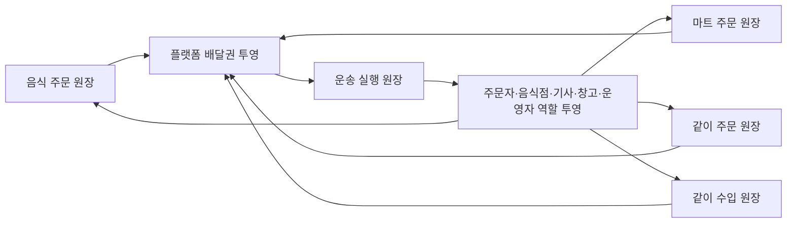

# 플랫폼 앱 완성도 수렴 계획

이 문서는 역할별 앱과 서버 기능이 넓게 구현된 현재 단계에서 화면 수를 더 늘리기보다, `배달권`과 네 가지 주문 원장을 공통 축으로 실제 사용자 여정을 닫는 보완 순서를 정한다.

기본 공개 기준은 계속 [문화교통 0.0 집중 로드맵](v0.0/focus-roadmap.md)이며, 이 문서는 `0.5`부터 최종 목표 `3.5`까지 준비된 capability를 개발·검증하는 계획이다. 기능이 구현되어 있다는 사실만으로 기본 노출이나 운영 효과를 켜지 않는다.

## 이번 점검에서 확인한 기준선

- `OrdererApp`, `RestaurantDeskApp`, `FDriverApp`, `DriverApp`, `WarehouseManagerApp`, `SsalddelApp`, `SsalddelAdmin`에 역할별 화면과 진입점이 이미 존재한다.
- 음식 주문은 주문자 조회·등록, 음식점 조리시간 수락, 음식 배달 기사 업무공간, 제안 수락·거절, 픽업·전달 완료 API까지 세로 흐름의 주요 자산이 있다.
- `플랫폼배달권`, `원장배달권투영`, `원장배달권투영Service`, `운송원장배달권연결Service`와 DB migration이 존재한다.
- 플랫폼 배달권 contract는 고객 업무 원장인 `음식주문`, `마트주문`, `같이주문`, `같이수입`과 실행 원장인 `운송원장`을 구분한다.
- 배차 실행 인덱스는 배달권별 기사·의뢰 후보를 빠르게 찾는 자료이고, 배차 확정 상태는 DB 운송 원장이 담당한다.
- 같이 주문과 음식점 탐색에는 기존 `배송권키` 또는 `deliveryScopeKey`가 남아 있고, 새 플랫폼 배달권 투영은 현재 운송 원장 인계에서 원천 원장으로 거슬러 연결되는 경로가 중심이다.
- `RestaurantDeskApp` 주문 수신함은 알림을 받은 뒤 프로세스 메모리에 보관하는 부분이 있고, `DriverApp`의 일반 상차·하차 일부는 기사 샘플 모델을 사용한다.
- `FDriverApp`의 native 음식 배달 업무와 `DriverApp`의 음식 배달 화면이 같은 서버 업무를 서로 다른 UI로 제공하므로 상태 판단과 Command가 앱마다 갈라지지 않게 해야 한다.
- 일부 화주·관리자 화면에는 명시적 Simulation 또는 sample fallback 자산이 남아 있다. 운영 검증에서는 fallback을 끄고 실제 서버 실패를 드러내야 한다.
- 음식 주문 등록과 음식점 수락 API는 실제 운영 승격 전에 인증, 음식점 소유권, 역할 권한을 action 단위 통합 테스트로 다시 고정해야 한다.

이 기준선은 “앱이 없다”는 상태가 아니라 “기능 자산은 많지만 동일 원장 재조회와 역할 간 인계가 아직 고르게 닫히지 않았다”는 상태다.

## 2026-07-27 · 공통 운송 실행 프로필 적용

P0의 첫 단위로 기존 RDB `운송원장`을 유지하면서 `배차업무유형`과 `원본의뢰유형`에서 다음 실행 프로필을 파생하도록 보강했다.

- 음식점 음식 배달: `음식점 픽업 → 고객 전달`, 조리 상태 필요
- 마트 라스트마일: `포장 상품 픽업 → 주문 전달`, 창고 선행 작업 필요
- 일반 화물: `화물 상차 → 화물 하차`, 화물 제원 필요
- 창고 출고 화물: `출고 화물 상차 → 화물 하차`, 창고 선행 작업과 화물 제원 필요
- 같이 주문 국내 배송: `공동 주문 화물 상차 → 집결지·세대 인계`
- 같이 수입 국내 인계: `보세·창고 화물 상차 → 국내 목적지 인계`

프로필은 DB 상태를 추가로 확정하지 않는 순수 분류 결과다. 일반 기사 추천, 음식 배달 업무공간, `DriverApp`과 `FDriverApp`이 같은 contract를 사용하며 기존 `원본의뢰유형` 직렬화 값은 유지한다.

## 완료를 판단하는 공통 기준

화면 하나가 보이는 것만으로 완료하지 않는다. 한 업무 node는 다음 조건을 모두 만족해야 한다.

1. 앞 단계에서 받은 stable ID와 원장 상태가 분명하다.
2. 상태 변경은 기존 Controller API와 UseCase 또는 Command를 통해 서버가 검증한다.
3. 성공 뒤 같은 stable ID를 다시 조회한다.
4. 주문자·음식점·기사·창고·운영자가 같은 상태를 역할에 맞게 다르게 본다.
5. loading, empty, error, retry, disabled, 만료, 철회 또는 취소 상태를 표현한다.
6. 정확한 주소와 위치는 해당 업무를 수행할 권한과 유효한 상태가 있을 때만 보여 준다.
7. 알림 실패, 앱 종료, 서버 재시작 뒤에도 DB 원장과 Outbox를 기준으로 복구된다.
8. 기능 플래그와 `SsalddelExecution:Mode`가 외부 효과를 통제한다.
9. API·상태 전이 test와 실제 앱 또는 브라우저의 화면 전환 근거를 함께 남긴다.

## 수렴시킬 아키텍처 결정

### 1. 네 가지 주문 원장과 하나의 운송 실행 원장



- 고객이 주문하는 원장은 네 가지다. `운송원장`은 다섯 번째 주문 종류가 아니라 주문 이행을 맡는 실행 원장이다.
- 주문 원장은 생성 또는 배송 조건 확정 시점에 플랫폼 배달권과 직접 연결한다.
- 운송 원장은 원천 주문 원장의 배달권을 이어받되, 픽업 배달권과 배송 배달권을 별도로 기록한다.
- 기존 `배송권키`, `deliveryScopeKey` 직렬화 이름은 호환을 위해 유지하고, 서버 adapter에서 canonical `플랫폼배달권.배달권키`로 해석한다.
- 새 앱별 배달권 모델이나 범용 쓰기 Controller를 만들지 않는다. 기존 주문 UseCase와 운송 인계 UseCase가 `I원장배달권투영Service`를 호출한다.
- 배달권은 수요 집계와 후보 범위다. 자동 참여, 자동 계약, 자동 배차 확정 또는 사용자의 자격 점수로 사용하지 않는다.

### 2. FDriverApp과 DriverApp의 책임

- `FDriverApp`은 음식 배달 기사에게 필요한 native 집중 화면을 맡는다.
- `DriverApp`은 일반 화물·마트·같이 주문·같이 수입 국내 인계까지 포함하는 범용 기사 앱을 맡고, 음식 배달 업무도 운영·검증용 공통 화면으로 제공할 수 있다.
- 제안 목록, 유효기간, 주소 공개 조건, 수락·거절, 픽업·전달 상태 판단은 서버 contract와 공용 client/service에서 한 번만 정의한다.
- 앱마다 별도의 배차 상태 머신이나 로컬 성공 상태를 만들지 않는다. Command 성공 뒤 음식 배달 업무공간 또는 현재 운송을 다시 조회한다.

### 3. 역할별 투영

| 역할 | 기본 표시 | 제한 |
| --- | --- | --- |
| 주문자 | 주문, 조리, 배차, 픽업, 이동, 도착, 전달 완료와 최근 변경 시각 | 기사 식별자와 실시간 정밀 위치 비노출 |
| 음식점 | 주문 상세, 선택 조리시간, 기사 찾기, 기사 수락, 도착 예정, 픽업 인계 | 고객 상세주소는 조리·인계에 필요한 범위만 표시 |
| 기사 | 유효한 추천의 예상 경로·보상·픽업/전달 요약, 수락 뒤 수행 주소 | 추천 만료 또는 권한 상실 뒤 정밀 주소 차단 |
| 창고 | 입고·피킹·포장·기사 인계와 담당 배달권 | 주문자의 불필요한 개인정보 비노출 |
| 운영자 | 후보 부족, 만료, 취소, 재추천, 진행 정체와 감사 이력 | 기사 대신 수락하거나 동의 없이 계약 확정하지 않음 |

## 단계별 보완 순서

### P0. 공통 식별자·권한·배달권 기준 고정

먼저 앱들이 같은 업무를 말하도록 기반을 고정한다.

1. `주문번호 → 원천원장Id → 운송의뢰Id → 제안Id → 운송Id` 상관관계를 contract와 감사 로그에서 추적한다.
2. 네 주문 원장이 배달권과 직접 연결되는 기존 UseCase 지점을 정하고, 운송 생성 전후에 같은 배달권 연결을 재조회한다.
3. 기존 `배송권키`와 플랫폼 배달권 key의 변환·호환 규칙을 한 adapter와 contract test로 고정한다.
4. 음식 주문 등록, 음식점 조회·수락, 기사 제안·진행 API의 인증·소유권·역할 검증을 통합 test로 확인한다.
5. 모든 상태 변경에 멱등 key, 동시성 충돌 결과와 재시도 가능 여부를 명시한다.
6. 역할별 정확한 주소 공개 시점을 계약 test로 고정한다.

완료 기준은 한 주문의 모든 stable ID와 배달권 연결을 운영자 감사 화면 또는 test 결과에서 역추적할 수 있는 것이다.

### P1. 음식 주문 한 건의 폐쇄 루프

현재 가장 많은 자산이 갖춰진 음식 배달을 첫 통합 기준선으로 삼는다.

1. `OrdererApp`: 카테고리·음식점·메뉴 선택, 주문 제출, 주문번호 상세와 상태 timeline을 잇는다.
2. `RestaurantDeskApp`: 서버 기반 주문 수신함을 추가해 앱 재시작 뒤에도 미처리 주문을 복구한다.
3. 음식점 상세에 주문 거절 또는 주문 불가, 조리시간 수정, 조리 시작, 픽업 준비 완료, 기사 인계 완료 상태를 기존 음식 주문 원장에 추가한다.
4. `FDriverApp`: 운행 시작, 위치 heartbeat, 추천 배너, 추천 상세, 수락·거절, 음식점 이동, 픽업, 전달을 같은 업무공간 재조회로 잇는다.
5. `DriverApp`: 음식 배달 공용 화면과 FDriverApp이 같은 client·상태 판정을 사용하는지 고정하고, 일반 화물 샘플 진행과 섞이지 않게 한다.
6. `OrdererApp`과 `RestaurantDeskApp`: 후보 부족, 추천 만료, 기사 수락 취소와 재추천 상태를 표시한다.
7. `SsalddelAdmin`: 음식 주문번호에서 배차대기·추천·운송 진행·알림 Outbox를 한 번에 추적한다.

완료 시나리오는 `주문 제출 → 음식점 수락 → 추천 → 기사 수락 → 픽업 → 전달 → 주문자 수령 확인`이다. 거절·추천 만료·앱 재시작 시나리오도 함께 통과해야 한다.

### P2. 마트 주문과 창고 인계

1. 마트 주문 생성 때 재고 출처와 주문 배달권을 직접 연결한다.
2. 창고 선택은 재고 적합성, 서비스 배달권, 거리·운송비 순으로 설명 가능한 결과를 남긴다.
3. 피킹·포장 완료 Command가 운송 인계 초안을 한 번만 만들도록 멱등성을 고정한다.
4. `WarehouseManagerApp`은 포장 완료, 기사 찾기, 기사 수락, 반출 인계 상태를 표시한다.
5. `OrdererApp`은 피킹, 포장, 기사 인계, 배송, 품목별 취소 가능 시점을 주문 상세에서 보여 준다.
6. `DriverApp`은 마트 배송을 음식 배달과 구분해 상품 수, 냉장·냉동, 수령 증빙 조건을 표시한다.

완료 시나리오는 `마트 주문 → 재고 예약 → 피킹 → 포장 → 기사 인계 → 배송 완료`다.

### P3. 같이 주문과 같이 수입의 국내 인계

1. 같이 주문은 참여자의 개별 주소가 아니라 공개 가능한 집결 배달권을 먼저 사용한다.
2. 모집 원장의 수량·박스·중량 합계와 집결 방식을 배달권별로 다시 계산한다.
3. 직접 배분, 기사 세대 배송, 3PL 입고를 명시적 투표·결정 상태로 분리한다.
4. 같이 수입은 FCL/LCL 판단, 선적·통관 문서와 국내 인계 배달권을 같은 원장 stable ID로 연결한다.
5. 통관 완료 뒤 창고 입고 또는 국내 운송 의뢰 생성은 명시적 인계 Command로 실행한다.
6. 주문자 집단 화면은 세대별 수령·미수령·파손·추가 비용을 확인하고 원장 합계와 일치시킨다.

완료 시나리오는 `배달권별 모집 → 집단 결정 → 국내 인계 → 창고 또는 기사 수행 → 참여자 수령 확인`이다.

### P4. 운영·예외·정산 수렴

1. 운영 보드는 음식·마트·같이 주문·같이 수입 원천 유형을 유지한 채 같은 운송 실행 상태로 묶는다.
2. 후보 없음, 추천 만료, 중복 수락, 수락 취소, 픽업 지연, 전달 실패와 장기 정체를 각각 다른 복구 사유로 표시한다.
3. 관리자 수동 조치는 사유, 수행자, 전후 상태와 원장 ID를 감사 로그로 남긴다.
4. 알림은 Outbox 재처리로 복구하고 앱 polling은 누락 보정 수단으로만 사용한다.
5. 증빙·문서·정산은 운송 완료 Event를 기준으로 후보를 만들고, 운영 승인 전 실제 지급을 실행하지 않는다.
6. AdminData 메모리 fallback과 화주 sample fallback은 운영 검증 profile에서 비활성으로 고정한다.

### P5. 릴리즈 게이트와 실제 화면 검증

1. 각 세로 흐름을 `Simulation` profile에서 실제 DB, 인증, Outbox, 서버 재시작과 함께 검증한다.
2. Orderer Android, RestaurantDesk Windows, FDriver Android, Driver Android, WarehouseManager, Admin과 Web의 대표 화면을 실제 실행한다.
3. Figma 화면에는 각 버튼 이름, 다음 route 또는 상태, 실패 분기와 역할 인계를 표시하고 실제 앱과 대조한다.
4. 모바일 네트워크 중단, 중복 탭, 앱 종료, 알림 누락, 위치 권한 거절, 제안 만료를 확인한다.
5. `Fast → Task → Release` 검증과 `Ssalddel.v3.5.slnx` 조립을 통과한다.
6. 운영 전환은 허가·보험·약관·개인정보·결제·정산·외부 지도와 알림 자격 증명을 별도로 확인한 뒤 승인한다.

## 앱별 우선 보완표

| 앱 | 활용할 기존 자산 | 다음 보완 |
| --- | --- | --- |
| `OrdererApp` | 음식·마트·같이 주문·같이 수입·주문 내역 route | 네 원장 상세의 공통 상태 timeline, 취소·이의·수령 확인, 배달권 연결 근거 |
| `RestaurantDeskApp` | 주문 알림, 주문 상세, 조리시간 수락·설정, 전표 | 서버 기반 수신함 복구, 거절·조리·픽업 준비·기사 인계 상태 |
| `FDriverApp` | native 로그인, 운행 시작, 위치 heartbeat, 음식 배달 업무공간 | 지도 중심 추천 배너·상세·진행 UX, 오프라인·만료·재조회, Driver 공통 상태 사용 |
| `DriverApp` | 운행, 추천, 결정, 음식 배달, 현재 운송, 상차·하차, 정산 | 샘플 기반 일반 운송 진행 제거, 원천 유형별 책임·증빙, FDriver와 contract 수렴 |
| `WarehouseManagerApp` | 입고·검수·스캔·피킹·포장·출고·마트 작업 | 배달권 기반 창고 선택 근거, 포장 완료→운송 인계, 예외·부분 처리 |
| `SsalddelApp` | 화주 운송·창고·판매·수입 계획 | sample fallback 없는 영속 조회·작성·인계, 운송 완료와 증빙 재조회 |
| `SsalddelAdmin` | 음식 운영, 배차 대기, AI 검토, 운송·문서·정산 | 원천 원장→배달권→운송→알림의 통합 추적, 예외 복구와 감사 |

## 구현 단위와 검증 방식

한 번에 한 세로 slice만 변경한다. 앱별로 따로 완료하지 않는다.

```text
Contract
→ 기존 Controller API
→ UseCase/Command
→ 원장·배달권 투영·Event/Outbox
→ 역할별 공용 read model
→ 각 앱 adapter
→ 실제 화면 전환
→ 같은 stable ID 재조회
```

각 slice에는 다음 검증을 붙인다.

- contract 호환성과 legacy key 변환 test
- 역할·소유권·정확한 주소 비노출 test
- 상태 전이, 중복 Command와 동시성 test
- 원장 저장·Event·Outbox 재처리와 서버 재시작 test
- 역할별 client가 같은 원장 상태를 보는 통합 test
- loading, empty, error, retry, 만료와 취소 화면 test
- 실제 앱 또는 브라우저 capture와 Figma route 대조

## 바로 시작할 첫 작업

첫 세로 slice는 **음식 주문 한 건의 서버 기반 폐쇄 루프**로 한다.

1. 음식 주문 stable ID와 현재 배달권 투영을 조회한다.
2. `RestaurantDeskApp` 수신함을 서버에서 복구할 수 있게 한다.
3. 음식점 수락 뒤 생성된 배차대기와 기사 제안을 같은 주문번호로 추적한다.
4. `FDriverApp` 수락·픽업·전달 뒤 업무공간을 재조회한다.
5. 주문자와 음식점 화면이 같은 변경 상태를 확인한다.
6. 운영자 화면에서 실패·만료·재추천을 복구한다.

이 한 건이 닫힌 뒤 같은 패턴을 마트, 같이 주문, 같이 수입 순으로 확장한다. 새로운 대형 엔진이나 앱별 원장을 먼저 만들지 않는다.

## 함께 보는 기준 문서

- [통합 구축 로드맵](integrated-build-roadmap.md)
- [워크플로우 앱 화면 지도](../ProjectOverview/workflow-app-screen-map.md)
- [전체 로드맵 조화형 페이지 원칙](../Architecture/WholeRoadmapPagePrinciple.md)
- [배차 큐와 DB 원장 책임 경계](../Architecture/DispatchQueueResponsibility.md)
- [기능 플래그 정책](feature-flags.md)
- [릴리즈 게이트](release-gates.md)
