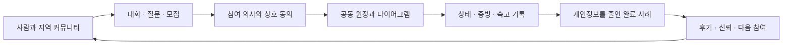

# Hongdal 0.0

## 목표

사람들이 먼저 모여 대화하고 서로를 알아가며, 함께 하려는 일을 공동 원장과 다이어그램으로 정리할 수 있는 커뮤니티 기반을 독립적으로 안정화합니다.

0.0은 국내 화물/용달의 축소판이 아닙니다. 게시글과 댓글, 참여와 합의, 신고와 차단, 개인정보 공개 동의, 원장과 다이어그램, 완료 사례와 신뢰 기록이 자체적으로 이어지는 첫 제품입니다.

## 제품 원칙

1. 커뮤니티는 모든 업무 모듈의 시작점이며 특정 물류 버전의 부가 화면이 아닙니다.
2. 원장은 당사자의 합의를 대신하지 않고, 합의한 일의 상태와 근거를 함께 기록합니다.
3. 신뢰는 별점 하나가 아니라 참여 이력, 공개 가능한 활동 신호, 후기, 신고 처리와 숙고 과정으로 쌓습니다.
4. 연락처와 위치는 상호 동의와 최소 공개 원칙을 따릅니다.
5. 국내 화물/용달 1.0은 0.0 기반을 통과한 뒤 여는 첫 실행 모듈입니다.

## 포함 범위

- 통합 커뮤니티 홈, 게시판, 게시글, 댓글과 첨부
- 질문, 제안, 모집, 투표와 결의 초안
- 참여자, 역할, 상태와 관계를 보여 주는 공동 원장·다이어그램
- 원장별 대화와 공개 범위, 서명·숙고·이의 기록
- 신고, 차단, 운영자 고정·숨김·감사 기록
- 개인정보 최소 공개와 연락 정보 상호 동의
- 키워드 구독·알림과 개인정보를 줄인 활동 신호
- 완료된 원장의 익명화 사례 게시와 재사용 가능한 절차 안내
- 생산자와 공동구매 대표의 직접 연락·협상 뼈대
- 기사 운행 가능 상태의 구 단위 공개와 개별 문의 뼈대

## 보류 범위

- 플랫폼이 특정 기사나 거래 상대를 선정·배정하는 기능
- 실제 운임·주선료·플랫폼 이용료의 수취·보관·분배
- 실제 카드 승인, 환불, 기사 지급과 세금 정산
- 국내 화물/용달의 상차·하차·POD 운영 흐름
- 창고, 통관, 해외 공동주문, 음식 배달과 마트 실행 모듈

## 다음 버전과의 관계

0.0은 혼자 실행되고 검증될 수 있어야 합니다. 1.0 국내 화물/용달은 0.0의 계정, 커뮤니티, 원장, 동의, 신고, 신뢰 기록을 재사용하지만 0.0은 운송 API나 기사 앱이 없어도 동작해야 합니다.

구현 순서는 [0.0 집중 로드맵](./focus-roadmap.md)을 따릅니다. 국내 공동구매 대표와 생산자의 직접 선택·협의·원장·완료 사례를 대표 파일럿으로 먼저 완성하고, 운송 주선·배차는 면허 취득 경로가 구체화될 때까지 현재 범위에서 제외합니다.

상세 운영 경계는 [커뮤니티 0.0 기반 제품 원칙](../../Architecture/CommunityFoundationV0Policy.md)을 따릅니다.
