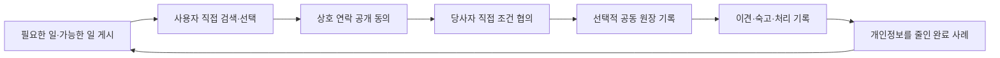

# Hongdal 0.0 집중 로드맵

이 문서는 현재 개발 순서를 정하는 단일 기준입니다. 면허 취득 경로와 운송 주선 운영 주체가 구체화될 때까지 **정보 공개형 커뮤니티 0.0만 현재 릴리즈 범위로 봅니다.**

1.0 이후 코드는 미래 자산으로 보존하지만 기본 노출을 끄고, 0.0 완료에 직접 도움이 되지 않는 확장은 중단합니다.

## 한 줄 목표

> 사용자가 필요한 일과 가능한 일을 공개하고, 직접 상대를 찾아 선택하며, 상호 동의로 연락하고, 합의한 진행 과정을 공동 원장으로 기록하는 커뮤니티를 완성합니다.

이 목표는 [이웃에서 시작하는 공동행동 개발 철학](../../Architecture/NeighborCenteredDevelopmentPhilosophy.md)에 따라, 가까운 필요를 자발적으로 돌보고 자신이 감당할 약속에서 시작한 신뢰를 더 넓은 공동체로 확장하는 순서로 구현합니다.



## 0.0 운영 경계

홍달은 정보를 게시·검색·기록할 도구를 제공하지만 거래 상대를 선택하거나 운송을 성사시키지 않습니다.

| 홍달이 제공 | 사용자가 직접 수행 |
| --- | --- |
| 게시글, 검색과 중립적 필터 | 상대방 탐색과 선택 |
| 관심 표시와 연락 요청 전달 | 연락처 공개 동의 |
| 공동 원장과 다이어그램 | 가격·일정·계약 조건 협의 |
| 신고·차단·숙고·후기 기록 | 자격·보험·거래 조건 확인 |
| 개인정보를 줄인 완료 사례 | 계약과 대금 처리 |

0.0에서는 다음 기능을 제공하지 않습니다.

- 특정 기사나 거래 상대 추천·순위·자동 선별
- 성사 가능성이나 적합성에 따른 우선 노출
- 플랫폼의 운임 제안·협상·계약 대리
- 자동 배차, 배차 확정과 운송계약 체결
- 운임·주선료·성사 수수료 수취
- 결제 보관, 기사 지급과 정산

안내문에 정보 게시판이라고 쓰는 것만으로 운영 경계가 지켜지는 것은 아닙니다. 실제 정렬, 알림, 수익과 계약 흐름도 위 원칙을 따라야 합니다.

## 기준 실행 설정

```text
CommunityTrustWorkflow=true
DomesticTransportWorkflow=false
CargoYongdalV1=false
WarehouseV15=false
CustomsHsV20=false
OrdererGroupOrderV25=false
FoodDeliveryV30=false
HongdalMartV35=false
```

운송·창고·통관·음식·마트 앱이나 데이터가 없어도 0.0이 독립적으로 실행되고 검증되어야 합니다.

## 현재 진행 순서

| 순서 | 단계 | 목표 | 완료 판단 |
| --- | --- | --- | --- |
| 1 | `0.0-A` 독립 실행 | 후속 모듈 없이 커뮤니티만 실행 | 메뉴·API·테스트에서 후속 기능이 차단됨 |
| 2 | `0.0-B` 커뮤니티 기본 영속화 | 게시글·댓글·모집·투표·대화 저장 | 재시작 뒤에도 동일한 데이터를 조회함 |
| 3 | `0.0-C` 국내 공동구매 대표 파일럿 | 대표와 생산자의 직접 협의 기록 | 연락·제안·협상·이행 초안이 영속 저장됨 |
| 4 | `0.0-D` 원장 폐쇄 루프 | 합의부터 숙고·완료 사례까지 연결 | 한 사용자 여정이 중복 없이 끝까지 이어짐 |
| 5 | `0.0-E` 개인정보·안전·운영 | 동의·신고·차단·속도 제한·복구 | 운영 체크리스트와 기기 검증을 통과함 |

## 코드 모듈 메타데이터

커뮤니티 0.0의 대표 진입점에는 `[HongdalCommunityV0Module]`을 붙인다. 이 특성은 `ProductVersion=0.0`, `CommunityTrustWorkflow`, 기본 활성 상태와 로드맵 단계를 함께 기록한다. 특성 자체가 기능을 활성화하지 않으며 실제 노출은 기능 플래그, 권한 검사와 `HongdalExecution:Mode`를 따른다.

| ModuleKey | 주 단계 | 관리 범위 |
| --- | --- | --- |
| `community-v0-ui` | `0.0-A`, `0.0-B` | 커뮤니티 UI 조립, 홈, 게시판별 글 목록과 글쓰기 |
| `community-v0-content` | `0.0-B` | 게시판, 게시글, 댓글, 첨부, 신고와 예약 발행 |
| `community-v0-participation` | `0.0-C`, `0.0-D` | 비구속 투표, 참여 의사, 결의문과 원장·다이어그램 대화 |
| `community-v0-ledger` | `0.0-D` | Mongo 공동 원장, 변경 Event와 개인정보를 줄인 완료 사례 환류 |
| `community-v0-safety` | `0.0-E` | 서버 쓰기 정책, 명시적 키워드 구독과 재시도 가능한 알림 |
| `community-v0-authoring` | `0.0-B` | 운영자 자료 검토, AI 보조 글·다이어그램·이미지와 예약 발행 |

다음 검색으로 0.0 모듈의 API, UseCase, 저장소, ViewModel과 운영 경계를 한 번에 찾을 수 있다.

```powershell
rg -n "HongdalCommunityV0Module\(" Hongdal Hongdal.Ui.Common
```

## 0.0-A. 독립 실행

- 커뮤니티 홈, 게시글, 댓글, 모집, 투표, 대화와 공동 원장 API를 확인합니다.
- 1.0 이후 메뉴는 0.0 기본 사용자에게 보이지 않게 합니다.
- 1.0 이후 API는 기능 플래그가 꺼져 있을 때 실행되지 않게 합니다.
- 0.0 전용 통합 테스트에서 운송 서비스와 기사 앱을 요구하지 않게 합니다.

이 단계가 끝나기 전에는 후속 버전의 새 기능을 확장하지 않습니다.

## 0.0-B. 커뮤니티 기본 영속화

다음 데이터가 서버 재시작 뒤에도 유지되어야 합니다.

1. 사용자 프로필과 공개 범위
2. 게시판, 게시글, 댓글, 첨부와 추천
3. 모집, 참여 의사, 투표와 변경 이력
4. 원장별 대화와 선택적 증빙
5. 키워드 구독, 알림과 신고 처리 상태

샘플 데이터 fallback은 개발 환경에서만 허용하고, 운영 검증에서는 저장 실패를 샘플 데이터로 덮지 않습니다.

## 0.0-C. 국내 공동구매 대표 파일럿

국내 공동구매는 0.0에서 사람과 사람의 직접 협의를 검증하는 첫 대표 시나리오입니다. 홍달이 생산자나 대표자를 추천하지 않고, 사용자가 게시글과 검색 결과를 보고 직접 선택합니다.

먼저 영속화할 데이터는 다음과 같습니다.

1. 공동구매 대표가 생산자에게 보내는 연락 요청
2. 생산자가 대표에게 보내는 공급 제안
3. 포장 규격, 가능 물량, 일정, 가격 조건과 변경 이력
4. 양쪽의 연락처 공개 동의와 철회 이력
5. 합의된 발주·집하·직송·거점·3PL 사용 초안
6. 각 원장 블록의 주담당자, 협업자와 검토자

거점·3PL은 사용자가 입력하고 선택한 조건을 기록하는 수준으로 제한합니다. 플랫폼이 업체나 운송 경로를 자동 선정하지 않습니다.

## 0.0-D. 하나의 폐쇄된 사용자 여정

첫 발표와 파일럿에서는 아래 흐름 하나를 끝까지 보여 줍니다.

1. 공동구매 대표가 품목, 수량, 포장 규격과 희망 일정을 게시합니다.
2. 생산자가 공급 가능 물량과 조건을 제안합니다.
3. 양측이 연락 정보 공개에 동의하고 직접 조건을 조정합니다.
4. 공개 범위 안에서 다른 참여자도 합의 과정과 변경 이력을 확인합니다.
5. 합의되면 주문 원장과 담당 블록을 만듭니다.
6. 문제가 생기면 원장 대화에서 이견, 숙고, 결정과 후속 담당자를 기록합니다.
7. 완료되면 개인정보를 줄인 사례 글과 다이어그램을 중복 없이 게시합니다.
8. 사례 글에서 같은 절차의 새 모집 또는 원장을 시작합니다.

기사 운행 가능 상태와 개별 문의는 이 흐름 이후의 제한 파일럿입니다. 기사도 단순히 가능한 지역·시간을 게시하고 사용자가 직접 선택하며, 홍달은 운송 요청을 추천하거나 배정하지 않습니다.

## 0.0-E. 개인정보와 운영 안정화

- 모든 쓰기 API의 인증과 참여자 권한을 확인합니다.
- 연락처·상세 주소·정확한 GPS는 상호 동의와 필요한 단계에서만 공개합니다.
- 동의 문구 버전, 시각, 철회와 재동의 이력을 저장합니다.
- 신고·차단·운영자 조치·이의 처리 이력을 감사할 수 있게 남깁니다.
- 스팸, 반복 연락 요청과 악성 사용을 제한하는 속도 제한을 적용합니다.
- 원장 완료 이벤트와 알림 발송은 재시도되어도 결과가 하나만 남게 합니다.
- DB 마이그레이션, 백업·복구, 오류 로그와 운영 알림을 검증합니다.
- Web과 모바일에서 핵심 화면과 푸시 딥링크를 확인합니다.

## 0.0 릴리즈 게이트

- [ ] [0.0 릴리즈 체크리스트](./checklist.md)를 통과했습니다.
- [ ] 0.0 범위의 사용자 생성 데이터가 재시작 뒤에도 유지됩니다.
- [ ] 게시부터 직접 선택·상호 동의·원장·숙고·완료 사례까지 E2E 시나리오가 통과합니다.
- [ ] 정확한 위치와 연락처가 동의 없이 공개되지 않습니다.
- [ ] 특정 상대 추천·순위·자동 배차 기능이 기본 화면과 API에 없습니다.
- [ ] 운임·주선료·성사 수수료·결제·정산 기능이 비활성입니다.
- [ ] 신고·차단·속도 제한과 운영자 감사 기록을 확인했습니다.
- [ ] DB 마이그레이션과 백업·복구 절차가 기록되어 있습니다.

## 1.0 이후 기능의 처리

1.0 이후 코드를 삭제하지 않습니다. 다만 현재 개발 집중 대상과 운영 노출에서 제외합니다.

| 기능 | 현재 처리 |
| --- | --- |
| 기사 추천, 자동 배차와 운송 의뢰 확정 | 기능 플래그 뒤에서 보존, 확장 중단 |
| 차량 적재 추천과 혼적 순서 | 테스트 자산으로 보존, 0.0 작업에서 제외 |
| 운임·주선료·결제·정산 | 운영 비활성 |
| 공동수입 HS 코드·관세사·해외 통관 | 해당 후속 버전 플래그 뒤에서 보존 |
| 창고, 음식점 배달, 알뜰살뜰 마트 | 각 후속 버전의 미래 자산으로 보존 |

1.0을 다시 현재 계획으로 올리는 판단은 다음 조건이 생긴 뒤 별도로 합니다.

- 운송주선사업 또는 사업모델에 맞는 허가 취득 경로가 구체화됨
- 운영 법인, 관할관청 사전 협의와 보험·약관 준비가 시작됨
- 정보 게시판과 면허 기반 주선 공간의 계약·수익·책임 경계가 서면으로 정리됨
- 사용자가 0.0 완료 뒤 1.0 개발 재개를 결정함

위 조건이 생기기 전에는 1.0 출시 일정이나 실배차 기능을 0.0 작업과 섞지 않습니다.

## 다음 작업을 고르는 규칙

1. 0.0 체크리스트의 미완료 항목을 닫는가?
2. 사용자의 직접 게시·검색·선택·연락 동의 흐름을 완성하는가?
3. 국내 공동구매 대표 시나리오를 실제 영속 데이터로 연결하는가?
4. 개인정보, 신뢰 또는 운영 안전성을 높이는가?
5. 이익과 효율뿐 아니라 참여자의 노동, 위험, 철회 가능성과 영향을 함께 드러내는가?
6. 위 다섯 가지가 아니면 현재 백로그로 보냅니다.

작업 묶음은 가능한 한 다음 크기로 유지합니다.

1. 0.0 독립 실행 회귀 테스트
2. 커뮤니티 또는 공동구매 저장소 하나의 영속화와 테스트
3. 상호 동의·철회 또는 신고·차단 같은 안전 기능 하나
4. 대표 E2E 시나리오 한 구간
5. 모바일·Web 검증 한 구간

## 함께 보는 문서

- [0.0 목표](./README.md)
- [0.0 범위](./scope.md)
- [0.0 체크리스트](./checklist.md)
- [0.0 마이그레이션 기록](./migration-notes.md)
- [릴리즈 게이트](../release-gates.md)
- [기능 플래그 정책](../feature-flags.md)
- [이웃에서 시작하는 공동행동 개발 철학](../../Architecture/NeighborCenteredDevelopmentPhilosophy.md)
- [커뮤니티 0.0 기반 제품 원칙](../../Architecture/CommunityFoundationV0Policy.md)
