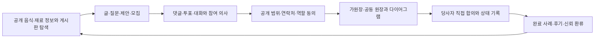

# 문화교통 0.0 집중 로드맵

현재 제품 개발과 기본 배포의 집중 범위는 **문화교통 0.0 커뮤니티·공공데이터 기반**입니다.

0.5 이후 코드는 삭제하지 않습니다. 다만 0.0 독립 실행과 release gate를 닫기 전에는 후속 버전 기능을 기본 노출하거나 새로운 외부 효과를 확장하지 않습니다.

## 제품 순서

```text
문화교통 0.0 커뮤니티·공공데이터 기반 ← 현재 집중
  → 문화교통 0.5 개별주문·개별 원장
  → 문화교통 1.0 같이 주문·주문자 집단화
  → 문화교통 1.5 공급·가격·무역 준비
  → 2.0 국내 화물·운송 이행
  → 2.5 창고·판매 이행
  → 3.0 음식점 배달
  → 3.5 마트·도심 물류
```

## 한 줄 목표

> 누구나 출처가 있는 음식·재료 정보를 둘러보고 대화에 참여하며, 명시적 동의가 있을 때만 가원장·공동 원장과 다이어그램으로 함께할 일을 기록하고, 완료 경험을 개인정보를 줄인 사례와 신뢰 기록으로 다시 커뮤니티에 돌려보냅니다.

## 대표 사용자 여정



플랫폼은 상대를 자동 선정하거나 계약을 대신 확정하지 않습니다. 관심, 참여, 연락처 공개, 가원장, 실원장과 실행은 서로 분리된 동의 상태로 관리합니다.

## 0.0-A 독립 실행

목표는 후속 업무 module 없이 01 Community가 자체 제품으로 동작하는 것입니다.

- `CommunityTrustWorkflow=true`
- `GroupPurchasePracticeWorkflow=false`
- `GroupPurchaseDemandWorkflow=false`
- `CustomsAndTradeDataWorkflow=false`
- 운송·창고·판매·음식·마트 Feature 모두 `false`
- 커뮤니티 홈, 게시판 디렉터리, 공개 정보와 인증 진입이 후속 API 없이 동작
- 01~05 앱에서 커뮤니티 모드로 돌아와 같은 공개 정보를 탐색
- loading, empty, error, retry와 모바일 navigation 제공

완료 판단은 0.5 이상의 API가 `404 FeatureDisabled`를 반환하는 환경에서도 0.0 대표 여정의 시작 화면과 조회가 정상 동작하는 것입니다.

## 0.0-B 영속 커뮤니티

목표는 게시글과 참여가 sample fallback이나 process memory에 머물지 않게 하는 것입니다.

- 게시글·댓글·첨부·추천·조회와 검색을 server 저장소에 기록
- 재시작과 새로고침 뒤 같은 stable ID로 재조회
- 모집·투표·대화의 변경 이력과 작성자 책임 범위 표시
- 공공데이터에 출처, 기준 시각, 단위, 지역, 갱신 주기와 제한 표시
- 게시판별로 등록된 공공·공식 데이터 source를 schedule에 따라 수집·작성하고 같은 source·기간의 글은 중복 발행하지 않음
- 자동 작성은 canonical 주기 데이터 게시판에 한 번만 저장하고 관련 게시판에는 복제 대신 안내 link를 표시
- 외부 수집과 자동 발행은 source별 운영 설정으로 명시적으로 활성화하며 검증된 데이터가 없으면 빈 글을 만들지 않음
- 저장 실패를 sample 성공으로 숨기지 않고 오류와 재시도 제공

등록 범위는 다음과 같습니다.

| canonical 게시판 | 공공·공식 source | 주기 작성 module |
| --- | --- | --- |
| KAMIS 농수산물 가격 누적 | 한국농수산식품유통공사 가격 관측 | 일별 수집 성공 뒤 가격 요약 작성 |
| MFDS 수입식품 제조업소 근거 | 식약처 수입식품 표시사항·해외제조업소 | 주별 근거 수집 뒤 중국 권역·미국 주별 월간 요약 작성 |
| USDA 미국 생산자가격 누적 | USDA NASS 생산자 수취가격 | 월별 수집 성공 뒤 가격 요약 작성 |
| 관세청 품목·국가별 수입단가 | 관세청 수입 평균단가 | 현재는 요청 시 조회만 허용하며 자동 게시 source를 등록하지 않음 |

각 module은 source key와 기간 key로 같은 글의 재실행을 식별합니다. 운영 환경은 필요한 외부 API credential을 갖춘 뒤 source별 활성화 설정을 명시적으로 켜며, 기본 설정에서는 외부 수집과 자동 발행 schedule을 등록하지 않습니다.

## 0.0-C 직접 협의 파일럿

`0.0-C`의 기존 metadata 이름인 `DomesticGroupPurchasePilot`은 호환을 위해 유지합니다. 이 단계는 0.5 개별주문이나 1.0 서버 집단화를 여는 단계가 아니라, 커뮤니티에서 당사자가 직접 선택하고 협의하는 제한된 공동행동 파일럿입니다.

- 글·모집에서 비구속적 참여 의사와 필요한 역할을 표시
- 비용, 노동, 위험, 담당자와 미정 조건을 함께 공개
- 연락 정보는 상호 동의 뒤 필요한 범위만 공개
- 생산자·대표·전문가 역할은 지원·문의 기회로 표시하고 자동 배정하지 않음
- 주문, 결제, 계약, 수입 신고, 배차와 정산을 생성하지 않음

## 0.0-D 원장 폐쇄 루프

목표는 대화가 기록 가능한 공동행동으로 이어지고 다시 커뮤니티에 환류되는 한 바퀴를 닫는 것입니다.

- 게시글·대화에서 가원장 또는 공동 원장 생성
- 참여자, 역할, 상태, 관계, 공개 범위와 선택적 증빙을 다이어그램과 일치시킴
- 상태 전이 성공 뒤 같은 원장을 다시 조회
- 원장 Event와 투영을 멱등하게 재처리하고 순환 발행을 막음
- 완료 원장을 중복 없이 개인정보를 줄인 비공개 사례 초안으로 만들고, 사용자가 공개 범위를 확인해 동의한 경우에만 게시
- 업무 관계를 당사자만 친구 후보 기록으로 확인하고, 친구 요청·수락·연락처 공개를 각각 별도 동의로 처리
- 사례에서 같은 절차의 새 대화·모집·원장을 시작

## 0.0-E 안전과 운영

목표는 공개 커뮤니티를 실제로 관리하고 복구할 수 있게 하는 것입니다.

- 신고, 차단, 운영자 숨김·고정과 이의 처리의 감사 기록
- 스팸·반복 요청·악성 사용에 대한 rate limit과 운영 정책
- 개인정보 수집·이용·공개 동의, 철회, 보유기간과 삭제 경로
- 주소·연락처·정확한 위치·계정 식별자의 공개 응답 차단
- DB migration, backup·restore, 오류 관측과 운영 알림 검증
- Android, iOS와 Web의 게시판·글쓰기·원장·deep link 핵심 경로 확인

## 0.0 release gate

- [ ] 후속 Feature가 모두 꺼진 상태에서 커뮤니티 홈·게시판·공공데이터가 동작합니다.
- [ ] 게시글·댓글·첨부·추천·투표·대화가 영속 저장되고 같은 ID로 재조회됩니다.
- [ ] 참여·연락처·가원장·실원장 동의가 분리되고 철회 이력이 남습니다.
- [ ] 업무 로그·친구 후보 기록·친구 요청·수락·연락처 공개가 분리되고 자동 친구 관계가 만들어지지 않습니다.
- [ ] 대화에서 공동 원장과 다이어그램을 만들고 완료 사례까지 한 바퀴가 이어집니다.
- [ ] 공공데이터의 출처·시각·단위·지역과 제한이 화면과 API에 표시됩니다.
- [ ] 주기 데이터 게시판의 등록 source가 schedule과 연결되고 같은 기간의 재실행이 중복 글을 만들지 않습니다.
- [ ] 신고·차단·운영 조치·rate limit과 개인정보 삭제 경로가 검증됩니다.
- [ ] 모바일과 Web에서 핵심 경로의 loading·empty·error·retry 상태를 확인합니다.
- [ ] 0.5 이후 Feature는 기본 비활성이고 0.0 경로가 후속 API에 의존하지 않습니다.

상세 판정 항목은 [0.0 release checklist](checklist.md)를 기준으로 합니다.

## 후속 버전 정리

| 버전 | 0.0 집중 기간의 처리 |
| --- | --- |
| `0.5` | 개별주문 의향과 본인 소유 개별 원장 코드를 보존하되 기본 Feature를 끄고 0.0의 공동 원장 초안과 구분 |
| `1.0` | 같이 주문 연습·동의한 개별주문 집단화·모집 코드를 보존하되 기본 Feature를 끄고 0.0-C 직접 협의와 섞지 않음 |
| `1.5` | 공급자·견적·원가·HS·HTS·수입 준비 자산을 보존하고 전문 검토와 외부 신고를 열지 않음 |
| `2.0` | 운송 의뢰·기사·배차·증빙 자산을 보존하되 유상 주선·자동 배차·운임 수취를 열지 않음 |
| `2.5` | 입고·재고·피킹·판매채널 자산을 보존하되 실제 보관·출고·판매 동기화를 기본 실행하지 않음 |
| `3.0`·`3.5` | 음식점 배달과 마트·도심 물류를 독립 capability로 계속 구현하되, 준비 전에는 0.0 기본 공개 화면과 정책에 혼합하지 않음 |

후속 버전 전용 검증은 명시적인 compose override나 test profile에서 수행합니다. 기본 개발과 배포 구성은 0.0만 엽니다.

## 다음 작업을 고르는 규칙

1. 공개 정보 탐색, 글쓰기와 참여의 끊김을 줄이는가?
2. 게시글·대화·원장의 영속성, 재조회와 멱등성을 높이는가?
3. 동의·개인정보·신고·운영 안전을 강화하는가?
4. 공동 원장과 완료 사례의 폐쇄 루프를 닫는가?
5. 함께한 업무 경험을 자동 공개·자동 친구 관계로 바꾸지 않으면서 사용자가 원할 때 친구 요청으로 이어 주는가?
6. 공공데이터의 출처와 한계를 더 정확히 보여 주는가?
7. 위 여섯 가지가 아니면 후속 버전 backlog로 분류합니다.

## 함께 보는 문서

- [문화교통 0.0](README.md)
- [0.0 scope](scope.md)
- [0.0 release checklist](checklist.md)
- [커뮤니티 0.0 기반 제품 원칙](../../Architecture/CommunityFoundationV0Policy.md)
- [업무 경험에서 친구 요청으로 이어지는 커뮤니티 설계 기준](../../Architecture/FriendRequestCommunityDesignStandard.md)
- [통합 클라이언트 3단계 navigation](../../Architecture/ThreeStageClientNavigation.md)
- [Feature flag 정책](../feature-flags.md)
- [Release gates](../release-gates.md)
