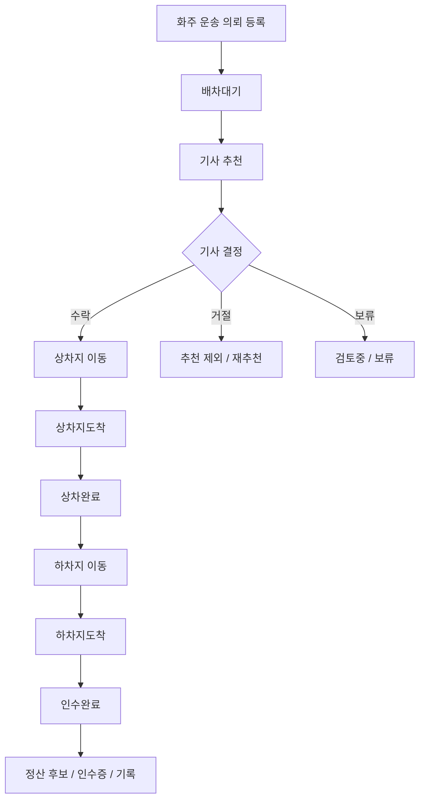

# Hongdal 1.0

## 목표

국내 화물/용달 운송에서 화주, 용달기사, 수령자 사이의 운송 정보를 안정적으로 연결합니다.

## 현재 집중 원칙

1.0은 지금 당장 릴리즈해야 할 최소 운영 버전입니다. 확장 기능을 계속 기록하더라도, 실제 구현 우선순위는 화주-용달기사-수령자 사이의 국내 운송 정보 흐름을 닫는 데 둡니다.

| 판단 질문 | 1.0 처리 |
| --- | --- |
| 화주 의뢰, 기사 배차, 상차/하차, 수령자 인수, 결제/정산 기본에 직접 필요한가 | 1.0 우선 작업 |
| 운송 완료 후 증빙, 인수증, 정산 후보를 더 명확하게 남기는가 | 1.0 우선 작업 |
| 음식 배달, 홍달마트, 창고 고도화, 통관, 공동 주문처럼 확장 축인가 | 문서화하고 기본 비활성 |
| 커뮤니티 기능이 업무 흐름을 보조하는 수준을 넘는가 | 1.0에서는 보류 또는 숨김 |

## 포함 범위

| 영역 | 내용 |
| --- | --- |
| 화주 | 운송 의뢰 등록, 상차/하차 정보, 화물 정보, 결제 조건 |
| 용달기사 | 추천 운송, 수락/거절/보류, 상차/하차 완료, 사진 증빙 |
| 수령자 | 하차 예정 정보, 인수 확인, 결제/인수증 관련 정보 |
| 커뮤니티 | 운송 경험, 문의, 후기, 신뢰 기록을 보조 모드로 제공 |
| 관리자 | 배차, 결제, 노출, 기본 설정 확인 |

## 보류 범위

- 음식 배달 실운영
- 홍달마트 실운영
- 해외 통관 자동화
- HS 데이터 유료 공유
- 창고 고도화 운영

## 우선 앱/모듈

- `ShipperApp`
- `DriverApp`
- `HongdalAdmin`
- `CargoYongdalDispatchEngine`
- `Hongdal.Contracts`
- `Hongdal.Domain`

## 필수 화면 기준

1.0 워크플로우를 성립시키기 위해 반드시 필요한 화면은 [홍달 1.0 필수 페이지 기준](../../ProjectOverview/hongdal-v1-required-pages.md)에 둡니다. 이 기준은 화주 의뢰 상세/타임라인, 기사 지도 홈/추천/상차/하차, 관리자 배차대기/운송 상세/증빙/정산 화면을 중심으로 봅니다.

## 안정화 기준

- 화주 의뢰가 생성되고 기사 추천/수락/거절 흐름으로 이어진다.
- 기사 앱에서 상차/하차 정보와 증빙 흐름을 확인할 수 있다.
- 수령자에게 필요한 하차/인수/결제 정보가 과도하지 않게 전달된다.
- 커뮤니티 모드는 업무 흐름을 방해하지 않고 보조 정보로 동작한다.

## 1.0 핵심 상태 흐름

1.0에서는 국내 화물/용달 운송의 상태명을 먼저 고정합니다. 이후 버전의 창고, 통관, 공동 주문, 홍달마트 기능은 이 흐름을 보조하거나 참조할 수 있지만, 1.0 흐름을 필수 의존으로 깨면 안 됩니다.



### 상태 전이 게이트

| 목표 상태 | 허용 이전 상태 | 필수 확인 |
| --- | --- | --- |
| `상차지도착` | `배차대기`, `매칭중`, `이동중` | 기사와 운송 건의 연결, 현재 운행 권한 |
| `상차완료` | `상차지도착` | 상차 완료 증빙, 상차 시각 기록 |
| `하차지도착` | `상차완료`, `운송중` | 하차지 접근, 수령자/인수 조건 확인 |
| `인수완료` | `하차지도착` | 하차 완료 증빙, 인수 확인, 정산 후보 생성 |

## 수령자 정보 노출 정책

수령자 정보는 운송 완료에 필요한 범위만 단계적으로 노출합니다. 개인정보와 상세주소는 운송 상태와 역할에 따라 마스킹합니다.

| 시점 | 기사에게 보이는 정보 | 원칙 |
| --- | --- | --- |
| 배차 전 | 하차 지역, 대략 주소, 결제/인수 조건 요약 | 상세 연락처와 상세주소는 비노출 |
| 배차 수락 후 | 운행에 필요한 하차 주소와 요청사항 | 연락처는 필요한 범위만 노출 |
| 하차지도착 이후 | 인수 확인에 필요한 연락/인수증 정보 | 인수 완료를 위한 최소 정보 허용 |
| 인수완료 후 | 마스킹된 수령자 정보와 증빙 기록 | 사후 조회는 감사/정산 목적 중심 |

## 결제/정산 폐쇄 루프

1.0에서는 고급 정산보다 운송이 끝났을 때 결제와 정산 상태가 열린 채로 남지 않는 것이 중요합니다.

| 단계 | 필요한 기록 |
| --- | --- |
| 의뢰 등록 | 결제 방식, 결제 주체, 현장지급/후불/카드/계좌/인수증 여부 |
| 배차 수락 | 결제 가능 상태, 기사 정산 대상 여부 |
| 상차완료 | 상차 증빙, 상차 시각, 결제 진행 가능 조건 |
| 인수완료 | 하차 증빙, 인수 확인, 정산 후보 생성, 인수증 자동 생성 여부 |
| 사후 조회 | 화주 결제 상태, 기사 정산 예정/완료 상태, 증빙 문서 링크 |

### 공개 화물 전환 기준

용달 배차는 먼저 서버가 기사 후보를 추천하고, 정해진 시간 안에 배차를 확정하지 못하면 공개 화물로 전환합니다. 당일 또는 상차가 임박한 의뢰는 배차대기 생성 후 30분을 기본값으로 삼고 `DispatchQueue:당일미배정공개전환분`으로 조정합니다. 이 값을 0 이하로 두면 시간 기준 자동 공개 전환을 끕니다.

예약 의뢰는 상차 시작까지 충분한 시간이 남아 있으면 곧바로 공개 화물로 열지 않습니다. 서버가 추천을 계속 시도하다가 기본값 기준 상차 24시간 전이 되면 공개 화물 전환 대상이 됩니다. 다만 등록 시각과 상차 시작 사이가 24시간 이상이면, 상차 24시간 전 기준에 걸리더라도 최소 60분은 추천 큐에 머물게 합니다. 이 기준은 `DispatchQueue:예약상차전공개전환시간`, `DispatchQueue:예약최소추천유지분`으로 조정합니다.

공개 전환 후에는 기사 추천 잠금이 풀리고, 여러 기사가 카드 목록에서 운임과 상하차 정보를 검토한 뒤 수락 또는 운임 협상 제안을 남길 수 있는 흐름으로 이어갑니다.

### 용달 멀티배차 분리 기준

음식 배달 멀티배차와 용달 멀티배차는 같은 알고리즘으로 다루지 않습니다. 음식 배달은 짧은 권역 안에서 조리 완료, 고객 도착 제한, 같은/인접 배달권, 최대 2건 묶음 효율을 중심으로 판단합니다. 용달 운송은 운행 거리가 길고 상하차 부담이 크며, 잘못 묶으면 기사님의 수면과 복귀 계획까지 깨질 수 있으므로 별도 안전 정책을 통과한 경우에만 후보로 검토합니다.

1.0에서는 용달 멀티배차를 기본 활성화하지 않고, 다음 조건을 모두 만족하는 제한 후보로만 발전시킵니다.

| 조건 | 1.0 기준 |
| --- | --- |
| 기사 동의 | 기사님이 멀티배차를 명시적으로 허용해야 함 |
| 화주 동의 | 화주가 혼적 또는 경유 운송을 허용해야 함 |
| 화물 속성 | 독차 필수, 온도/파손/위험물 등 민감 화물은 제외 |
| 규모 | 우선 최대 2건까지만 검토 |
| 시간창 | 상차/하차 시간창 위반 예상 시 제외 |
| 휴식 | 장거리 무휴식, 과도한 심야 운행, 큰 복귀 부담은 제외 또는 후순위 |

따라서 `음식멀티배차조합Service`는 음식 배달 전용 조합 엔진으로 두고, 용달 쪽은 `용달멀티배차안전정책`을 먼저 통과한 뒤 별도 용달 조합 엔진으로 발전시킵니다.

### 기사 이용료 상한 정책

1.0의 플랫폼 수입 방식은 화주 운임을 크게 건드리기보다, 용달기사 정산에서 배차 확정 건당 소액 이용료를 월 상한까지만 누적하는 방식으로 둔다.

| 항목 | 기준 |
| --- | ---: |
| 건당 기사 이용료 | 500원 |
| 월 이용료 상한 | 5,000원 |
| 월 상한 도달 이후 | 같은 월 추가 배차 이용료 0원 |
| 무료배차 옵션 | 오픈 베타 또는 운영자 정책으로 전체 0원 처리 가능 |

정산 계산은 다음 기준을 따른다.

```text
월 누적 이용료 = min(월 배차확정건수 * 500원, 5,000원)
```

기사 정산 조회는 이용료를 새로 발생시키지 않는다. 이용료는 배차 확정 또는 월마감 같은 정산 이벤트에서만 반영한다.

## 기사 편의 UX 기준

기사 앱은 운송 중 판단 비용을 줄이는 쪽으로 1.0을 안정화합니다. 상세 정보는 접었다 펼 수 있게 두되, 접힌 상태에서도 다음 행동은 항상 보여야 합니다.

| 상황 | 기사에게 먼저 보여야 하는 정보 |
| --- | --- |
| 추천 확인 | 상차지, 하차 지역, 운임, 화물 종류, 결제 조건 |
| 운행 중 | 다음 행동, 상차/하차 주소, 예정 시각, 요청사항 |
| 상차 완료 전 | 상차지, LCL/FCL 상차 유형, BL/컨테이너/봉인 확인, 상차 완료 사진 버튼 |
| 하차 완료 전 | 하차지, 수령/인수 조건, 결제/인수증 조건 |
| 완료 후 | 정산 예정 상태, 증빙 기록, 문의/신고 진입 |

수입/통관 연계 운송이 1.0 용달 운송으로 들어온 경우에도 기사 화면은 별도 버전 화면으로 분리하지 않고 기존 상차 흐름에서 처리합니다. LCL은 혼재 화물 분리 상차 체크리스트를, FCL은 컨테이너와 봉인 확인 체크리스트를 완료해야 상차 완료가 가능하도록 둡니다. 바코드 상차에서는 상품 구성, 수량, 중량이 서로 다를 때만 적재순번을 크게 표시하고, 동일 규격 화물은 적재순번 없이 수량과 외관 확인 중심으로 처리합니다. 하차 화면은 다음에 내려야 할 세대/하차지 물량을 먼저 보여주고, 수량 부족, 다른 화물, 바코드 훼손, 수령자 부재 같은 현장 문제를 즉시 기록할 수 있게 둡니다.

## 화주 요금/알선 정책 기준

화주 운송 의뢰는 알선소를 거치더라도 요금 흐름이 흐려지지 않아야 합니다. 1.0에서는 완전한 정산 자동화보다, 의뢰 생성 시점에 기본요금, km당 단가, 기사 지급 예정 운임, 알선 단계를 기록할 수 있는 구조를 먼저 둡니다.

차량별 기준운임은 `차량단가`의 `기본운임`, `Km당단가`, `최소운임`을 서버 기준으로 적용합니다. 거리 기준은 실제 네비게이션 운행거리보다 먼저 상차지-하차지 직선거리 또는 화주가 입력한 예상 직선거리로 계산하고, 결제예정금액이 이 기준운임보다 낮으면 의뢰 생성을 차단합니다.

| 차량 예시 | km당 최소 단가 기준 |
| --- | --- |
| 오토바이/오토바이 퀵 | 1,000원/km |
| 다마스 | 1,200원/km |
| 라보/1톤 카고 | 1,300원/km부터 |
| 1.4톤 이상 | 차량 톤수와 특장 조건에 따라 단계 상향 |

| 이벤트 코드 | 의미 | 1.0 처리 |
| --- | --- | --- |
| `기준운임미달` | 결제예정금액이 기본운임+거리운임+부대비용 또는 최소운임보다 낮음 | 의뢰 생성 차단 또는 관리자 확인 |
| `재알선차단필요` | 재알선금지 의뢰인데 2차 이상 알선 단계가 감지됨 | 의뢰 생성 차단 |
| `재알선의심` | 화주 결제액과 기사 지급 예정액 사이에 설명되지 않은 차액이 있음 | 이벤트 기록 후 확인 대상 |
| `기사지급운임누락` | 재알선금지 의뢰에서 기사 지급 예정 운임이 빠짐 | 보완 입력 유도 |

## 1.0 보류 기능 차단 기준

다음 기능은 코드가 존재하더라도 `CargoYongdalV1` 운영 화면에서 기본 노출하지 않습니다.

| 기능 플래그 | 1.0 기본값 | 이유 |
| --- | --- | --- |
| `WarehouseV15` | `false` | 창고 입고/출고 고도화는 1.5 범위 |
| `CustomsHsV20` | `false` | 통관/HS 데이터는 2.0 범위 |
| `OrdererGroupOrderV25` | `false` | 주문자 집단 공동 주문은 2.5 범위 |
| `FoodDeliveryV30` | `false` | 음식점 일반 음식 배달은 3.0 범위 |
| `HongdalMartV35` | `false` | 홍달마트 도심 즉시배송은 3.5 범위 |

## 기능 설정 운영 기준

1.0 릴리즈에서는 관리자와 사용자의 on/off 설정도 `1.0` 그룹을 우선 확인합니다. 같은 화면에 1.5 이후 기능이 보이더라도 기본적으로 확장 후보이며, 1.0 릴리즈 판단에는 포함하지 않습니다.

| 설정 유형 | 1.0 기준 |
| --- | --- |
| 필수 기능 | 상태 전이, 상차/하차 증빙, 인수 확인처럼 운송 완료에 필요한 기능은 사용자가 끌 수 없습니다. |
| 부가 기능 | 알림, 관계 스냅샷, 보조 노출은 관리자 전역 설정과 사용자별 설정을 허용할 수 있습니다. |
| 확장 버전 기능 | 1.5 이후 기능은 별도 버전 그룹으로 표시하고, 1.0 운영 화면에서는 기본 비활성으로 둡니다. |
