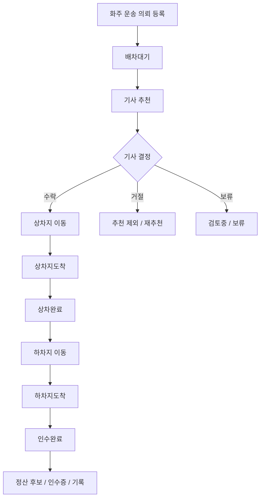

# Hongdal 1.0

## 목표

국내 화물/용달 운송에서 화주, 용달기사, 수령자 사이의 운송 정보를 안정적으로 연결합니다.

## 현재 집중 원칙

1.0은 지금 당장 릴리즈해야 할 최소 운영 버전입니다. 확장 기능을 계속 기록하더라도, 실제 구현 우선순위는 화주-용달기사-수령자 사이의 국내 운송 정보 흐름을 닫는 데 둡니다.

| 판단 질문 | 1.0 처리 |
| --- | --- |
| 화주 의뢰, 기사 배차, 상차/하차, 수령자 인수, 결제/정산 기본에 직접 필요한가 | 1.0 우선 작업 |
| 운송 완료 후 증빙, 인수증, 정산 후보를 더 명확하게 남기는가 | 1.0 우선 작업 |
| 음식 배달, 홍달마트, 창고 고도화, 통관, 공동 주문처럼 확장 축인가 | 문서화하고 기본 비활성 |
| 커뮤니티 기능이 업무 흐름을 보조하는 수준을 넘는가 | 1.0에서는 보류 또는 숨김 |

## 포함 범위

| 영역 | 내용 |
| --- | --- |
| 화주 | 운송 의뢰 등록, 상차/하차 정보, 화물 정보, 결제 조건 |
| 용달기사 | 추천 운송, 수락/거절/보류, 상차/하차 완료, 사진 증빙 |
| 수령자 | 하차 예정 정보, 인수 확인, 결제/인수증 관련 정보 |
| 커뮤니티 | 운송 경험, 문의, 후기, 신뢰 기록을 보조 모드로 제공 |
| 관리자 | 배차, 결제, 노출, 기본 설정 확인 |

## 보류 범위

- 음식 배달 실운영
- 홍달마트 실운영
- 해외 통관 자동화
- HS 데이터 유료 공유
- 창고 고도화 운영

## 우선 앱/모듈

- `ShipperApp`
- `DriverApp`
- `HongdalAdmin`
- `CargoYongdalDispatchEngine`
- `Hongdal.Contracts`
- `Hongdal.Domain`

## 안정화 기준

- 화주 의뢰가 생성되고 기사 추천/수락/거절 흐름으로 이어진다.
- 기사 앱에서 상차/하차 정보와 증빙 흐름을 확인할 수 있다.
- 수령자에게 필요한 하차/인수/결제 정보가 과도하지 않게 전달된다.
- 커뮤니티 모드는 업무 흐름을 방해하지 않고 보조 정보로 동작한다.

## 1.0 핵심 상태 흐름

1.0에서는 국내 화물/용달 운송의 상태명을 먼저 고정합니다. 이후 버전의 창고, 통관, 공동 주문, 홍달마트 기능은 이 흐름을 보조하거나 참조할 수 있지만, 1.0 흐름을 필수 의존으로 깨면 안 됩니다.

### 상태 전이 게이트

| 목표 상태 | 허용 이전 상태 | 필수 확인 |
| --- | --- | --- |
| `상차지도착` | `배차대기`, `매칭중`, `이동중` | 기사와 운송 건의 연결, 현재 운행 권한 |
| `상차완료` | `상차지도착` | 상차 완료 증빙, 상차 시각 기록 |
| `하차지도착` | `상차완료`, `운송중` | 하차지 접근, 수령자/인수 조건 확인 |
| `인수완료` | `하차지도착` | 하차 완료 증빙, 인수 확인, 정산 후보 생성 |

## 수령자 정보 노출 정책

수령자 정보는 운송 완료에 필요한 범위만 단계적으로 노출합니다. 개인정보와 상세주소는 운송 상태와 역할에 따라 마스킹합니다.

| 시점 | 기사에게 보이는 정보 | 원칙 |
| --- | --- | --- |
| 배차 전 | 하차 지역, 대략 주소, 결제/인수 조건 요약 | 상세 연락처와 상세주소는 비노출 |
| 배차 수락 후 | 운행에 필요한 하차 주소와 요청사항 | 연락처는 필요한 범위만 노출 |
| 하차지도착 이후 | 인수 확인에 필요한 연락/인수증 정보 | 인수 완료를 위한 최소 정보 허용 |
| 인수완료 후 | 마스킹된 수령자 정보와 증빙 기록 | 사후 조회는 감사/정산 목적 중심 |

## 결제/정산 폐쇄 루프

1.0에서는 고급 정산보다 운송이 끝났을 때 결제와 정산 상태가 열린 채로 남지 않는 것이 중요합니다.

| 단계 | 필요한 기록 |
| --- | --- |
| 의뢰 등록 | 결제 방식, 결제 주체, 현장지급/후불/카드/계좌/인수증 여부 |
| 배차 수락 | 결제 가능 상태, 기사 정산 대상 여부 |
| 상차완료 | 상차 증빙, 상차 시각, 결제 진행 가능 조건 |
| 인수완료 | 하차 증빙, 인수 확인, 정산 후보 생성, 인수증 자동 생성 여부 |
| 사후 조회 | 화주 결제 상태, 기사 정산 예정/완료 상태, 증빙 문서 링크 |

## 기사 편의 UX 기준

기사 앱은 운송 중 판단 비용을 줄이는 쪽으로 1.0을 안정화합니다. 상세 정보는 접었다 펼 수 있게 두되, 접힌 상태에서도 다음 행동은 항상 보여야 합니다.

| 상황 | 기사에게 먼저 보여야 하는 정보 |
| --- | --- |
| 추천 확인 | 상차지, 하차 지역, 운임, 화물 종류, 결제 조건 |
| 운행 중 | 다음 행동, 상차/하차 주소, 예정 시각, 요청사항 |
| 상차 완료 전 | 상차지와 상차 완료 사진 버튼 |
| 하차 완료 전 | 하차지, 수령/인수 조건, 결제/인수증 조건 |
| 완료 후 | 정산 예정 상태, 증빙 기록, 문의/신고 진입 |

## 화주 요금/알선 정책 기준

화주 운송 의뢰는 알선소를 거치더라도 요금 흐름이 흐려지지 않아야 합니다. 1.0에서는 완전한 정산 자동화보다, 의뢰 생성 시점에 기본요금, km당 단가, 기사 지급 예정 운임, 알선 단계를 기록할 수 있는 구조를 먼저 둡니다.

| 이벤트 코드 | 의미 | 1.0 처리 |
| --- | --- | --- |
| `기준운임미달` | 결제예정금액이 기본운임+거리운임+부대비용 또는 최소운임보다 낮음 | 의뢰 생성 차단 또는 관리자 확인 |
| `재알선차단필요` | 재알선금지 의뢰인데 2차 이상 알선 단계가 감지됨 | 의뢰 생성 차단 |
| `재알선의심` | 화주 결제액과 기사 지급 예정액 사이에 설명되지 않은 차액이 있음 | 이벤트 기록 후 확인 대상 |
| `기사지급운임누락` | 재알선금지 의뢰에서 기사 지급 예정 운임이 빠짐 | 보완 입력 유도 |

## 1.0 보류 기능 차단 기준

다음 기능은 코드가 존재하더라도 `CargoYongdalV1` 운영 화면에서 기본 노출하지 않습니다.

| 기능 플래그 | 1.0 기본값 | 이유 |
| --- | --- | --- |
| `WarehouseV15` | `false` | 창고 입고/출고 고도화는 1.5 범위 |
| `CustomsHsV20` | `false` | 통관/HS 데이터는 2.0 범위 |
| `OrdererGroupOrderV25` | `false` | 주문자 집단 공동 주문은 2.5 범위 |
| `FoodDeliveryV30` | `false` | 음식점 일반 음식 배달은 3.0 범위 |
| `HongdalMartV35` | `false` | 홍달마트 도심 즉시배송은 3.5 범위 |

## 기능 설정 운영 기준

1.0 릴리즈에서는 관리자와 사용자의 on/off 설정도 `1.0` 그룹을 우선 확인합니다. 같은 화면에 1.5 이후 기능이 보이더라도 기본적으로 확장 후보이며, 1.0 릴리즈 판단에는 포함하지 않습니다.

| 설정 유형 | 1.0 기준 |
| --- | --- |
| 필수 기능 | 상태 전이, 상차/하차 증빙, 인수 확인처럼 운송 완료에 필요한 기능은 사용자가 끌 수 없습니다. |
| 부가 기능 | 알림, 관계 스냅샷, 보조 노출은 관리자 전역 설정과 사용자별 설정을 허용할 수 있습니다. |
| 확장 버전 기능 | 1.5 이후 기능은 별도 버전 그룹으로 표시하고, 1.0 운영 화면에서는 기본 비활성으로 둡니다. |
