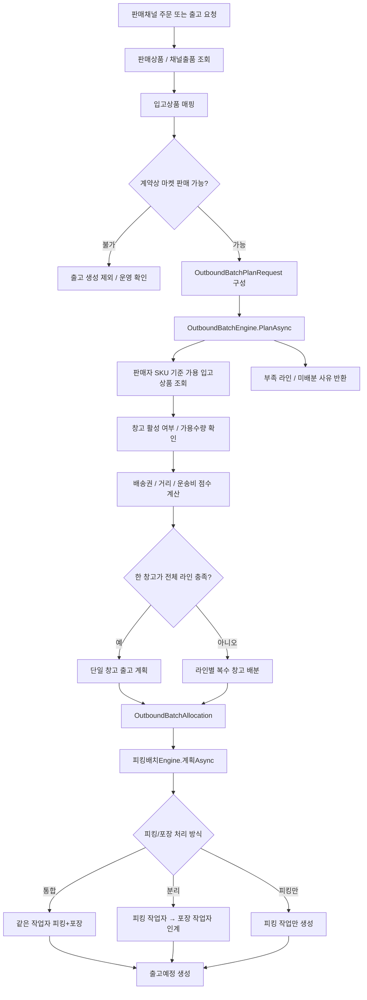

# Ssalddel 1.5

## 목표

판매 물류와 창고 기반 입고, 적재, 출고, 재위탁 흐름을 1.0 화물/용달 운송 흐름 위에 얹습니다.

1.5의 핵심은 창고가 단순 보관 장소가 아니라, 주문과 운송 요청을 실제 출고 가능한 작업 단위로 바꾸는 운영 지점이 되도록 만드는 것입니다.

## 포함 범위

| 영역 | 내용 |
| --- | --- |
| 입고 | 계약 기반 입고, 현장 임시 입고, 주문 자동 입고 예정 |
| 적재 | 검수 후 보관 위치 확정, 입고 묶음 해제, 재고 이동 기록 |
| 출고 | 출고 배치 엔진, 피킹 배치 엔진, 주문 출고 알림, 출고 예약, 피킹, 포장, 출고 예정 |
| 재위탁 | 창고 출고 후 화물/용달 운송 연결 |
| 작업자 검증 | 휴대폰 뒤 8자리, 작업대 바코드, 역할 확인 |

## 출고 배치 엔진

출고 배치 엔진은 주문 또는 운송 요청을 받아 단일 창고 출고로 처리할지, 복수 창고 분할 출고로 처리할지 판단합니다.

- 단일 상품 주문은 가까운 창고 또는 비용이 낮은 창고에서 우선 충족합니다.
- 복수 상품 주문은 한 창고가 전체 수요를 충족할 수 있는지 먼저 확인합니다.
- 한 창고에서 충족할 수 없으면 상품 라인별로 여러 창고에 출고 요청을 나눕니다.
- 창고에 재고가 있어도 주문자 주소가 배송권 밖이거나 운송비가 과도하면 다른 창고 후보와 비교합니다.
- 분할 출고가 발생하면 배송 단위, 예상 도착 시각, 추가 비용 가능성을 함께 관리합니다.

상세 설계는 [출고 배치 엔진](../../Architecture/OutboundBatchEngine.md)을 기준으로 합니다.

### 현재 구현 기준

현재 서버 구현은 출고 배치 엔진을 `계획 계층`으로 둡니다. 엔진은 실제 피킹이나 포장을 바로 수행하지 않고, 판매채널 주문이나 운송 요청을 어떤 창고의 어떤 입고상품 재고로 충족할지 계산합니다.

| 구성 | 역할 | 코드 위치 |
| --- | --- | --- |
| 출고 배치 요청 DTO | 주문 참조번호, 판매자, 주문자, 하차 주소, 상품 라인을 전달 | `Ssalddel.Contracts/Common/Warehouse/OutboundBatchDtos.cs` |
| `IOutboundBatchEngine` | 출고 계획을 만드는 인터페이스 | `Ssalddel/Services/LogisticsProcessing/Warehouse/IOutboundBatchEngine.cs` |
| `OutboundBatchEngine` | 입고상품 재고, 창고 배송권, 거리/운송비 점수를 보고 출고 배분 계산 | `Ssalddel/Services/LogisticsProcessing/Warehouse/OutboundBatchEngine.cs` |
| 피킹 배치 DTO | 출고 라인, 적재대/보관 위치, 피킹/포장 처리 방식, 작업자 후보를 전달 | `Ssalddel.Contracts/Common/Warehouse/PickingBatchDtos.cs` |
| `I피킹배치Engine` | 출고 배치 결과를 현장 피킹/포장 작업으로 나누는 인터페이스 | `Ssalddel/Services/LogisticsProcessing/Warehouse/I피킹배치Engine.cs` |
| `피킹배치Engine` | 피킹 작업자와 포장 작업자를 통합 또는 분리 방식으로 배정 | `Ssalddel/Services/LogisticsProcessing/Warehouse/피킹배치Engine.cs` |
| `WarehouseServiceAreaPolicy` | 주문자 주소가 창고 기본 배송권에 들어가는지 판단 | `Ssalddel/Services/LogisticsProcessing/Warehouse/WarehouseServiceAreaPolicy.cs` |
| `WarehouseDistanceCostEstimator` | 창고와 주문자 주소 사이의 거리/운송비를 추정 | `Ssalddel/Services/LogisticsProcessing/Warehouse/WarehouseDistanceCostEstimator.cs` |
| 판매채널 주문 동기화 | 채널 주문을 판매상품/입고상품과 매핑하고 출고 배치 엔진을 호출 | `Ssalddel/Services/LogisticsProcessing/SalesOrders/SalesChannelOrderSyncService.cs` |

### 처리 흐름

### 판단 기준과 제한

| 기준 | 현재 처리 |
| --- | --- |
| 재고 기준 | `입고상품.가용수량 - 예약수량`이 0보다 큰 재고만 후보로 사용 |
| 판매 가능 계약 | `StorageOnly` 재고는 제외하고, `ConsignmentSale`, `MarketFulfillment`, `ImportCustomsFulfillment` 재고를 출고 후보로 사용 |
| 선호 입고상품 | 판매상품에 연결된 입고상품을 우선 후보로 가산 |
| 단일 창고 우선 | 복수 상품 주문은 한 창고가 전체 라인을 충족할 수 있으면 단일 창고 계획을 우선 시도 |
| 분할 출고 | 단일 창고가 전체 라인을 충족하지 못하면 라인별 후보 재고로 복수 창고 배분 |
| 미배분 라인 | 재고 부족이나 조건 불충족 라인은 `UnallocatedLines`에 사유를 남김 |

### 용어 정리

| 용어 | 정의 |
| --- | --- |
| 출고 배치 엔진 | 주문 또는 운송 요청을 어느 창고의 어느 재고로 충족할지 계산하는 계획 모듈 |
| 출고 요청 라인 | 주문 안의 상품별 수요 단위. SKU, 상품명, 수량, 판매상품 ID를 포함 |
| 입고상품 | 창고에 실제 입고되어 재고 수량과 계약 조건을 가진 상품 단위 |
| 가용수량 | 출고에 사용할 수 있는 수량. 현재 구현은 `가용수량 - 예약수량`으로 후보 수량을 계산 |
| 배송권 | 특정 창고가 기본적으로 담당하기 좋은 주소 권역 |
| 선택 점수 | 재고 충족, 배송권 포함, 기본창고 여부, 선호 입고상품, 거리/운송비를 합산한 창고 후보 점수 |
| 분할 출고 | 한 주문을 여러 창고 또는 여러 출고 단위로 나누는 처리 |
| 미배분 라인 | 출고 계획을 만들지 못한 상품 라인. 재고 부족 등 사유를 함께 보관 |
| 피킹 배치 엔진 | 출고 배치 결과를 적재대, 피킹 작업자, 포장 작업자, 피킹/포장 처리 방식으로 나누는 현장 작업 배정 모듈 |
| 창고별 피킹 옵션 | 창고마다 피킹/포장 통합, 피킹/포장 분리, 피킹만, 상품 바코드 검증 필수 여부를 조정하는 설정 |
| 피킹/포장 통합 | 피킹한 작업자가 같은 물량을 포장까지 이어서 처리하는 방식 |
| 피킹/포장 분리 | 피킹 작업자가 물건을 꺼낸 뒤 별도 포장 작업자에게 넘기는 방식 |
| 적재대 위치 바코드 | 피킹 작업자가 실제 보관 위치에 접근했는지 확인하기 위해 스캔하는 위치 식별값 |

## 보류 범위

- 알뜰살뜰 마트 도심 즉시배송 운영
- 해외 통관 자동화
- HS 데이터 유료 공유
- 음식점 일반 음식 배달

## 우선 대상 모듈

- `WarehouseManagerApp`
- `SsalddelApp`
- `OrdererApp`
- `Ssalddel.Domain`
- `Ssalddel.Infrastructure`

## 안정화 기준

- 입고, 적재, 출고가 각각 독립적인 업무 흐름으로 설명되고 기록된다.
- 단일 상품 주문과 복수 상품 주문이 출고 배치 엔진을 통해 단일 창고 또는 복수 창고 출고 계획으로 분기된다.
- 주문 발생 시 판매자 창고에 출고 알림이 생성된다.
- 플랫폼 참여 주문자에게만 자동 입고 예정 연결을 시도한다.
- 창고 출고 연계 운송이 1.0 화물/용달 운송 흐름을 재사용한다.
