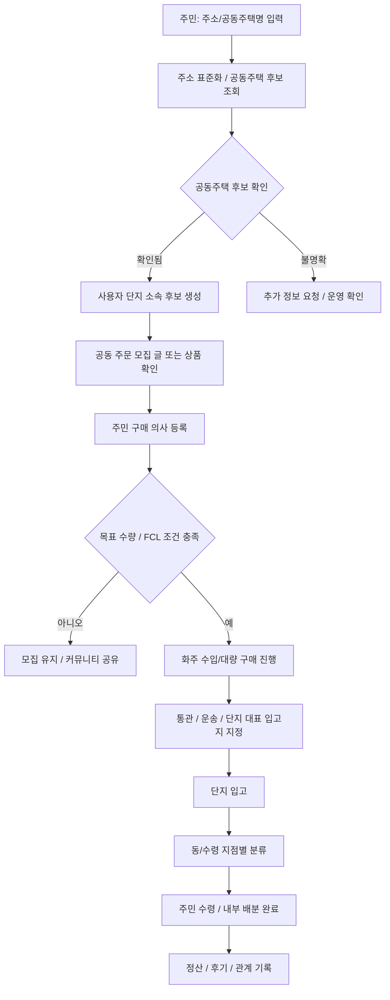

# Hongdal 2.5

## 목표

공동주택 단지 안의 주민들이 함께 주문 의사를 모으고, FCL 또는 대량 화물 단위로 들어온 물품을 단지 안에서 분류해 각 동/수령 지점으로 배분하는 프로세스를 만듭니다.

2.5는 2.0의 국제 물류/통관/HS 데이터와 3.5의 도심 즉시배송 사이에 놓입니다. 수입 또는 대량 구매를 검토하는 화주와 실제 구매 의사를 가진 주민을 연결하고, 공동주택이라는 물리적 단위 안에서 입고/분류/배분 업무를 정리합니다.

## 포함 범위

| 영역 | 내용 |
| --- | --- |
| 공동주택 식별 | 주소, 공동주택 단지 코드, 공동주택명, 동/호 단서를 기반으로 같은 단지 주민인지 확인 |
| 공동 주문 모집 | 주민들이 구매 의사를 표시하고 목표 수량/금액/FCL 가능성을 확인 |
| 화주/주민 연결 | 화주가 수입 또는 대량 구매 예정 상품을 공개하고 주민이 선주문 의사를 등록 |
| FCL/대량 입고 | 컨테이너 또는 팔레트 단위 화물이 단지 대표 입고 지점으로 들어오는 흐름 |
| 단지 내 분류 | 입고된 물품을 동, 라인, 수령 지점, 세대 단위로 분류 |
| 내부 배분 | 주민 자율 배분, 관리 인력, 외부 인력, 용달/배달 인력 중 적절한 방식을 선택 |
| 정산/수수료 | 공동 주문 참여 금액, 분류/배분 비용, 플랫폼 이용료를 분리 기록 |

## 보류 범위

- 홍달마트 도심 즉시배송 실운영
- 음식 배달 기사 중심의 실시간 배차
- 단지 관리사무소 공식 승인 자동화
- 세대 내부 위치나 민감한 거주 정보의 과도한 노출

## 우선 앱/모듈

- `OrdererApp`
- `ShipperApp`
- `WarehouseManagerApp`
- `CargoYongdalDispatchEngine`
- 공동주택 식별/주소 확인 서비스
- 공동 주문 모집 서비스

## 안정화 기준

- 사용자가 주소 또는 공동주택명으로 단지 후보를 확인할 수 있다.
- 같은 단지로 확인된 사용자들이 공동 주문 의사를 등록할 수 있다.
- 화주는 수입/대량 구매 예정 상품과 최소 진행 조건을 공개할 수 있다.
- 목표 수량 또는 FCL 가능 조건에 도달하면 화주 운송/입고 계획으로 연결된다.
- 단지 대표 입고 지점과 동/수령 지점별 분류 작업이 기록된다.
- 주민 개인정보는 필요한 범위만 마스킹 또는 제한 공개된다.

## 공동주택 코드/주소 데이터 후보

| 데이터 후보 | 용도 | 메모 |
| --- | --- | --- |
| 행정안전부 실시간 주소정보 조회 API | 주소 검색, 도로명/지번/우편번호 확인 | 사용자가 입력한 주소를 표준화하는 1차 관문 |
| 국토교통부 공동주택 단지 목록제공 서비스 | 공동주택 단지 후보 조회 | 시도/시군구/읍면동/도로명주소 기반 단지 목록 확인 |
| 국토교통부 공동주택 기본 정보제공 서비스 | 단지 상세 정보 확인 | 동수, 세대수, 관리 방식 등 단지 규모 판단 |
| 전국공동주택표준데이터 | 표준 공동주택 데이터 보강 | 연간 갱신 데이터와 OpenAPI 정보 확인 |

운영 코드에서는 외부 API 응답을 그대로 신뢰하지 않고, `공동주택후보`, `공동주택확정`, `사용자단지소속확인` 같은 내부 상태를 둡니다.

### 프로젝트 모듈 위치

- 계약 DTO: `Hongdal.Contracts/Common/PublicData/PublicDataApiMetadataDtos.cs`
- 조회 DTO: `Hongdal.Contracts/Common/PublicData/PublicDataLookupDtos.cs`
- 서버 카탈로그: `Hongdal/Services/External/PublicData/PublicDataApiMetadataCatalog.cs`
- 주소 조회 서비스: `Hongdal/Services/External/PublicData/RoadAddressLookupService.cs`
- 공동주택 조회 서비스: `Hongdal/Services/External/PublicData/ApartmentComplexLookupService.cs`
- 메타데이터 조회 API: `GET /api/v1/public-data/apis`
- 실제 데이터 조회 API:
  - `GET /api/v1/orderer/public-data/addresses?keyword={주소}`
  - `GET /api/v1/orderer/public-data/apartment-complexes?sidoCode={시도코드}`
  - `GET /api/v1/orderer/public-data/apartment-complexes/{complexCode}/basic`

메타데이터 모듈은 공공데이터 API의 출처, 사용 목적, 버전 범위, 주요 파라미터, 개인정보/거주정보 주의 여부를 관리합니다. 실제 호출 모듈은 주소 조회와 공동주택 단지 조회부터 분리되어 있으며, API 키가 없으면 실패 응답을 반환합니다.

### 설정 키

```json
{
  "PublicData": {
    "DataGoKrServiceKey": "YOUR_DATA_GO_KR_SERVICE_KEY",
    "RoadAddress": {
      "ConfirmKey": "YOUR_JUSO_CONFM_KEY"
    },
    "ApartmentComplex": {
      "ServiceKey": "YOUR_DATA_GO_KR_SERVICE_KEY"
    }
  }
}
```

### 참고 데이터 출처

- 행정안전부 실시간 주소정보 조회 API: https://www.data.go.kr/data/15057017/openapi.do
- 주소정보 API 연계 안내: https://business.juso.go.kr/jst/jstRoadNmAddrApiSearch
- 국토교통부 공동주택 단지 목록제공 서비스: https://www.data.go.kr/data/15057332/openapi.do
- 국토교통부 공동주택 기본 정보제공 서비스: https://www.data.go.kr/data/15058453/openapi.do
- 전국공동주택표준데이터: https://www.data.go.kr/data/15096285/standard.do

## 기본 흐름


