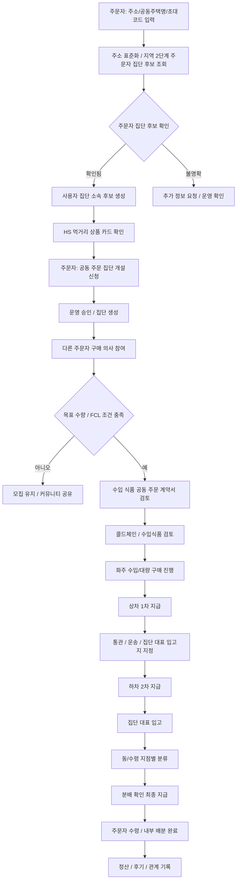

# Hongdal 2.5

## 목표

주문자 집단이 함께 주문 의사를 모으고, FCL 또는 대량 화물 단위로 들어온 물품을 집단 대표 입고지에서 분류해 각 수령 지점으로 배분하는 프로세스를 만듭니다.

2.5는 2.0의 국제 물류/통관/HS 데이터와 3.5의 도심 즉시배송 사이에 놓입니다. 수입 또는 대량 구매를 검토하는 화주와 실제 구매 의사를 가진 주문자를 연결하고, 주문자 집단이라는 운영 단위 안에서 입고/분류/배분 업무를 정리합니다.

공동주택은 주문자 집단을 구성하기 쉬운 대표 하위 개념입니다. 핵심은 아파트 자체가 아니라, 같은 생활권이나 주소 단서를 공유하는 사용자가 공동 주문, 대표 입고, 내부 분류를 함께 수행할 수 있는 집단인지 판단하는 것입니다. 이후 오피스텔, 기숙사, 빌라 단지, 사내 기숙사, 지역 커뮤니티도 같은 주문자 집단 모델로 확장할 수 있게 둡니다.

주문자 집단의 기본 후보 범위는 도로명주소 2단계 또는 Kakao 지역 2단계입니다. 음식 배달/음식점 조회처럼 즉시 배송권을 좁게 잡아야 하는 경우에는 3단계나 반경 km가 유리하지만, 공동 주문은 초기에 참여자 밀도가 부족할 수 있으므로 2단계를 기본 모집권으로 둡니다. 공동주택, 오피스텔, 회사 기숙사, 단지명은 이 2단계 모집권 안에서 더 좁게 확인하는 하위 단서입니다.

## 포함 범위

| 영역 | 내용 |
| --- | --- |
| 주문자 집단 구성 | 도로명주소/Kakao 지역 2단계를 기본 모집권으로 두고, 주소, 생활권, 건물/단지, 초대코드, 운영자 확인을 기반으로 같은 공동 주문 집단인지 확인 |
| 공동주택 식별 | 공동주택 단지 코드, 공동주택명, 동/호 단서를 주문자 집단 판별의 하위 단서로 사용 |
| 공동 주문 모집 | 주문자 집단 구성원이 구매 의사를 표시하고 목표 수량/금액/FCL 가능성을 확인 |
| 먹거리 공동주문 우선 활성화 | HS chapter 01~24 식품/식품 인접 화물을 우선 후보로 두고 냉장/냉동, 수입식품, FCL 가능성을 함께 검토 |
| 상품 카드 기반 집단 개설 | 주문자가 HS 먹거리 상품 카드를 보고 공동 주문 집단 개설을 신청하면 운영 승인 후 다른 주문자가 참여 |
| 수입 식품 공동 주문 계약서 | 계약 영역에서 개설 신청자, 공급자/화주, 플랫폼 운영자, HS 식품 조건, 지급/분배/환불 조항을 관리 |
| 마일스톤 지급 | 주문자 선결제 부담을 줄이기 위해 상차, 하차, 분배 확인 기준으로 지급 시기를 분리 |
| 해외 선적/통관 추적 | BL/AWB, 문서관리번호, UNI-PASS 통관 상태를 공동주문 원장으로 연결 |
| 국내 물류대행 입고 | 공동수입 물품을 국내 물류대행사 또는 3PL에 입고하고, 입고상품/재고 로트/판매상품으로 연결 |
| 판매채널 출품과 출고 배치 | 스마트스토어/쿠팡 등 판매채널 주문을 창고 재고와 출고 배치 엔진으로 연결 |
| 주문자 집단 운영 주체 | 비사업자 모임, 개인사업자, 법인, 협동조합, 관리사무소 위임, 플랫폼 위임을 구분 |
| 입주민 우선 고용 | 공동주문 분류/배분, 택배·공동구매 물품 집합, 공동주택 관리 보조, 경비/순찰 보조 업무를 단지 내부 주민 우선으로 설계 |
| 화주/주문자 연결 | 화주가 수입 또는 대량 구매 예정 상품을 공개하고 주문자가 선주문 의사를 등록 |
| FCL/대량 입고 | 컨테이너 또는 팔레트 단위 화물이 집단 대표 입고 지점으로 들어오는 흐름 |
| 집단 내 분류 | 입고된 물품을 동, 라인, 수령 지점, 세대, 그룹 수령 지점 단위로 분류 |
| 내부 배분 | 주문자 자율 배분, 집단 운영자, 관리 인력, 외부 인력, 용달/배달 인력 중 적절한 방식을 선택 |
| 정산/수수료 | 공동 주문 참여 금액, 분류/배분 비용, 플랫폼 이용료를 분리 기록 |

## 보류 범위

- 홍달마트 도심 즉시배송 실운영
- 음식 배달 기사 중심의 실시간 배차
- 단지 관리사무소 공식 승인 자동화
- 세대 내부 위치나 민감한 거주 정보, 집단 소속 정보의 과도한 노출

## 우선 앱/모듈

- `OrdererApp`
- `ShipperApp`
- `WarehouseManagerApp`
- `CargoYongdalDispatchEngine`
- 주문자 집단 식별 서비스
- 공동주택 식별/주소 확인 서비스
- 공동 주문 모집 서비스
- 먹거리/냉동 식품 공동주문 플래너
- 1.5 출고 배치 엔진

## 안정화 기준

- 사용자가 주소, Kakao 지역 2단계, 공동주택명, 초대코드, 생활권 단서로 주문자 집단 후보를 확인할 수 있다.
- 같은 주문자 집단으로 확인된 사용자들이 공동 주문 의사를 등록할 수 있다.
- 화주는 수입/대량 구매 예정 상품과 최소 진행 조건을 공개할 수 있다.
- HS 코드가 식품/식품 인접 화물인 경우 먹거리 공동주문 우선 후보로 분류된다.
- 주문자가 HS 먹거리 상품 카드에서 공동 주문 집단 개설 신청을 할 수 있다.
- 운영 승인 뒤 같은 주문자 집단 범위의 다른 주문자가 구매 의향으로 참여할 수 있다.
- 실제 공급 단계로 넘어가기 전 수입 식품 공동 주문 계약서의 필수 당사자와 조항을 확인할 수 있다.
- 공동구매 금액은 상차 1차, 하차 2차, 분배 확인 최종 지급처럼 마일스톤으로 나눌 수 있다.
- 해외 판매자 건은 BL/AWB와 문서관리번호로 선적/통관 상태를 조회할 수 있다.
- 통관 완료 후 국내 물류대행 입고, 재고 로트 확정, 판매채널 출품, 출고 배치 가능 상태를 구분할 수 있다.
- 공동수입 물품이 판매채널 주문으로 판매될 때 1.5 출고 배치 엔진을 재사용해 창고/입고상품/출고예정으로 연결할 수 있다.
- 주문자 집단 운영 주체가 직접 수입자/고용주가 될 수 있는지 사업자 검증 상태와 함께 확인할 수 있다.
- 단지 내부 주민을 우선 고용하는 역할 정책과 외부 인력 허용 여부를 구분할 수 있다.
- 목표 수량 또는 FCL 가능 조건에 도달하면 화주 운송/입고 계획으로 연결된다.
- 집단 대표 입고 지점과 동/수령 지점별 분류 작업이 기록된다.
- 주문자 개인정보는 필요한 범위만 마스킹 또는 제한 공개된다.
- 개인정보와 계약 데이터를 함께 다루는 기능은 ISMS-P 내부 준비도 항목을 통과해야 한다.

## 공동주택 코드/주소 데이터 후보

| 데이터 후보 | 용도 | 메모 |
| --- | --- | --- |
| 행정안전부 실시간 주소정보 조회 API | 주소 검색, 도로명/지번/우편번호 확인 | 사용자가 입력한 주소를 표준화하는 1차 관문 |
| 국토교통부 공동주택 단지 목록제공 서비스 | 공동주택 단지 후보 조회 | 시도/시군구/읍면동/도로명주소 기반 단지 목록 확인 |
| 국토교통부 공동주택 기본 정보제공 서비스 | 단지 상세 정보 확인 | 동수, 세대수, 관리 방식 등 단지 규모 판단 |
| 전국공동주택표준데이터 | 표준 공동주택 데이터 보강 | 연간 갱신 데이터와 OpenAPI 정보 확인 |

운영 코드에서는 외부 API 응답을 그대로 신뢰하지 않고, `주문자집단후보`, `주문자집단확정`, `사용자집단소속확인` 같은 상위 상태를 둡니다. 공동주택 API로 확인한 단지는 `공동주택후보`, `공동주택확정`처럼 주문자 집단의 하위 식별 근거로 저장합니다.

### 프로젝트 모듈 위치

- 계약 DTO: `Hongdal.Contracts/Common/PublicData/PublicDataApiMetadataDtos.cs`
- 조회 DTO: `Hongdal.Contracts/Common/PublicData/PublicDataLookupDtos.cs`
- 서버 카탈로그: `Hongdal/Services/External/PublicData/PublicDataApiMetadataCatalog.cs`
- 주소 조회 서비스: `Hongdal/Services/External/PublicData/RoadAddressLookupService.cs`
- 공동주택 조회 서비스: `Hongdal/Services/External/PublicData/ApartmentComplexLookupService.cs`
- 주문자 집단 범위 후보 서비스: `Hongdal/Services/External/PublicData/OrdererGroupScopeLookupService.cs`
- 먹거리 공동주문 플래너: `Hongdal.Contracts/Common/Orderer/ColdChainFoodGroupPurchasePlanner.cs`
- 마일스톤 지급 플래너: `Hongdal.Contracts/Common/Orderer/GroupPurchasePaymentMilestonePlanner.cs`
- 수입 식품 공동 주문 계약서 플래너: `Hongdal.Contracts/Common/ContractManagement/ImportFoodGroupPurchaseContract.cs`
- 개인정보/계약 ISMS-P 준비도 플래너: `Hongdal.Contracts/Common/Privacy/IsmsPComplianceReadiness.cs`
- 개인정보 필드 보호 카탈로그: `Hongdal.Contracts/Common/Privacy/PersonalDataFieldProtectionCatalog.cs`
- 주문자 공동구매 화면: `OrdererApp/Components/Pages/GroupPurchaseIntent.razor`
- 먹거리 공동주문 정책 문서: `docs/Architecture/FoodFocusedGroupPurchase.md`
- 주문자 집단 공동주문/커머스 흐름 문서: `docs/ProjectOverview/orderer-group-commerce-flows.md`
- 출고 배치 엔진 상세 문서: `docs/Architecture/OutboundBatchEngine.md`
- 메타데이터 조회 API: `GET /api/v1/public-data/apis`
- 실제 데이터 조회 API:
  - `GET /api/v1/orderer/public-data/addresses?keyword={주소}`
  - `GET /api/v1/orderer/public-data/orderer-group-scopes?roadAddress={주소}`
  - `GET /api/v1/orderer/public-data/orderer-group-scopes?kakaoRegionLevel1={시도}&kakaoRegionLevel2={시군구}`
  - `GET /api/v1/orderer/public-data/apartment-complexes?sidoCode={시도코드}`
  - `GET /api/v1/orderer/public-data/apartment-complexes/{complexCode}/basic`
  - `GET /api/v1/orderer/group-purchase-overseas-shipments/lookup?documentManagementNumber={문서관리번호}`
  - `GET /api/v1/orderer/group-purchase-commerce-fulfillment-plans/by-group-purchase/{groupPurchaseId}`
  - `GET /api/v1/orderer/orderer-group-operating-entities/{ordererGroupScopeKey}`

메타데이터 모듈은 공공데이터 API의 출처, 사용 목적, 버전 범위, 주요 파라미터, 개인정보/거주정보 주의 여부를 관리합니다. 실제 호출 모듈은 주소 조회와 공동주택 단지 조회부터 분리되어 있으며, API 키가 없으면 실패 응답을 반환합니다.

### 설정 키

```json
{
  "PublicData": {
    "DataGoKrServiceKey": "YOUR_DATA_GO_KR_SERVICE_KEY",
    "RoadAddress": {
      "ConfirmKey": "YOUR_JUSO_CONFM_KEY"
    },
    "ApartmentComplex": {
      "ServiceKey": "YOUR_DATA_GO_KR_SERVICE_KEY"
    }
  }
}
```

### 참고 데이터 출처

- 행정안전부 실시간 주소정보 조회 API: https://www.data.go.kr/data/15057017/openapi.do
- 주소정보 API 연계 안내: https://business.juso.go.kr/jst/jstRoadNmAddrApiSearch
- 국토교통부 공동주택 단지 목록제공 서비스: https://www.data.go.kr/data/15057332/openapi.do
- 국토교통부 공동주택 기본 정보제공 서비스: https://www.data.go.kr/data/15058453/openapi.do
- 전국공동주택표준데이터: https://www.data.go.kr/data/15096285/standard.do

## 기본 흐름


