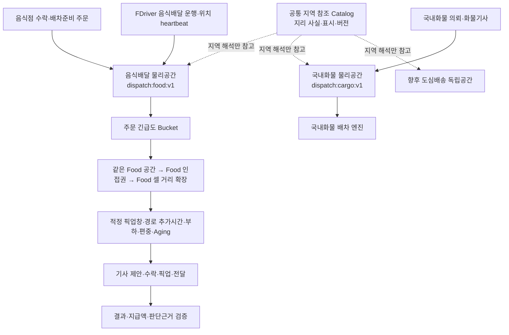

# 음식배달·국내화물 독립 실행공간 검증 제안서

작성일: 2026-07-30

## 1. 제안 목적

배달권과 인접권이라는 개념과 공통 지역 사실은 재사용하되, 음식배달 기사·주문은
`음식배달 전용 실행공간`, 국내화물 기사·의뢰는 `국내화물 전용 실행공간`에서
서로 섞이지 않도록 물리적으로 분리한다. 두 공간은 하나의 공통 실행 Store 아래
놓인 하위 타입이 아니며, 서로 다른 계약·스냅샷·저장소·Key 체계를 갖는다.

음식 주문, 음식점 수락, 배차대기, 음식배달권 후보 축소, 주문 우선순위와 기사
적합도 평가, 기사 수락, 픽업, 전달과 주문자 수령확인까지 실제 서버 흐름을 반복
실행하고, 그 결과를 웹에서 직접 보며 부족한 점을 찾는 검증 환경을 만든다.

이 단계의 목적은 AI가 곧바로 자동 배차하거나 실제 지급액을 결정하게 하는 것이
아니다. 우선 동일한 입력에서 규칙·요금·추천 결과가 재현되는지 확인하고, 사람의
판정과 실제 결과를 축적한 뒤 AI 후보를 `shadow` 방식으로 비교한다.

## 2. 현재 구현 조사 결과

### 서버 코드 (조정 전 조사 기준)

| 대상 | 현재 상태 | 판단 |
| --- | --- | --- |
| 음식점 주문 수락 후 배차대기 | 수락 Event에서 음식배달 운송 실행 투영을 만들고 주문에 배차대기 ID를 반영하는 Handler가 있다. | 코드 경로는 있으나 Azure 실제 관계형 DB E2E는 미검증 |
| 주문 배달권 연결 | 운송원장을 만들 때 픽업·배송 배달권을 `원장배달권투영`에 연결하고, 대기 중인 의뢰를 픽업 배달권 실행 공간에 넣는다. 서버 시작 때 DB 원장 기준 재구성도 한다. | 주문 측 인덱싱 기반은 있음 |
| 기사 운행 시작 | 운행중 상태와 기사 상태 인덱스는 만들지만 당시 공용 배달권 실행 Store에는 등록하지 않는다. | 운행 시작만으로는 배달권 후보가 되지 않음 |
| 기사 위치 갱신 | 운행중 위치를 기사 상태 Store에 저장하고 기사 ID를 현재 배달권 실행 공간으로 이동시킨다. 운행 종료 때 제거한다. | 첫 위치 갱신 뒤에야 배달권 인덱스에 들어감 |
| 기사 배달권 판정 | 위치 좌표와 기사 프로필의 `주_활동지역`을 함께 전달하며, 현재 정책은 주소를 좌표보다 먼저 사용한다. | 실제 현재 위치보다 고정 활동지역이 우선될 수 있음 |
| 음식 배달 기사 후보 | FDriver 앱, 운행중 상태, 위치 신선도, 거절 이력, 상차 접근 반경, 음식점까지 거리와 Aging 점수로 선정한다. | 배달권 인덱스가 아니라 위치 반경 조회부터 시작 |
| 기사 위치 검색 인덱스 | Redis 사용 시 GEO 인덱스가 있지만 기본 설정은 `Memory`이고, 메모리 구현은 전체 활성 상태를 순회해 거리를 계산한다. 공통 검색 반경 기본값은 50km다. | 음식배달 전용 후보 폭과 운영 저장소 구성이 필요 |
| 배달권 실행 공간 | 배달권별 운행중 기사 ID·미처리 의뢰 ID·인접 배달권 키를 하나의 Singleton 메모리에 보관한다. 업무유형·기사 앱·원천 유형이 공간 Key에 포함되지 않고 TTL과 위치 신선도도 없다. | 음식배달과 국내화물 실행공간의 명시적 분리가 필요 |
| 배달권 조율 계획 | 주 배달권과 인접 배달권 기사 ID를 묶는 계획·실행 서비스와 단위 테스트가 있다. | 전체 배달권 Snapshot을 순회하며, 실제 운영 호출처가 없음 |
| 배달권 조율 실행 | 계획 결과를 `국내화물배차조율실행Service`로 넘긴다. | 음식배달 엔진 경로와 분리되어 있고 음식배달 특성 검증이 없음 |
| 배차 주기 실행 | Quartz 배차 스캔은 `Operational` 모드에서만 등록되고 `DomesticTransportWorkflow` 활성 조건을 사용한다. | 현재 Simulation 체험 환경에서는 자동 음식배차 검증 경로가 없음 |
| 음식 멀티배차 | 최대 2건, 같은·인접 배달권, 조리 완료 시각, 픽업·전달지 거리와 약 6km 상한을 사용한다. | 규칙 기반 조합과 정렬 |
| 음식배달 AI 검토 | 규칙 점수로 묶음 후보를 정렬하고 가장 가까운 기사를 제안한다. 운영자 판정은 RAG 판단 사례 원장에 저장한다. | 학습 모델이 아니며 판정 저장이 실제 배차 확정을 수행하지 않음 |
| 기사 제안 금액 | `2,500원 + 1km 초과 거리 × 900원/km`, 최소 2,500원의 고정 코드다. | DB 요금 정책과 연결되지 않음 |
| 관리자 요금 정책 | 기본·최소요금, 거리 단위요금, 기사 기본·거리·최소 지급액을 저장하는 계약과 UseCase가 있다. | 현재 기사 제안 금액 계산에서는 사용하지 않음 |
| 관리자 검토 화면 | `/dispatch/food-ai-review`, 주문 추적 `/food/order-trace`가 있다. | 실제 주문·기사 부재 시 샘플을 섞을 수 있어 실데이터 검증 화면으로는 경계 보완 필요 |

기존 요금 검토 메모의 `기사 최소 3,500원`, `기사 목표 4,500원 전후`는 운영
후보값이다. 현재 코드에는 평균을 4,000~4,500원대로 수렴시키는 회귀 모델이나
누적 피드백 제어가 없다. 거리 약 3.2km인 단건이 현 산식에서 약 4,480원이 될
뿐이며, 전체 평균을 목표값으로 보정하는 동작은 아니다.

### 조정 전 배달권 인덱스 조사 결론

현재 코드는 필요한 부품을 일부 갖추었지만, 사용자가 의도한
`음식배달 전용 공간에서 1차 축소 → 음식배달 인접권 확장 → 음식배달 우선순위
평가`가 하나의 운영 경로로 연결되어 있지는 않다. 현재 Store에는 공간유형이 없어
같은 배달권의 음식배달 기사·주문과 국내화물 기사·의뢰를 구조적으로 분리할 수 없다.

현재 실제 음식배달 경로는 다음과 같다.

```text
음식점 수락
  → 운송원장과 공통 픽업 배달권 투영
  → 공용 배달권 실행 인덱스에 의뢰 등록
  → 배차큐 Scan
  → 음식배달 엔진
  → 위치 반경 기사 조회
  → FDriver·운행중·신선도·거절·접근반경 필터
  → 거리 점수 + Aging 점수로 한 명 선택
```

목표로 삼아야 하는 경로는 다음과 같다.

```text
음식점 수락
  → 공통 픽업·배송 배달권과 CatalogVersion 영속
  → 음식배달 전용 실행공간에 주문 등록
FDriver 음식배달 운행 시작 + 최신 위치
  → 음식배달 전용 실행공간의 현재 배달권에만 기사 등록
음식배달 배차 실행
  → 같은 음식배달권 공간
  → 후보 부족 시 음식배달 인접권
  → 그래도 부족할 때만 음식배달 정책의 제한 거리 확장
  → 주문 긴급도 Bucket 선택
  → 음식 준비시각과 기사 도착시각의 적합도 평가
  → 추천과 제외 근거 저장
```

기사 ID는 선택한 업무 실행유형의 현재 배달권 공간 한 곳에만 등록한다. FDriver가
음식배달 운행을 시작했다면 음식배달 공간에만, 화물기사가 국내화물 운행을
시작했다면 국내화물 공간에만 들어간다. 인접 배달권마다 같은 기사 ID를 복제하지
않고 각 업무공간의 인접 그래프로 후보를 확장해야 위치 이동 때 중복·잔존 인덱스를
줄일 수 있다.

### 2026-07-30 1차 서버 조정 현황

| 항목 | 반영 상태 | 남은 범위 |
| --- | --- | --- |
| 물리 실행공간 | 공통 실행 Store 계약을 제거하고 `I음식배달권실행공간Store`와 `I국내화물배달권실행공간Store`가 서로 다른 스냅샷과 내부 인덱스를 소유한다. 메모리 물리공간 식별자는 각각 `dispatch:food:v1`, `dispatch:cargo:v1`이다. | 다중 서버용 Redis 구현과 운영 연결 설정 |
| Key 격리 | Food는 `food-cell:*`·`food-scope:*`만 받고, Cargo는 Food Key 쓰기를 거부한다. 교차 쓰기 단위 테스트를 추가했다. | Redis ACL·접두어·논리 DB 또는 별도 클러스터 수준의 운영 격리 |
| 의뢰 등록 | 배차대기 생성과 서버 예열에서 음식배달 의뢰는 Food 공간, 화물 의뢰는 Cargo 공간에만 등록한다. | DB Commit 뒤 Event/Outbox로 인덱스 동기화를 옮기는 작업 |
| 기사 등록 | `기사근무.transport_execution_type`에 실행유형을 영속한다. 위치 heartbeat는 Food 또는 Cargo 한 공간에만 기사 ID를 두고, 서버 예열도 저장된 실행유형대로 두 공간을 복구한다. 운행 종료 때 잔존 인덱스를 제거한다. | 위치 heartbeat TTL과 DB Commit 이후 멱등 Event 동기화 |
| Food 공간 정책 | 좌표 우선 `food-cell-v1` 세부 셀과 8개 인접 셀을 사용한다. 동일 Food 셀, 인접 Food 셀, Food 물리공간 안의 제한 5km 셀 확장 순으로 후보를 조회한다. | TTL, 위치 만료 정리, 정책·Catalog 버전의 영속 Snapshot |
| 픽업 적합도 | 음식 주문의 `조리예상완료시각Utc`와 직선거리 이동시간을 비교해 적정 픽업창, 조기 도착, 지연 도착을 구분한다. | 실제 경로 추가시간, 현재 수행 건수, 최근 추천 편중을 포함한 안정 정렬 |
| 주문 우선순위 | 아직 기존 배차 큐 순서를 사용한다. | 긴급·주의·정상 Bucket과 명시적 `준비 안 됨` 결과 |

`원장배달권투영`은 커뮤니티·원장 조회에서 지역을 설명하기 위한 영속 정보 투영으로
남아 있다. Food와 Cargo 배차 엔진은 이 투영의 기사·의뢰 집합을 공유하지 않으며,
각자 소유한 실행공간만 후보 축소에 사용한다.

### 주문 우선순위와 기사 적합도의 분리

단순히 `예상 지연이 적은 기사 → 픽업 ETA가 짧은 기사`로 정렬하면 가까운 기사가
음식이 완성되기 전에 너무 일찍 도착해 대기하거나, 새 주문이 오래 기다린 주문보다
계속 먼저 배차될 수 있다. 따라서 **어느 주문을 먼저 배차할지**와 **그 주문에 어느
기사가 적합한지**를 분리한다.

#### 1단계: 먼저 배차할 주문 선택

1. 음식점 수락, 조리 상태, 픽업·배송 좌표가 갖춰진 주문만 `배차준비`로 본다.
2. `약속 전달시각까지 남은 여유시간 - 최소 예상 운행시간`을 기준으로
   `긴급 / 주의 / 정상` Bucket을 만든다.
3. 약속 전달시각이 없는 주문은 수락시각·조리예정시간·거리구간의 정책 버전으로
   목표 전달시각을 한 번 계산해 Snapshot으로 저장한다.
4. 같은 Bucket에서는 배차준비 후 가장 오래 기다린 주문을 먼저 처리한다.
5. `후보 없음`, `조리예정시각 미확정`, `좌표 미확정`, `구성 오류`는 서로 다른 결과로
   기록하며 모두를 지연이나 후보 없음으로 뭉뚱그리지 않는다.

#### 2단계: 선택된 주문에 적합한 기사 선택

1. 운행중, FDriver 앱, 최신 위치, 접근 가능 반경, 거절·동시 제안 상한을
   `hard filter`로 적용한다.
2. 같은 Food 배달권의 적격 후보 수가 정책상 최소 수보다 적을 때만 Food 인접권을
   연다.
3. 인접 배달권에도 후보가 없을 때만 음식배달 정책의 제한 거리 확장을 연다.
4. 기사 도착 예상시각과 음식 준비 예상시각의 차이를 계산한다. 정책이 정한
   `적정 픽업창` 안에 도착하는 기사를 우선하고, 너무 이른 도착 대기와 늦은 도착을
   별도 불이익으로 기록한다.
5. 적정 픽업창 안의 후보는 `기존 경로에 추가되는 시간 오름차순 → 현재 수행 건수
   오름차순 → 최근 추천 편중이 적은 순 → Aging 내림차순 → 기사 ID`로 안정
   정렬한다.
6. 묶음 배달은 단건 순위 뒤에 단순히 붙이지 않고, 기존 경로 삽입으로 늘어나는
   시간과 두 주문의 조리 완료·전달 SLA를 별도로 검사한다.

핵심은 `픽업 ETA가 가장 짧은 기사`가 아니라 `음식이 준비되는 시점에 맞춰 무리
없이 도착하고, 현재 경로를 과도하게 늘리지 않으며, 추천이 특정 기사에게 쏠리지
않는 기사`를 선택하는 것이다. 초기에는 위 단계별 규칙을 기준 결과로 쓰고, 데이터가
쌓인 뒤 가중 점수나 Shadow AI가 다른 선택을 제안하도록 해야 기준 규칙과 모델
차이를 설명할 수 있다.

추가로 현재 고정 배달권 Catalog는 서울 25개 시군구가 중심이고 좌표 fallback은
0.25도 격자다. 이는 음식배달 후보를 세밀하게 좁히기에는 너무 거칠며, 좌표 격자에는
인접 관계도 정의되어 있지 않다. 행정 배달권을 운영·표시 단위로 유지하더라도 실제
후보 검색에는 더 작은 Food 위치 셀이나 Food 전용 Redis GEO를 사용해야 한다.

### 현재 Azure 상시 체험 환경

2026-07-30 읽기 전용 점검 결과는 다음과 같다.

- 실행 모드는 `Simulation`이다.
- 현재 배포 프로필에는 `FoodDeliveryWorkflow`가 활성화되어 있지 않다.
- 음식 주문, 음식 주문 상품·상태이력, 음식 운영정책, 운송 실행 투영 표가 실제
  Azure DB에 없다.
- 반면 주 DB migration 이력에는 음식 주문 후속 migration이 적용된 것으로
  기록되어 있다.

따라서 데이터를 바로 넣기보다 `migration 이력 ↔ 실제 표 ↔ 현재 모델`의 기준을
먼저 맞춰야 한다. 이 상태에서 샘플 화면만 확인하면 실제 서버 흐름이 성공한 것으로
오인할 수 있다.

## 3. 배달권 계층과 목표 구조

### 공통 지역 참조 Catalog (실행공간 아님)

플랫폼 공통 계층은 지리적 사실만 관리한다. 이는 Food와 Cargo가 들어가는 공통
물리 공간이나 부모 실행 Store가 아니다.

- 안정적인 `PlatformDeliveryScopeKey`
- 행정구역·좌표 셀·서비스 Polygon의 연결
- 기준점, 표시명과 상위 행정구역
- 공통 인접 관계와 Catalog 버전
- 주문·운송·창고·커뮤니티 원장이 같은 지역을 참조할 수 있는 연결

이 계층에는 실시간 기사 ID, 대기 주문 ID, 추천 잠금, 음식 준비 상태를 넣지 않는다.

### 업무별 배달권 실행공간

| 실행공간 | 포함 대상 | 공간 특성 | 후보 정책 |
| --- | --- | --- | --- |
| `FoodDelivery` | 음식점 수락 후 배차준비 주문, 음식배달 운행을 선택한 FDriver | 짧은 위치 TTL, 세밀한 위치 셀, 짧은 인접 확장 | 조리시각·적정 픽업창·경로 추가시간·추천 편중 |
| `DomesticCargo` | 국내화물 운송의뢰, 화물 운행을 선택한 기사 | 더 넓은 권역, 긴 운행시간, 복귀지·시간창 고려 | 적재·차종·상차시간창·수익·복귀경로 |
| 향후 도심배송 | 마트·창고 도심배송 의뢰와 해당 기사 | 피킹·출고 준비와 배송 Batch 연계 | 출고준비·차량 적재·다중 Stop |

같은 지역을 가리키더라도 실행공간은 서로 독립된 집합이다. 예를 들어 서울 강남구를
공통 지역 Catalog로 설명할 수 있지만, `FoodDelivery`는 `food-cell:v1:*` Key를,
`DomesticCargo`는 `bjd-sigungu:11680` 같은 화물 권역 Key를 각자 해석한다.
음식배달 엔진은 Cargo 공간을 조회할 수 없다.

음식배달에 공통 시군구보다 세밀한 구역이 필요하면
`PlatformDeliveryScopeKey + FoodCellKey`로 연결한다. 공통 배달권은 원장·화면의
지역 기준으로 유지하고, `FoodCellKey`는 짧은 거리 후보 검색에만 사용한다.



공통 지역 Catalog와 업무별 실행공간의 의존 방향은 한쪽이다. 음식배달 공간이 공통
배달권을 참조할 수는 있지만, 공통 배달권 계층이 음식 주문이나 FDriver를 알게
해서는 안 된다.

시나리오 데이터도 DB에 직접 `INSERT`하지 않는다. 정상 Command와 API를 통해
저장해야 Event, 배차대기, 운송 투영, 알림 Outbox, 기사 업무공간과 상태 전이가
실제와 같은 경로를 탄다.

## 4. 데이터 원장

### 검증 Run

각 데이터 묶음에는 다음 식별자를 부여한다.

| 필드 | 용도 |
| --- | --- |
| `ExperimentRunId` | 한 번의 데이터 투입과 검증 결과를 연결 |
| `ScenarioCode` | 단건·묶음·장거리·조리지연 등 상황 분류 |
| `Seed` | 같은 시나리오를 재현 |
| `DataOriginCode` | `Scenario`, `Actual`, `Sample`을 구분 |
| `PolicyVersion` | 적용된 요금·배차 규칙 버전 |
| `ModelVersion` | Shadow 모델 버전. 없으면 `RuleBaseline` |
| `ExecutionMode` | 반드시 `Simulation` |
| `PickupDeliveryScopeKey` | 주문 픽업지의 기준 배달권 |
| `DropoffDeliveryScopeKey` | 주문 배송지의 기준 배달권 |
| `DeliveryScopeCatalogVersion` | 재현 가능한 배달권·인접 관계 버전 |
| `DeliveryScopeSpaceType` | 이번 제안서는 항상 `FoodDelivery` |
| `FoodPickupCellKey` | 음식배달 전용 세부 픽업 셀. 좌표가 없으면 Food 전용 지역 fallback Key 사용 |
| `ScopeSpacePolicyVersion` | Food 공간 TTL·인접 확장·후보 수 정책 버전 |
| `DispatchReadyAtUtc` | 음식점 수락과 조리 상태를 반영한 배차 준비 기준시각 |
| `DeliveryPromiseAtUtc` | 주문 약속시각 또는 정책으로 계산해 고정한 목표 전달시각 |

시나리오 Run은 생성한 주문번호, 배차대기 ID, 운송 의뢰 ID와 테스트 기사 ID를
참조한다. 화면·집계·정리 작업은 이 Run을 기준으로 하며 실제 데이터와 섞지 않는다.

### 판단 관측

최종 결과만 저장하지 않고 다음 값을 함께 보관한다.

- 후보로 본 기사 수와 제외 사유
- `FoodDelivery` 공간에서 검색한 주·인접·확장 배달권 키와 단계별 후보 수
- 배달권 후보 축소 전후 기사 수와 위치 신선도 기준 시각
- 처리 대상 주문의 긴급도 Bucket, 남은 여유시간과 배차 대기시간
- 추천 기사와 경로 추가시간, Aging·추천 편중 보정
- 음식 준비 예상시각, 기사 도착 예상시각, 적정 픽업창과 조기·지연 도착분
- 현재 제안·수행 부하와 전달 약속시각 충족 가능 여부
- 단건·묶음 분류와 묶음 제외 사유
- 조리 완료 예상·실제 시각
- 기사 제안·수락·거절·만료 시각
- 픽업·전달·주문자 수령확인 시각
- 요금 정책 입력, 산출 항목과 최종 기사 지급 후보액
- 규칙 추천과 Shadow AI 추천의 차이
- 운영자 승인·보류·수정과 사유

주소·연락처·이름은 학습용 특성에 넣지 않는다. 시나리오에는 가상 사용자와
가상 연락처를 쓰고, 지도 판단에는 사전에 정한 테스트 좌표와 배달권 키만 사용한다.

## 5. 첫 검증 시나리오

첫 Run은 주문 12건과 기사 6명 정도로 작게 닫는다.

| 분류 | 시나리오 | 기대 결과 |
| --- | --- | --- |
| 공간 분리 | 같은 지역의 음식배달 기사와 화물기사 | 음식 엔진에는 음식배달 기사만 포함 |
| 공간 분리 | 같은 지역의 음식주문과 화물의뢰 | 각 업무공간의 대기의뢰 집합에만 등록 |
| 공간 전환 | 기사가 화물 운행 종료 후 음식배달 운행 시작 | 화물 공간에서 제거된 뒤 Food 공간에 한 번만 등록 |
| 배달권 | 같은 Food 배달권의 최신 위치 기사 | 1차 후보군에 포함 |
| 배달권 | Food 인접 배달권의 최신 위치 기사 | 같은 Food 권역 후보가 부족할 때 2차 포함 |
| 배달권 | 비인접 Food 배달권 기사 | 명시적 거리 확장 전에는 제외 |
| 기사 시작 | 최신 위치 없이 운행 시작 | `위치 대기`이며 배달권 후보에는 미등록 |
| 기사 시작 | 최신 위치를 가진 음식배달 운행 시작 | 현재 Food 배달권에 즉시 등록 |
| 기사 이동 | heartbeat로 Food 배달권 경계 통과 | 이전 Food 권역에서 제거되고 새 권역에 한 번만 등록 |
| 기사 종료 | 운행 종료 또는 heartbeat 만료 | Food 후보 인덱스에서 제거 |
| 주문 우선 | 가까운 새 주문과 오래 기다린 주의 Bucket 주문 | 주의 Bucket의 오래 기다린 주문을 먼저 처리 |
| 픽업 적합 | 가장 가까우나 너무 일찍 도착하는 기사와 적정 픽업창 기사 | 적정 픽업창 기사를 우선 |
| 픽업 적합 | 음식 준비 뒤 늦게 도착하는 기사 | 지연 도착분을 별도 기록하고 후순위 |
| 공정성 | 경로·부하 조건이 같은 기사 여러 명 | 최근 추천 편중이 적고 Aging이 높은 기사 우선 |
| 단건 | 1km 이내 근거리 | 단건 추천, 최소 지급 산식과 개인정보 축약 확인 |
| 단건 | 2~3.5km 중거리 | 거리 할증과 4,000~4,500원대 후보 확인 |
| 단건 | 4~6km 장거리 | 지급액 상승, 마진·장거리 경고 확인 |
| 묶음 | 같은 음식점·비슷한 조리완료 | 2건 묶음 후보 |
| 묶음 | 다른 음식점·같은 배달권 | 픽업·전달 순서와 시간창 검증 |
| 묶음 | 인접 배달권 | 인접 배달권 배지와 6km 상한 확인 |
| 제외 | 비인접 배달권 | 묶음 제외 사유 노출 |
| 제외 | 조리완료 시각 차이 큼 | 묶음 제외 또는 경고 |
| 기사 | 위치가 오래된 기사 | 후보 제외 |
| 기사 | 이전 거절 기사 | 같은 주문 재추천 제외 |
| 실패 | 기사 후보 없음·음식 준비 전·좌표 미확정 | 서로 다른 결과 코드와 재시도 조건으로 구분 |
| 완료 | 수락→픽업→전달→수령확인 | 네 역할이 같은 주문번호의 최신 상태를 재조회 |
| 복구 | 서버 재시작 뒤 같은 원장 재구성 | 대기의뢰·운행기사 인덱스가 DB 원장과 일치 |

첫 Run이 통과하면 하루 50~100건 규모의 가상 주문을 2주간 넣는다. 대량 생성보다
다양한 거리, 시간대, 조리 지연, 기사 수와 배달권 분포를 갖추는 것이 우선이다.

## 6. 4,000~4,500원 기사 지급 목표 검증

### 원칙

모든 건을 4,500원으로 맞추는 모델을 만들지 않는다. 거리가 길거나 대기가 긴
배달은 더 지급해야 하고, 짧은 배달도 기사 최소 지급액 아래로 낮아지면 안 된다.
목표는 비슷한 조건의 구간별 평균이 정책 범위 안에 있는지 보는 것이다.

```text
기사 지급 후보액 =
  max(
    기사 최소 지급액,
    기사 기본 지급액
  + 거리 지급액
  + 피크·심야·기상 보정
  + 조리 대기 보상
  + 묶음 배달 보정
  )
```

먼저 다음 두 정책을 같은 데이터에 `shadow` 계산한다.

| 정책 | 내용 |
| --- | --- |
| A. 현재 코드 기준 | 최소·기본 2,500원, 1km 초과 900원/km |
| B. 검토 메모 기준 | 최소 3,500원, 건당 평균 목표 4,500원 전후, 플랫폼 목표 마진 500원 |

비교 지표는 평균 하나로 끝내지 않는다.

- 거리 구간별 평균·중앙값·10/90 분위 지급액
- 단건과 2건 묶음의 건당·묶음당 지급액
- 기사 수락률과 추천 만료율
- 조리 대기·픽업 지연·전달 지연
- 주문자·음식점 수취 배달료와 기사 지급 후보액의 차이
- 플랫폼 예상 마진 100원 미만 건수
- 기사별 추천·수락·완료 분포의 과도한 쏠림

초기에는 규칙 정책 A/B 비교가 기준이다. 데이터가 쌓이면 AI는 `필요 지급액`,
`수락 가능성`, `예상 픽업 지연`을 예측하는 Shadow 모델로 추가한다. 예측값이
직접 배차나 지급을 확정하지 않으며, 규칙 결과와 다른 이유를 화면에 표시하고
운영자가 판정한다.

## 7. 웹 검증 화면

### 관리자 음식배달 검증 허브

기존 Admin의 음식배달 AI 검토와 주문 운영 추적을 한 검증 흐름으로 연결한다.

- 상단에 `Actual / Scenario / Sample` 출처를 크게 표시
- 검증 Run과 정책·모델 버전 선택
- `주문 → 음식점 수락 → 배차대기 → 추천 → 기사 수락 → 픽업 → 전달 → 수령확인`
  전환 Funnel
- `전체 Food 운행기사 → 같은 Food 배달권 → Food 인접 배달권 → 위치 신선도
  → 접근반경·동시제안 상한 → 적정 픽업창` 후보 Funnel
- `FoodDelivery` 실행공간 표식과 국내화물 후보가 섞이지 않았다는 격리 상태
- 주문의 공통 픽업 배달권·FoodCell, 검색한 Food 인접권, 기사 현재 Food 배달권과
  Catalog·공간정책 버전
- 주문 긴급도 Bucket, 배차 대기시간과 선택된 주문의 우선 사유
- 음식 준비 예상시각, 기사 도착 예상시각, 조기 대기·지연 도착 예상분
- 거리 확장 여부와 확장 사유, 단계별 제외 사유·건수
- 단건·묶음·제외 사유별 건수
- 기사 지급액 평균·중앙값·분포와 4,000~4,500원 목표 구간
- 추천 만료·후보 없음·상태 불일치·Outbox 실패 목록
- 주문번호를 누르면 기존 운영 추적 화면으로 이동
- 규칙 추천과 Shadow AI 추천을 나란히 표시
- 운영자 승인·보류·수정 사유 기록

`ActualOnly` 검증 모드에서는 주문이나 기사가 없어도 샘플로 대체하지 않고
`실제 데이터 없음`을 표시한다. 샘플은 사용자가 명시적으로 `Sample`을 고른 경우에만
보인다.

### 기사 체험 화면

04 기사 역할과 음식배달 기사 업무공간에는 다음을 보여 준다.

- 이번 제안이 단건인지 묶음인지
- 음식점까지 거리, 배달 거리와 예상 시간
- 기사 지급 후보액과 항목별 계산 근거
- 추천 이유와 제외되지 않은 이유
- 수락 전에는 축약 주소, 수락 뒤에만 필요한 실제 전달 정보
- 수락·거절·픽업·전달 이후 같은 주문번호의 서버 재조회 결과
- 화면 상단의 `Simulation 시나리오` 표식

## 8. 합격 기준

| 영역 | 첫 합격 기준 |
| --- | --- |
| 스키마 | migration 이력, 실제 표, EF 모델 signature 일치 |
| 데이터 출처 | Scenario·Actual·Sample 혼합 0건 |
| 주문 저장 | 같은 요청 ID 재실행 시 중복 주문 0건 |
| 수락 인계 | 음식점 수락 주문의 배차대기·운송 투영 연결률 100% |
| 공간 격리 | 음식 엔진 후보·대기의뢰에 국내화물 ID가 섞인 건수 0건 |
| 실행유형 | 한 근무가 Food·Cargo 공간에 동시에 활성 등록된 건수 0건 |
| 주문 인덱스 | 배차 가능한 음식주문의 Food 픽업공간 등록 누락 0건 |
| 기사 인덱스 | 음식배달 운행중·최신 위치 기사의 단일 현재 Food 공간 등록률 100% |
| 경계 이동 | 위치 heartbeat 경계 이동 뒤 이전 Food 공간 잔존 0건 |
| 후보 축소 | 음식 엔진이 위치 전수·광역 반경 검색 전에 Food 공간 후보 API를 호출한 비율 100% |
| 인접 확장 | 같은 Food 공간 후보가 충분한데 인접·거리 확장을 수행한 건수 0건 |
| 만료 제거 | 운행 종료·위치 만료 기사가 후보에 남은 건수 0건 |
| 재구성 | 서버 재시작 후 DB 원장과 실행 인덱스 불일치 0건 |
| 주문 우선순위 | 긴급도 Bucket과 대기시간 규칙을 거슬러 선택한 주문 0건 |
| 픽업 적합도 | 적정 픽업창 후보가 있는데 조기·지연 도착 후보를 우선한 건수 0건 |
| 추천 설명 | 추천·제외 결과의 사유 기록률 100% |
| 개인정보 | 기사 수락 전 상세 주소·연락처 노출 0건 |
| 멀티배차 | 최대 2건, 픽업 선행, 배달권·거리·시간창 위반 추천 0건 |
| 금액 재현 | 같은 정책 버전과 입력의 기사 지급액 불일치 0건 |
| 완료 흐름 | 수락→픽업→전달→수령확인의 상태 역전 0건 |
| 운영 효과 | Simulation에서 외부 결제·송금·운영 알림 0건 |

## 9. 구현 우선순위

### P0. Azure 기준과 Simulation 실행 경로 복구

1. 현재 Azure DB를 백업한다.
2. 주 DB migration 이력과 실제 표의 signature를 비교한다.
3. 음식 주문·운송·요금·배차 관련 누락 표와 인덱스를 안전한 baseline migration으로
   복구한다.
4. `FoodDeliveryWorkflow=true + SsalddelExecution:Mode=Simulation` 전용 검증
   프로필을 만든다.
5. `Operational` Quartz를 켜지 않아도 내부 상태 전이만 실행하는
   Simulation 전용 수동 배차 Run API를 둔다.
6. 실제 데이터가 없을 때 샘플 성공으로 대체하지 않는 `ActualOnly` 조회를 확인한다.

### P1. 공통 지역 참조와 업무별 물리 실행공간 분리

1. 공통 `PlatformDeliveryScopeCatalog`는 지리 Key·표시명·좌표·인접 관계·버전만
   책임지게 한다.
2. 실시간 집합은 `I음식배달권실행공간Store`와
   `I국내화물배달권실행공간Store`처럼 업무 계약을 물리적으로 분리한다.
3. 내부 저장소도 하나의 `(SpaceType, ...)` 집합으로 합치지 않는다. Food는
   `dispatch:food:v1`과 `food-cell:*`, Cargo는 `dispatch:cargo:v1`과 화물 권역
   Key를 각각 소유한다.
4. 음식배달은 FoodCell·짧은 TTL·짧은 인접 확장, 국내화물은 더 넓은 권역·시간창·
   복귀 경로 정책을 각각 가진다.
5. 기사 근무에는 선택한 `운송실행유형`을 저장하고 한 근무가 한 실행공간에만
   활성 등록되게 한다.
6. 기존 공용 실행공간 계약은 제거하고 신규 쓰기와 조회 모두 업무별 Store로만
   허용한다. 공통화는 외부에 노출되지 않는 내부 자료구조 구현에만 한정한다.

### P2. 음식배달 공간의 수명주기 연결

1. 주문과 기사는 같은 지역 사실·Catalog 버전을 참고하되 Food 전용 Resolver와
   Key로 실행공간을 판정한다.
2. 기사 위치 판정에서는 프로필 `주_활동지역`보다 최신 좌표를 우선하고, 좌표가
   없을 때만 프로필 지역을 fallback으로 사용한다.
3. 음식점 수락과 배차준비가 완료된 주문만 Food 공간의 대기의뢰 집합에 넣는다.
4. 음식배달 운행 시작 시 최신 위치가 있으면 Food 공간에 즉시 넣고, 없으면
   `위치 대기` 상태로 둔다.
5. heartbeat 이동, 운행 종료, 주문 추천·만료·거절·수락·취소·완료에 대해 Food
   실행공간 동기화 규칙을 하나로 둔다.
6. 화물 운행에서 음식배달 운행으로 전환할 때는 이전 Cargo 공간 제거를 확인한 뒤
   Food 공간에 등록한다.
7. 인덱스 갱신은 DB Commit 이후 Event/Outbox로 멱등 처리해 저장 실패와 실행
   인덱스의 불일치를 막는다.

### P3. 주문 우선순위와 기사 적합도 엔진

1. 음식배달 엔진은 먼저 배차준비 주문을 `긴급 / 주의 / 정상` Bucket과 대기시간으로
   정렬한다.
2. 선택된 주문에 대해서만 `같은 Food 공간 → Food 인접권 → Food 셀 거리 확장`
   순서로 기사 후보를 조회한다.
3. 전체 `SnapshotAsync` 순회 대신 Food 공간의 주 권역과 인접권을 직접 조회하는
   `후보기사Ids조회Async` 계약을 둔다.
4. 공통 50km 기본값을 사용하지 않고 음식배달 전용 기본·최대 확장 반경을
   정책으로 분리한다.
5. 후보 ID를 얻은 뒤 FDriver, 운행중, 위치 신선도, 거절, 접근반경, 동시 제안
   상한을 검사한다.
6. 가장 짧은 픽업 ETA 대신 음식 준비시각과 기사 도착시각의 `적정 픽업창`
   충족 여부를 먼저 비교한다.
7. 같은 픽업창 후보는 경로 추가시간·현재 부하·최근 추천 편중·Aging 순으로
   안정 정렬한다.
8. 국내화물 조율 서비스를 그대로 호출하지 않고 음식배달 엔진 경계를 유지한다.
9. 후보 없음·준비 안 됨·좌표 미확정·구성 오류를 명시적 결과로 분리하고 판단
   근거는 개인정보 없이 append-only로 저장한다.

### P4. 다중 인스턴스 실행 인덱스

1. Food와 Cargo Store 각각에 Redis 구현과 별도 연결 옵션을 추가한다.
2. Food는 `scope-space:food:{policyVersion}:{catalogVersion}:{zone}:drivers`와
   `...:pending`을 사용하고 Cargo는 별도 `scope-space:cargo:` 접두어를 사용한다.
   운영 위험도에 따라 Redis 논리 DB나 클러스터도 분리해 접두어만으로 격리를
   끝내지 않는다.
3. 기사 ID별 역방향 현재 공간을 두고 공간 이동을 원자적으로 갱신한다.
4. 기사 heartbeat에는 업무공간별 TTL 또는 갱신시각 Sorted Set을 적용하고, 만료
   후보는 조회 단계에서 제거한다.
5. 서버 재시작·Scale-out·동시 heartbeat·업무유형 전환에서 중복·유실·교차오염이
   없는지 검증한다.
6. DB 원장은 기준 상태, Redis는 재구성 가능한 업무별 실행 인덱스로 유지한다.

### P5. 시나리오 투입과 웹 검증 허브

1. Admin·Simulation 전용 시나리오 Run API를 만든다.
2. 정상 Command/API로 첫 12건과 기사 6명을 생성한다.
3. Food·Cargo가 같은 지역을 가리켜도 후보가 섞이지 않는 격리 시나리오를
   포함한다.
4. 주문 Bucket, Food 공간 후보 단계, 픽업창 적합도, 배차, 기사 행동과 결과
   지표를 `ExperimentRunId`로 연결한다.
5. 기존 AI 검토·주문 운영 추적을 Run 중심으로 연결한다.
6. Food 공간 후보 Funnel, 지급액 분포, 묶음·제외 사유와 오류 목록을 표시한다.
7. 공개 화면에는 기사 ID·정확한 위치를 노출하지 않고 집계와 축약 근거만 표시한다.
8. 같은 Seed 재실행의 멱등성과 정리 가능성을 검증한다.

### P6. 지급 정책과 Shadow AI

1. `FoodDeliveryDriverWorkService`의 고정 금액을 관리자 음식 운영정책 기반 계산기로
   단일화한다.
2. 현재 코드 기준과 4,500원 검토 기준을 Shadow로 동시에 계산한다.
3. 하루 50~100건의 통제된 시나리오를 2주간 누적한다.
4. 규칙 정책 A/B를 먼저 비교하고 충분한 결과가 쌓인 뒤에만 지급 필요액·수락·지연
   예측 Shadow 모델을 붙인다.
5. 운영자 판정과 결과를 검증한 뒤에도 자동 배차·자동 지급은 별도 승인 Gate로
   유지한다.

## 10. 권장 첫 구현 단위

첫 구현은 `Azure 음식 주문 스키마 복구 → 공통 지역 Catalog 유지 → Food/Cargo
실행공간 계약 분리 → 음식주문과 FDriver의 Food 공간 등록 → 주문 긴급도 Bucket
선택 → 같은·인접 Food 공간 후보 축소 → 적정 픽업창 기반 기사 선택 → Food 후보
Funnel 저장·조회`까지 한 세로 Slice로 닫는 것이 적절하다.

이 Slice가 끝나면 사용자는 웹에서 다음 질문에 직접 답할 수 있다.

1. 음식점 수락 뒤 실제 배차대기가 만들어졌는가?
2. 주문과 기사는 같은 지역에서 각각 어느 독립 실행공간에 들어갔는가?
3. Food 공간에 화물 기사나 화물 의뢰가 섞이지 않았는가?
4. 어떤 주문이 긴급·주의·정상 중 먼저 선택됐고 그 이유는 무엇인가?
5. 같은 Food 권역·인접권·거리 확장에서 후보가 몇 명씩 남았는가?
6. 선택된 기사가 음식 준비시각과 적정 픽업창에 왜 가장 잘 맞았는가?
7. 어떤 주문이 단건·묶음·제외로 분류됐는가?
8. 기사 지급 후보액이 왜 이 금액인가?
9. 평균 4,000~4,500원 목표와 실제 분포의 차이는 무엇인가?
10. 어느 상태·화면·설명이 부족한가?

## 참고

- [Ssalddel 3.0 음식배달 요금·정산 임시 분석 노트](food-delivery-pricing-settlement-notes.md)
- [배차 흐름](../../ProjectOverview/dispatch-flows.md)
- [Ssalddel 3.0 README](README.md)
