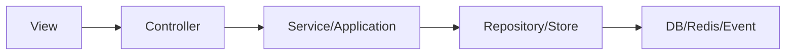

# 전체 View ↔ Controller ↔ API 인덱스

지금 여기서는 홍달의 Server와 클라이언트 App을 한 장에서 본다. 화면에서 시작해도 되고, Controller에서 시작해도 된다.

## 1. 문서 입구
- 전체 구조: `Docs/ViewControllerMapping/README.md`
- 공통 템플릿: `Docs/ViewControllerMapping/01_공통_매핑템플릿.md`
- 기사 화면 인덱스: `Docs/ViewControllerMapping/DriverApp/README.md`
- 기사 화면 상세: `Docs/ViewControllerMapping/DriverApp/기사화면_상세매핑.md`
- 화주 화면 인덱스: `Docs/ViewControllerMapping/ShipperApp/README.md`
- 화주 화면 상세: `Docs/ViewControllerMapping/ShipperApp/화주화면_상세매핑.md`
- Server 역방향 매핑: `Docs/ViewControllerMapping/Server/README.md`

## 2. DriverApp 핵심 축
| View 축 | Controller 축 | 현재 상태 |
|---|---|---|
| 기사 홈 요약 | 기사홈Controller | API 연결 |
| 추천 목록/상세/배차 처리 | 기사배차추천Controller / 기사운송의뢰Controller / 기사배차액션Controller | 샘플데이터 |
| 운행 시작/설정 | 기사운행Controller / 기사근무Controller | 샘플데이터/후속연결 |
| 진행 중 운송/상차/하차 | 기사운송진행Controller | 샘플데이터 |
| 예약 | 기사예약Controller | 샘플데이터 |
| 정산 | 기사정산Controller | 샘플데이터 |
| 알림/푸시/기능설정 | 기사알림Controller / 기사Command기능설정Controller | 후속연결 |
| 탐색 캠페인 | 기사탐색캠페인Controller | 샘플데이터 |

## 3. ShipperApp 핵심 축
| View 축 | Controller 축 | 현재 상태 |
|---|---|---|
| 화주 홈 | 화주운송의뢰Controller / 인증Controller / View설정Controller | 혼합 |
| 단건 의뢰 등록 | 화주운송의뢰Controller | 혼합 |
| CSV 일괄등록 | 화주운송의뢰Controller | API 연결 |
| 공개 화물 | 화주운송의뢰Controller | 샘플데이터 |
| 탐색 문의함 | 화주탐색문의Controller | 샘플데이터 |
| 입고 대시보드/입고 현황 | WarehouseOperationsController | API 연결 |
| 재고 허브/재위탁 | WarehouseOperationsController | API 연결 |
| 판매채널/출품 | SalesChannelsController | API 연결 |
| 화면 설정 | View설정Controller | API 연결 |
| 결제 준비/승인 | 화주결제Controller | 후속연결 |

## 4. 현재 리팩토링 결론
- namespace 변경 없이도, 기존 View와 Controller만으로 화면-API 책임선을 충분히 다시 읽을 수 있게 됐다.
- DriverApp은 오프라인 샘플 화면이 많아서 `문서 선정리 → API 연결` 순서가 맞다.
- ShipperApp은 기능별 성숙도가 다르므로 `혼합 화면 분리`가 핵심이다.
- 다음 구현 단계는 문서에서 `후속연결`로 표시된 화면부터 API 연결을 하나씩 실제화하면 된다.

## 5. 다음 우선순위 제안
1. DriverApp 추천 목록/상세/배차 처리에 실제 API 연결 추가
2. DriverApp 진행 중 운송/상차/하차 Command 연결 추가
3. ShipperApp 단건 의뢰 등록과 결제 준비/승인 연결 추가
4. 알림함/알림설정에 실제 기사알림Controller 연결 추가

## 6. 전체 흐름 Mermaid

