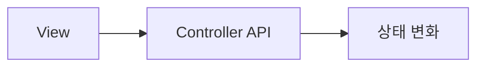
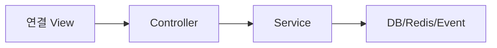

# 공통 View-Controller 매핑 템플릿

지금 여기서 너는 화면 문서와 Controller 문서를 서로 거울처럼 본다. 아래 템플릿을 그대로 반복해서 쓰면 된다.

## 1. View 문서 템플릿

```markdown
# [역할 화면] 화면명

## 1. View 목적
- 이 화면이 지금 사용자에게 제공하는 핵심 목적

## 2. 대응 Controller
- 주 대응 Controller: `...Controller`
- 보조 Controller: `...Controller` (없으면 생략)

## 3. 현재 연결 상태
- API 연결 | 샘플데이터 | 혼합 | 후속연결

## 4. 화면 진입 시 필요한 데이터
- 항목 1
- 항목 2

## 5. View 구성 요소
- 리스트
- 카드
- 버튼
- 상태 표시
- 입력 폼
- 필터/탭/토글
- 빈 상태/에러 상태

## 6. View 요소 ↔ API 함수 매핑
| View 요소 | 사용자 행동 | Controller 함수 | Method/Endpoint | 결과 상태 | 비고 |
|---|---|---|---|---|---|
| 추천 리스트 | 화면 진입 시 조회 | 조회 | GET /api/... | 목록 표시 | 샘플데이터면 명시 |

## 7. 상태 변화
- 상태 A → 상태 B → 상태 C

## 8. 예외/빈 상태
- 데이터 없음
- 권한 없음
- 상태 충돌

## 9. Mermaid 흐름

```

## 2. Controller 문서 템플릿

```markdown
# Controller명

## 1. Controller 목적
- 이 Controller가 지금 담당하는 역할

## 2. 연결 View
- `[역할 화면] 화면명`

## 3. API 함수 목록
| 함수 | Method/Endpoint | 연결 View | Request DTO | Response DTO | 상태 영향 | 비고 |
|---|---|---|---|---|---|---|
| 조회 | GET /api/... | 추천목록Page | 없음 | ...응답 | 조회만 | 샘플데이터 후속연결 |

## 4. 내부 연결
- Service 호출
- Domain/DB 영향
- Event 기록 여부

## 5. 화면 연결 상태
- API 연결 화면
- 샘플데이터 화면
- 후속 연결 예정 화면

## 6. Mermaid 흐름

```

## 3. 작성 규칙
- namespace 변경을 전제로 쓰지 않는다.
- 기존 파일명과 기존 route를 기준으로 쓴다.
- 아직 구현되지 않은 연결은 추정하지 말고 `후속연결`로 적는다.
- 화면 하나에 Controller가 여러 개면 주 대응 1개 + 보조 대응 N개로 적는다.
- 화면 내부 버튼과 액션은 가능한 한 API 함수 단위로 분해한다.
- DriverApp과 ShipperApp은 현재 오프라인 우선 원칙을 같이 적는다.
