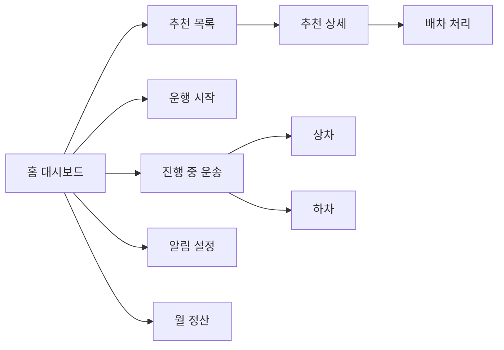

# DriverApp View-Controller 매핑

지금 여기서는 DriverApp의 기존 Page를 기준으로, 어떤 Server Controller가 주 대응인지 먼저 정리한다. 아직 샘플데이터로만 동작하는 화면은 그대로 표시하고, 나중에 API를 붙일 기준점을 남긴다.

## 1. 기사 화면 인덱스

| View | Route | 주 대응 Controller | 보조 Controller | 현재 연결 상태 | 비고 |
|---|---|---|---|---|---|
| 홈 대시보드 | `/driver/home` | 기사배차추천Controller | 기사운송의뢰Controller, 기사배차액션Controller | 샘플데이터 | 지도/리스트/배차신청 중심 |
| 기사 홈 요약 | `/driver/home/summary` | 기사홈Controller | 기사정산Controller, 기사운행Controller | API 연결 | 실제 `api/v1/driver/home` 호출 확인 |
| 운행 시작 | `/driver/work/start` | 기사운행Controller | 기사근무Controller | 샘플데이터 | 운행시작 Command 연결 예정 |
| 추천 목록 | `/driver/recommendations` | 기사배차추천Controller | 기사배차추천요약Controller | 샘플데이터 | 반경/정렬/표시모드 포함 |
| 추천 상세 | `/driver/recommendations/{의뢰Id}` | 기사운송의뢰Controller | 기사배차추천Controller | 샘플데이터 | 단건 의뢰 상세 조회 대응 |
| 배차 처리 | `/driver/recommendations/{의뢰Id}/decision` | 기사배차액션Controller | 기사운송의뢰Controller | 샘플데이터 | 수락/거절 처리 예정 |
| 탐색 캠페인 | `/driver/exploration/campaigns` | 기사탐색캠페인Controller | 없음 | 샘플데이터 | 목록/상세/추천대상 흐름 존재 |
| 예약 | `/driver/reservations` | 기사예약Controller | 없음 | 샘플데이터 | 예약 목록 중심 |
| 진행 중 운송 | `/driver/transports/current` | 기사운송진행Controller | 없음 | 샘플데이터 | 현재 운송, 다음 행동 |
| 상차 | `/driver/transports/{운송Id}/pickup` | 기사운송진행Controller | 없음 | 샘플데이터 | 상차지 도착/상차완료 |
| 하차 | `/driver/transports/{운송Id}/dropoff` | 기사운송진행Controller | 없음 | 샘플데이터 | 하차지 도착/인수완료 |
| 운행 설정 | `/driver/work/settings` | 기사운행Controller | 기사설정Controller | 후속연결 | 현재는 로컬 샘플 정보 표시 |
| 화면 설정 | `/driver/settings/views` | 전용 Driver Controller 없음 | 없음 | 샘플데이터 | 로컬 ViewVisibility/HomeDisplay/CardPreference 사용 |
| 알림 설정 | `/driver/notifications/settings` | 기사알림Controller | 기사Command기능설정Controller | 후속연결 | 수신설정/기능설정 연결 예정 |
| 푸시 설정 | `/driver/notifications/push` | 기사알림Controller | 없음 | 후속연결 | 푸시토큰 등록/삭제 대응 |
| 알림함 | `/driver/notifications` | 기사알림Controller | 없음 | 후속연결 | 알림 목록 API는 아직 직접 연결 안 됨 |
| 월 정산 | `/driver/settlements/current-month` | 기사정산Controller | 없음 | 샘플데이터 | 현재월 정산 대응 |
| 이용료 안내 | `/driver/settlements/info` | 기사정산Controller | 없음 | 후속연결 | 정책 안내 문구 위주 |
| 메뉴 | `/driver/menu` | 전용 Driver Controller 없음 | 없음 | 샘플데이터 | 내비게이션 허브 역할 |

## 2. 화면 흐름 요약

## 3. 현재 리팩토링 판단
- `기사홈Page.razor`만 실제 API 연결이 확인된다.
- 추천, 예약, 진행, 정산, 알림의 대부분은 샘플데이터 우선 구조다.
- 따라서 지금은 Page 이름과 Controller 책임을 먼저 문서로 고정하고, API 연결은 후속 단계로 나누는 것이 안전하다.

## 4. 상세 문서
- `기사화면_상세매핑.md`
