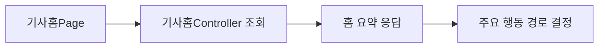
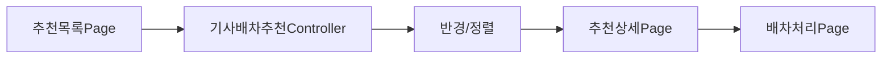

# 기사 화면 상세 매핑

## 1. [기사 화면] 기사 홈 요약

### 1. View 목적
- 기사 현재 상태, 오늘 할 일, 정산 요약을 한 번에 보여준다.

### 2. 대응 Controller
- 주 대응 Controller: `기사홈Controller`
- 보조 Controller: `기사운행Controller`, `기사정산Controller`

### 3. 현재 연결 상태
- API 연결

### 4. 화면 진입 시 필요한 데이터
- 홈 상태 문구
- 주요 행동 코드
- 오늘 할 일 목록
- 이번 달 정산 요약

### 5. View 구성 요소
- 상태 요약 카드
- 주요 행동 버튼
- 오늘 할 일 카드 목록
- 정산 요약 패널
- 에러/로딩 상태

### 6. View 요소 ↔ API 함수 매핑
| View 요소 | 사용자 행동 | Controller 함수 | Method/Endpoint | 결과 상태 | 비고 |
|---|---|---|---|---|---|
| 홈 진입 | 화면 진입 시 조회 | 조회 | `GET /api/v1/driver/home` | 홈 요약 표시 | `기사홈Page.razor`에서 실제 호출 |
| 주요 행동 버튼 | 다음 화면 이동 판단 | 조회 | `GET /api/v1/driver/home` | 행동 코드에 따라 이동 | 서버 응답의 `주요행동코드` 사용 |
| 오늘 할 일 카드 | 이동 버튼 클릭 | 조회 | `GET /api/v1/driver/home` | 링크 이동 | 데이터는 응답에 포함 |
| 정산 요약 | 월 요약 표시 | 조회 | `GET /api/v1/driver/home` | 정산 문구 표시 | 보조 정산 API 직접 호출은 아직 없음 |

### 7. 상태 변화
- 홈 조회 전 → 로딩 → 정상 표시 또는 에러 표시

### 8. 예외/빈 상태
- 기사 정보 없음
- 인증 정보 없음
- 응답 null

### 9. Mermaid 흐름

## 2. [기사 화면] 추천 목록

### 1. View 목적
- 기사 현재 위치 기준으로 추천 의뢰 목록을 빠르게 훑고 상세/처리 화면으로 이동한다.

### 2. 대응 Controller
- 주 대응 Controller: `기사배차추천Controller`
- 보조 Controller: `기사배차추천요약Controller`

### 3. 현재 연결 상태
- 샘플데이터

### 4. 화면 진입 시 필요한 데이터
- 추천 의뢰 목록
- 기사 현재 위치
- 반경 필터 값
- 정렬 기준
- 카드 표시 모드

### 5. View 구성 요소
- 현재 위치 헤더
- 반경 필터 버튼
- 정렬 버튼
- 보기 방식 버튼
- 추천 카드 리스트
- 상세/수락거절 이동 버튼
- 빈 상태 메시지

### 6. View 요소 ↔ API 함수 매핑
| View 요소 | 사용자 행동 | Controller 함수 | Method/Endpoint | 결과 상태 | 비고 |
|---|---|---|---|---|---|
| 화면 진입 목록 | 추천 의뢰 조회 | 조회 | `GET /api/v1/driver/recommendations` | 추천 목록 표시 | 현재는 샘플데이터 사용 |
| 반경 필터 | 반경별 재조회 | 검색 | `GET /api/v1/driver/recommendations/search` | 반경 내 목록만 표시 | 현재는 로컬 필터 |
| 운행 상태별 분리 | 비운행/운행중 추천 조회 | 비운행중조회 / 운행중조회 | `GET /api/v1/driver/recommendations/idle`, `GET /api/v1/driver/recommendations/driving` | 상황별 목록 | 후속 API 연결 |
| 요약 칩 | 추천 수 요약 조회 | 요약 | `GET /api/v1/driver/recommendations/summary` | 전체/적합/전국콜 요약 | 화면에는 아직 직접 미연결 |
| 상세 버튼 | 상세 화면 이동 | 상세조회 | `GET /api/v1/driver/requests/{requestId}` | 상세 진입 | 상세 화면에서 사용 예정 |

### 7. 상태 변화
- 추천 조회 → 필터/정렬 적용 → 상세 이동 → 배차 처리 이동

### 8. 예외/빈 상태
- 반경 내 추천 없음
- 기사 인증 없음
- 추천 엔진 결과 없음

### 9. Mermaid 흐름

## 3. [기사 화면] 추천 상세

### 1. View 목적
- 추천 사유, 경로, 수익, 조건을 보고 수락/거절 판단 근거를 제공한다.

### 2. 대응 Controller
- 주 대응 Controller: `기사운송의뢰Controller`
- 보조 Controller: `기사배차추천Controller`

### 3. 현재 연결 상태
- 샘플데이터

### 4. 화면 진입 시 필요한 데이터
- 운송의뢰 단건 상세
- 추천 사유
- 배차 상태

### 5. View 요소 ↔ API 함수 매핑
| View 요소 | 사용자 행동 | Controller 함수 | Method/Endpoint | 결과 상태 | 비고 |
|---|---|---|---|---|---|
| 화면 진입 | 단건 상세 조회 | 상세조회 | `GET /api/v1/driver/requests/{requestId}` | 상세 정보 표시 | 현재는 `Samples.추천의뢰조회` 사용 |
| 조건 칩 | 조건 표시 | 상세조회 | `GET /api/v1/driver/requests/{requestId}` | 조건/거리/수익 표시 | 응답 포함 가정 |
| 배차 처리 이동 버튼 | 수락/거절 화면 이동 | 상세조회 | `GET /api/v1/driver/requests/{requestId}` | 판단 후 다음 화면 이동 | 상세 재조회 후 처리 가능 |

### 6. 상태 변화
- 목록 선택 → 상세 조회 → 배차 처리 이동

### 7. 예외/빈 상태
- 의뢰 없음
- 이미 종료된 의뢰
- 조회는 되지만 배차 가능 상태 아님

## 4. [기사 화면] 배차 처리

### 1. View 목적
- 추천 의뢰를 수락하거나 거절한다.

### 2. 대응 Controller
- 주 대응 Controller: `기사배차액션Controller`
- 보조 Controller: `기사운송의뢰Controller`

### 3. 현재 연결 상태
- 샘플데이터

### 4. View 요소 ↔ API 함수 매핑
| View 요소 | 사용자 행동 | Controller 함수 | Method/Endpoint | 결과 상태 | 비고 |
|---|---|---|---|---|---|
| 배차 수락 버튼 | 추천 의뢰 수락 | 수락 | `POST /api/v1/driver/dispatch-actions/{requestId}/accept` | 배차 확정 또는 성공 응답 | 현재는 로컬 메시지만 변경 |
| 배차 거절 버튼 | 추천 의뢰 거절 | 거절 | `POST /api/v1/driver/dispatch-actions/{requestId}/reject` | 추천 제외 또는 NoContent | 현재는 로컬 메시지만 변경 |
| 처리 전 정보 표시 | 처리 대상 확인 | 상세조회 | `GET /api/v1/driver/requests/{requestId}` | 처리 대상 검증 | 현재 샘플데이터 |

### 5. 상태 변화
- 처리 전 → 수락 또는 거절 → 추천 상태 변경

### 6. 예외/빈 상태
- 이미 다른 기사가 수락함
- 처리 대상 없음
- 운행 가능 상태 아님

## 5. [기사 화면] 운행 시작

### 1. View 목적
- 운행 시작 입력값과 시작 흐름을 확인한다.

### 2. 대응 Controller
- 주 대응 Controller: `기사운행Controller`
- 보조 Controller: `기사근무Controller`

### 3. 현재 연결 상태
- 샘플데이터

### 4. View 요소 ↔ API 함수 매핑
| View 요소 | 사용자 행동 | Controller 함수 | Method/Endpoint | 결과 상태 | 비고 |
|---|---|---|---|---|---|
| 시작 정보 표시 | 현재 운행 기본값 조회 | 상태조회 | `GET /api/v1/driver/work/status` | 시작 전 상태 표시 | 후속연결 |
| 샘플 운행 시작 버튼 | 운행 시작 | 시작 | `POST /api/v1/driver/work/start` | 운행 시작됨 | 현재 로컬 메시지만 갱신 |
| 현재 근무 확인 | 현재 근무 조회 | 현재근무조회 | `GET /api/v1/driver/work/current` | 현재 근무 정보 | 후속연결 |

### 5. 상태 변화
- 운행 전 → 운행 시작 요청 → 운행중

### 6. 예외/빈 상태
- 이미 운행중
- 위치 정보 누락
- 기사 인증 없음

## 6. [기사 화면] 예약

### 1. View 목적
- 예약된 운행 시작 일정을 확인하고 이후 운행 시작으로 이어진다.

### 2. 대응 Controller
- 주 대응 Controller: `기사예약Controller`

### 3. 현재 연결 상태
- 샘플데이터

### 4. View 요소 ↔ API 함수 매핑
| View 요소 | 사용자 행동 | Controller 함수 | Method/Endpoint | 결과 상태 | 비고 |
|---|---|---|---|---|---|
| 예약 목록 | 예약 조회 | 예약목록 | `GET /api/v1/driver/reservations` | 목록 표시 | 현재 샘플 목록 |
| 예약 카드 | 단건 확인 | 상세조회 | `GET /api/v1/driver/reservations/{id}` | 단건 확인 | 후속연결 |
| 예약 생성 흐름 | 예약 등록 | 예약 | `POST /api/v1/driver/reservations` | 예약 생성 | 화면은 아직 등록 UI 없음 |
| 예약 취소 흐름 | 예약 취소 | 취소 | `POST /api/v1/driver/reservations/{id}/cancel` | 예약 상태 변경 | 화면은 아직 취소 UI 없음 |

## 7. [기사 화면] 진행 중 운송 / 상차 / 하차

### 1. View 목적
- 현재 운송과 다음 수행 액션을 단계별로 보여준다.

### 2. 대응 Controller
- 주 대응 Controller: `기사운송진행Controller`

### 3. 현재 연결 상태
- 샘플데이터

### 4. View 요소 ↔ API 함수 매핑
| View 요소 | 사용자 행동 | Controller 함수 | Method/Endpoint | 결과 상태 | 비고 |
|---|---|---|---|---|---|
| 현재 운송 화면 진입 | 현재 운송 조회 | 현재조회 | `GET /api/v1/driver/transports/current` | 현재 운송 표시 | 현재 샘플데이터 |
| 상차 화면 진입 | 운송 상세 조회 | 상세조회 | `GET /api/v1/driver/transports/{id}` | 상차 대상 표시 | 후속연결 |
| 상차지 도착 | 상차 단계 진행 | 상차지도착 | `POST /api/v1/driver/transports/{id}/arrive-pickup` | 상차지 도착 상태 | 후속연결 |
| 상차 완료 | 적재 완료 처리 | 상차완료 | `POST /api/v1/driver/transports/{id}/pickup-complete` | 운송 진행 단계 전환 | 후속연결 |
| 하차지 도착 | 하차 단계 진행 | 하차지도착 | `POST /api/v1/driver/transports/{id}/arrive-dropoff` | 하차지 도착 상태 | 후속연결 |
| 인수 완료 | 운송 완료 처리 | 완료 | `POST /api/v1/driver/transports/{id}/complete` | 완료 상태 | 후속연결 |
| 문제 신고 | 이슈 등록 | 문제신고 | `POST /api/v1/driver/transports/{id}/report-issue` | 이슈 기록 | 화면 UI는 아직 없음 |

### 5. 상태 변화
- 배차 확정 → 진행 중 운송 → 상차지 도착 → 상차 완료 → 하차지 도착 → 인수 완료

## 8. [기사 화면] 알림 설정 / 푸시 설정 / 알림함

### 1. View 목적
- 기사에게 도착하는 알림, 푸시 토큰, 수신 옵션을 관리한다.

### 2. 대응 Controller
- 주 대응 Controller: `기사알림Controller`
- 보조 Controller: `기사Command기능설정Controller`

### 3. 현재 연결 상태
- 후속연결

### 4. View 요소 ↔ API 함수 매핑
| View 요소 | 사용자 행동 | Controller 함수 | Method/Endpoint | 결과 상태 | 비고 |
|---|---|---|---|---|---|
| 알림 설정 진입 | 설정 조회 | 설정조회 | `GET /api/v1/driver/notifications/settings` | 수신설정 표시 | 현재 샘플 요약만 표시 |
| 알림 설정 저장 | 설정 수정 | 설정수정 | `PUT /api/v1/driver/notifications/settings` | 설정 저장 | 후속연결 |
| 푸시 상태 확인 | 토큰 조회 | 조회 | `GET /api/v1/driver/notifications/push-token` | 토큰 존재 여부 표시 | 후속연결 |
| 토큰 등록 | 푸시 토큰 저장 | 등록 | `PUT /api/v1/driver/notifications/push-token` | 토큰 등록됨 | 후속연결 |
| 토큰 삭제 | 푸시 토큰 제거 | 삭제 | `DELETE /api/v1/driver/notifications/push-token` | 토큰 제거 | 후속연결 |
| 커맨드별 부가기능 설정 | 기능 목록 조회/수정 | 목록조회 / 수정 / 기본값으로복원 | `GET/PUT/DELETE /api/v1/driver/command-feature-settings/...` | 사용자별 기능 오버라이드 | 화면은 아직 직접 연결 안 됨 |

### 5. 상태 변화
- 설정 조회 → 수정 → 푸시토큰 등록/삭제 → 알림 수신 정책 반영

## 9. [기사 화면] 월 정산 / 이용료 안내

### 1. View 목적
- 기사 월 정산과 이용료 정책을 확인한다.

### 2. 대응 Controller
- 주 대응 Controller: `기사정산Controller`

### 3. 현재 연결 상태
- 샘플데이터

### 4. View 요소 ↔ API 함수 매핑
| View 요소 | 사용자 행동 | Controller 함수 | Method/Endpoint | 결과 상태 | 비고 |
|---|---|---|---|---|---|
| 월 정산 화면 진입 | 현재월 조회 | 현재월조회 | `GET /api/v1/driver/settlements/current-month` | 현재월 정산 표시 | 현재 샘플데이터 |
| 월별 정산 상세 | 특정 월 조회 | 월별조회 | `GET /api/v1/driver/settlements/{year}/{month}` | 월별 상세 | 후속연결 |
| 정산 이력 | 정산 목록 조회 | 목록조회 | `GET /api/v1/driver/settlements` | 목록 표시 | 후속연결 |
| 이용료 안내 | 정책 문구 표시 | 현재월조회 | `GET /api/v1/driver/settlements/current-month` | 샘플 금액/상한 표시 | 정책 안내는 화면 상수 성격 포함 |

## 10. [기사 화면] 탐색 캠페인

### 1. View 목적
- 기사가 먼저 보낸 탐색 문의 캠페인과 응답 흐름을 본다.

### 2. 대응 Controller
- 주 대응 Controller: `기사탐색캠페인Controller`

### 3. 현재 연결 상태
- 샘플데이터

### 4. View 요소 ↔ API 함수 매핑
| View 요소 | 사용자 행동 | Controller 함수 | Method/Endpoint | 결과 상태 | 비고 |
|---|---|---|---|---|---|
| 캠페인 목록 | 목록 조회 | 목록 | `GET /api/v1/driver/exploration-campaigns` | 캠페인 목록 표시 | 현재 샘플서비스 사용 |
| 상세 패널 | 단건 상세 조회 | 상세 | `GET /api/v1/driver/exploration-campaigns/{id}` | 상세 정보 표시 | 샘플 상세 사용 |
| 추가 추천 대상 | 추천 대상 조회 | 추천대상 | `GET /api/v1/driver/exploration-campaigns/{id}/recommendations` | 추천 대상 목록 | 샘플 추천 사용 |
| 캠페인 생성 | 신규 캠페인 생성 | 생성 | `POST /api/v1/driver/exploration-campaigns` | 캠페인 생성 | 화면 UI는 아직 없음 |
| 발송 | 대상 발송 | 발송 | `POST /api/v1/driver/exploration-campaigns/{id}/send` | 발송 결과 반영 | 화면 UI는 아직 없음 |

## 11. 현재 기사 앱 문서화 결론
- 기사 앱은 `기사홈Page`만 실제 API 연결이 분명하다.
- 추천, 진행, 예약, 알림, 정산은 이미 대응 Controller가 있으므로 View 기준 문서를 먼저 맞춰 두면 후속 연결이 쉬워진다.
- `화면 설정`, `메뉴`는 현재 서버 전용 Driver Controller 없이 로컬 UI 정책을 관리하므로 별도 표시가 필요하다.
