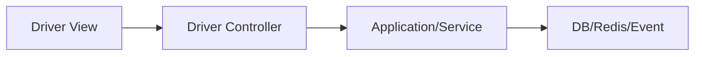
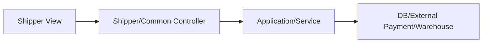

# Server Controller 역방향 매핑

지금 여기서는 Controller에서 출발해서 어떤 View가 연결되는지 본다. 기존 namespace는 그대로 두고, 실제 route와 현재 클라이언트 화면 기준으로만 정리한다.

## 1. Driver Controller ↔ View

| Controller | Route Prefix | 연결 View | 현재 연결 상태 | 비고 |
|---|---|---|---|---|
| 기사홈Controller | `/api/v1/driver/home` | `기사홈Page.razor` | API 연결 | 기사 홈 요약 단건 조회 |
| 기사운행Controller | `/api/v1/driver/work` | `운행시작Page.razor`, `운행설정Page.razor` | 후속연결/샘플데이터 | 상태/현재근무/시작/종료 |
| 기사근무Controller | `/api/v1/driver/shifts` | `운행시작Page.razor` | 후속연결 | 근무 목록/상세 |
| 기사배차추천Controller | `/api/v1/driver/recommendations` | `Home.razor`, `추천목록Page.razor` | 샘플데이터 | 목록/idle/driving/search/national |
| 기사배차추천요약Controller | `/api/v1/driver/recommendations` | `추천목록Page.razor` | 후속연결 | summary 전용 |
| 기사운송의뢰Controller | `/api/v1/driver/requests` | `추천상세Page.razor`, `배차처리Page.razor` | 샘플데이터 | 의뢰 단건 상세 |
| 기사배차액션Controller | `/api/v1/driver/dispatch-actions` | `Home.razor`, `배차처리Page.razor` | 샘플데이터 | 수락/거절 |
| 기사예약Controller | `/api/v1/driver/reservations` | `예약Page.razor` | 샘플데이터 | 목록/생성/취소/상세 |
| 기사운송진행Controller | `/api/v1/driver/transports` | `진행중운송Page.razor`, `상차Page.razor`, `하차Page.razor` | 샘플데이터 | 운송 단계 전이 |
| 기사정산Controller | `/api/v1/driver/settlements` | `월정산Page.razor`, `이용료안내Page.razor`, `기사홈Page.razor` | 샘플데이터/보조연결 | 정산 목록/월별/현재월 |
| 기사알림Controller | `/api/v1/driver/notifications` | `알림설정Page.razor`, `푸시설정Page.razor`, `알림함Page.razor` | 후속연결 | 푸시토큰/설정 |
| 기사Command기능설정Controller | `/api/v1/driver/command-feature-settings` | `알림설정Page.razor` | 후속연결 | 사용자별 기능 오버라이드 |
| 기사설정Controller | `/api/v1/driver/preferences` | `운행설정Page.razor` | 후속연결 | 콜 범위 설정 |
| 기사탐색캠페인Controller | `/api/v1/driver/exploration-campaigns` | `탐색캠페인Page.razor` | 샘플데이터 | 목록/생성/상세/추천/발송 |

## 2. Shipper/Common Controller ↔ View

| Controller | Route Prefix | 연결 View | 현재 연결 상태 | 비고 |
|---|---|---|---|---|
| 인증Controller | `/api/v1/auth` | `ShipperApp/Home.razor` | 혼합 | 현재 로그인은 오프라인 세션 기반 |
| 화주운송의뢰Controller | `/api/v1/shipper/requests` | `ShipperRequestWizard.razor`, `ShipperBulkImport.razor`, `PublicCargo.razor`, `Home.razor` | 혼합 | 단건/공개화물/일괄등록 |
| 화주결제Controller | `/api/v1/payments` | `ShipperRequestWizard.razor`, `Home.razor` | 후속연결 | Toss 준비/승인 |
| 화주탐색문의Controller | `/api/v1/shipper/exploration-inbox` | `ExplorationInbox.razor` | 샘플데이터 | 목록/상세/응답 |
| WarehouseOperationsController | `/api/v1/warehouse-operations` | `InboundDashboard.razor`, `InboundRequests.razor`, `WarehouseInventory.razor`, `ReconsignmentOrders.razor` | API 연결 | 창고/입고/재고/재위탁 |
| SalesChannelsController | `/api/v1/sales-channels` | `SalesChannels.razor`, `ProductListings.razor`, `WarehouseInventory.razor` | API 연결 | 계정/상품/출품 |
| View설정Controller | `/api/v1/view-settings` | `ShipperViewSettings.razor`, `ShipperApp/Home.razor` | API 연결/보조연결 | 화면 가시성 조회/저장 |

## 3. Driver 영역 Mermaid

## 4. Shipper 영역 Mermaid

