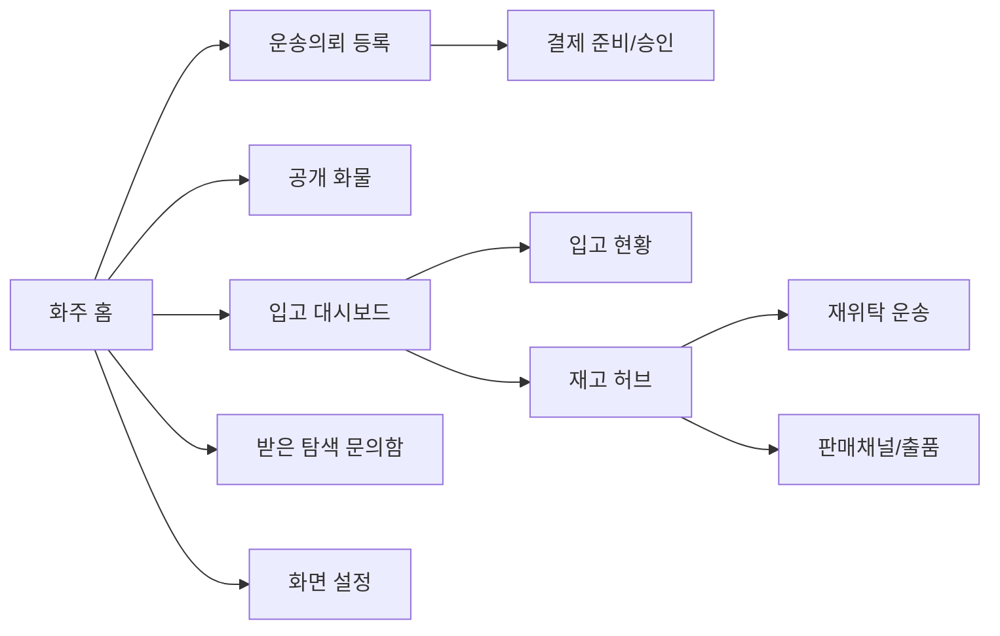

# ShipperApp View-Controller 매핑

지금 여기서는 ShipperApp의 기존 Page를 기준으로, 어떤 Server Controller가 화면을 받는지 먼저 정리한다. 화주 앱은 메모리 기반 흐름과 실제 API 호출 흐름이 섞여 있으므로 연결 상태를 분리해서 본다.

## 1. 화주 화면 인덱스

| View | Route | 주 대응 Controller | 보조 Controller | 현재 연결 상태 | 비고 |
|---|---|---|---|---|---|
| 화주 홈 | `/`, `/shipper` | 화주운송의뢰Controller | 인증Controller, View설정Controller | 혼합 | 로그인은 오프라인 세션, 의뢰 목록은 메모리 스토어 |
| 화물운송의뢰 등록 | `/shipper/request` | 화주운송의뢰Controller | 화주결제Controller | 혼합 | 단건 등록은 메모리, CSV 탭은 서버 연동 |
| CSV 일괄등록 | `/shipper/request/bulk` | 화주운송의뢰Controller | 없음 | API 연결 | `bulk/preview`, `bulk/confirm-preview` 중심 |
| 공개 화물 | `/shipper/public-cargo` | 화주운송의뢰Controller | 없음 | 샘플데이터 | 공개 화물 API 존재, 화면은 메모리 목록 사용 |
| 받은 탐색 문의함 | `/shipper/exploration/inbox` | 화주탐색문의Controller | 없음 | 샘플데이터 | 목록/상세/응답 API 대응 |
| 입고 대시보드 | `/shipper/inbound/dashboard` | WarehouseOperationsController | 없음 | API 연결 | 창고/입고/재고 요약 조회 |
| 입고 현황 | `/shipper/inbound/requests` | WarehouseOperationsController | 없음 | API 연결 | 창고 등록, 입고 등록, 입고완료 |
| 재고 허브 | `/shipper/warehouse/inventory` | WarehouseOperationsController | SalesChannelsController | API 연결 | 재고 조회 + 판매 등록 연계 |
| 재위탁 운송 | `/shipper/reconsignment/orders` | WarehouseOperationsController | 없음 | API 연결 | 재고 기준 재위탁 의뢰 생성 |
| 판매채널 연결 | `/shipper/sales/channels` | SalesChannelsController | 없음 | API 연결 | 계정 조회/등록 |
| 출품 관리 | `/shipper/sales/listings` | SalesChannelsController | 없음 | API 연결 | 상품/출품 조회 및 추가 출품 |
| 화면 설정 | `/shipper/settings/views` | View설정Controller | 없음 | API 연결 | 사용자별 화면 가시성 |

## 2. 화주 흐름 요약

## 3. 현재 리팩토링 판단
- 운송의뢰 단건 등록은 아직 메모리 기반이다.
- CSV 일괄등록, 입고/재고/판매채널, 화면 설정은 이미 서버 API 중심으로 연결되어 있다.
- 따라서 화주 앱은 기능별로 연결 상태가 크게 다르므로, 같은 화면 안에서도 `혼합` 표기가 중요하다.

## 4. 상세 문서
- `화주화면_상세매핑.md`
