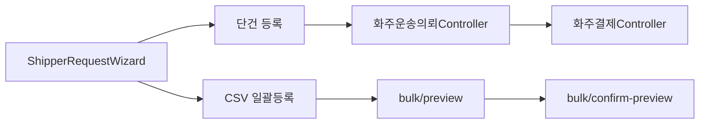

# 화주 화면 상세 매핑

## 1. [화주 화면] 화주 홈

### 1. View 목적
- 로그인 상태, 최근 의뢰 상태, 다음 행동을 한 화면에서 보여준다.

### 2. 대응 Controller
- 주 대응 Controller: `화주운송의뢰Controller`
- 보조 Controller: `인증Controller`, `View설정Controller`

### 3. 현재 연결 상태
- 혼합

### 4. 화면 진입 시 필요한 데이터
- 로그인 세션 상태
- 최신 의뢰 목록
- 화면 가시성 정책

### 5. View 요소 ↔ API 함수 매핑
| View 요소 | 사용자 행동 | Controller 함수 | Method/Endpoint | 결과 상태 | 비고 |
|---|---|---|---|---|---|
| 로그인 폼 | 로그인 시도 | 로그인 | `POST /api/v1/auth/login` | 세션 생성 | 현재 `AuthApiService`는 오프라인 세션 적용 |
| 의뢰 목록 | 최신 의뢰 확인 | 의뢰목록조회 | `GET /api/v1/shipper/requests` | 최근 의뢰 표시 | 현재 메모리 스토어 사용 |
| 결제하기 버튼 | 결제 흐름 진입 | 토스결제준비 | `POST /api/v1/payments/toss/prepare` | 결제 준비됨 | 홈 화면에서는 아직 메시지 수준 |
| 화면 정책 반영 | 화면 표시 여부 로드 | 조회 | `GET /api/v1/view-settings/effective` | 화면 가시성 반영 | 서비스 내부 연결 가능성 반영 |

### 6. 상태 변화
- 미로그인 → 로그인 → 의뢰 생성 또는 최근 의뢰 검토

### 7. 예외/빈 상태
- 로그인 실패
- 의뢰 없음
- 화면 정책 로드 실패

## 2. [화주 화면] 화물운송의뢰 등록

### 1. View 목적
- 단건 운송의뢰 등록과 CSV 일괄등록을 한 화면에서 처리한다.

### 2. 대응 Controller
- 주 대응 Controller: `화주운송의뢰Controller`
- 보조 Controller: `화주결제Controller`

### 3. 현재 연결 상태
- 혼합

### 4. 화면 진입 시 필요한 데이터
- 단건 의뢰 입력값
- 차량 종류 후보
- CSV 미리보기/등록 결과

### 5. View 구성 요소
- 단계형 단건 등록 폼
- 진행률 표시
- 요약 카드
- CSV 업로드 패널
- 미리보기 표
- 확정 등록 버튼

### 6. View 요소 ↔ API 함수 매핑
| View 요소 | 사용자 행동 | Controller 함수 | Method/Endpoint | 결과 상태 | 비고 |
|---|---|---|---|---|---|
| 단건 등록 1~4단계 | 의뢰 입력 후 전송 | 의뢰생성 | `POST /api/v1/shipper/requests` | 의뢰 생성 | 현재는 메모리 스토어 저장 |
| 차량 추천 | 차량 추천 요청 | 차량추천 | `POST /api/v1/shipper/requests/recommend-vehicle` | 추천 차량 표시 | 화면에는 아직 직접 연결 안 됨 |
| CSV 미리보기 | 파일 검증/추천 조회 | 일괄미리보기 | `POST /api/v1/shipper/requests/bulk/preview` | 행별 미리보기 | 실제 API 연결 |
| CSV 검토결과 등록 | 유효 행 확정 등록 | 일괄미리보기확정등록 | `POST /api/v1/shipper/requests/bulk/confirm-preview` | 등록 결과 표시 | 실제 API 연결 |
| 향후 결제 흐름 | 결제 준비/승인 | 토스결제준비 / 토스결제승인 | `POST /api/v1/payments/toss/prepare`, `POST /api/v1/payments/toss/confirm` | 결제 상태 반영 | 현재 단건 화면에는 미연결 |

### 7. 상태 변화
- 입력 시작 → 의뢰 생성 → 결제대기 → 결제승인 → 배차대기 생성

### 8. 예외/빈 상태
- 필수값 누락
- CSV 검증 오류
- 결제 승인 실패

### 9. Mermaid 흐름

## 3. [화주 화면] 공개 화물

### 1. View 목적
- 회원가입 없이도 공개 화물 목록을 보여준다.

### 2. 대응 Controller
- 주 대응 Controller: `화주운송의뢰Controller`

### 3. 현재 연결 상태
- 샘플데이터

### 4. View 요소 ↔ API 함수 매핑
| View 요소 | 사용자 행동 | Controller 함수 | Method/Endpoint | 결과 상태 | 비고 |
|---|---|---|---|---|---|
| 공개 화물 목록 | 공개 목록 조회 | 공개화물요약조회 | `GET /api/v1/shipper/requests/public` | 공개 화물 목록 표시 | 현재 `InMemoryShipperStore` 사용 |
| 새로고침 버튼 | 목록 다시 조회 | 공개화물요약조회 | `GET /api/v1/shipper/requests/public` | 목록 갱신 | 후속연결 |

## 4. [화주 화면] 받은 탐색 문의함

### 1. View 목적
- 기사님이 먼저 보낸 탐색 문의를 보고 화주가 응답한다.

### 2. 대응 Controller
- 주 대응 Controller: `화주탐색문의Controller`

### 3. 현재 연결 상태
- 샘플데이터

### 4. View 요소 ↔ API 함수 매핑
| View 요소 | 사용자 행동 | Controller 함수 | Method/Endpoint | 결과 상태 | 비고 |
|---|---|---|---|---|---|
| 문의 목록 | 전체 문의 조회 | 목록 | `GET /api/v1/shipper/exploration-inbox` | 목록 표시 | 현재 샘플 목록 사용 |
| 상세 패널 | 단건 문의 조회 | 상세 | `GET /api/v1/shipper/exploration-inbox/{campaignId}` | 상세 표시 | 현재 샘플 상세 사용 |
| 가능/미정/불가 응답 | 문의 응답 | 응답 | `POST /api/v1/shipper/exploration-inbox/{campaignId}/reply` | 대상 상태 변경 | 현재 화면 로컬 상태만 반영 |

### 5. 상태 변화
- 문의 수신 → 상세 확인 → 가능/미정/불가 응답

## 5. [화주 화면] 입고 대시보드 / 입고 현황

### 1. View 목적
- 창고 등록, 입고 요청, 입고완료를 통해 재고로 전환하는 흐름을 시작한다.

### 2. 대응 Controller
- 주 대응 Controller: `WarehouseOperationsController`

### 3. 현재 연결 상태
- API 연결

### 4. View 요소 ↔ API 함수 매핑
| View 요소 | 사용자 행동 | Controller 함수 | Method/Endpoint | 결과 상태 | 비고 |
|---|---|---|---|---|---|
| 대시보드 요약 카드 | 창고/입고/재고 요약 로드 | 창고목록 / 입고목록 / 재고목록 | `GET /api/v1/warehouse-operations/warehouses`, `GET /api/v1/warehouse-operations/inbounds`, `GET /api/v1/warehouse-operations/inventory` | 대시보드 수치 표시 | 실제 API 연결 |
| 창고 등록 폼 | 창고 생성 | 창고생성 | `POST /api/v1/warehouse-operations/warehouses` | 창고 추가 | 실제 API 연결 |
| 입고 요청 등록 폼 | 입고 생성 | 입고생성 | `POST /api/v1/warehouse-operations/inbounds` | 입고 요청 추가 | 실제 API 연결 |
| 입고완료 처리 | 입고 상품 재고 전환 | 입고완료 | `POST /api/v1/warehouse-operations/inbounds/{inboundId}/complete` | 재고 생성 | 실제 API 연결 |

### 5. 상태 변화
- 창고 없음 → 창고 등록 → 입고 요청 → 입고완료 → 재고 생성

## 6. [화주 화면] 재고 허브 / 재위탁 운송

### 1. View 목적
- 입고된 재고를 재위탁 운송 또는 판매 등록으로 연결한다.

### 2. 대응 Controller
- 주 대응 Controller: `WarehouseOperationsController`
- 보조 Controller: `SalesChannelsController`

### 3. 현재 연결 상태
- API 연결

### 4. View 요소 ↔ API 함수 매핑
| View 요소 | 사용자 행동 | Controller 함수 | Method/Endpoint | 결과 상태 | 비고 |
|---|---|---|---|---|---|
| 재고 목록 | 재고 조회 | 재고목록 | `GET /api/v1/warehouse-operations/inventory` | 재고 목록 표시 | 실제 API 연결 |
| 재위탁 버튼 | 재위탁 화면 이동 | 재고목록 | `GET /api/v1/warehouse-operations/inventory` | 대상 재고 선택 | 화면 간 파라미터 전달 |
| 재위탁 운송 생성 | 재고 기준 운송의뢰 생성 | 재위탁운송생성 | `POST /api/v1/warehouse-operations/inventory/reconsignment` | 신규 운송의뢰 생성 | 실제 API 연결 |
| 판매 등록 | 판매상품 생성 | 상품생성 | `POST /api/v1/sales-channels/products` | 판매상품 생성 | 실제 API 연결 |
| 판매 후 채널출품 | 출품 생성 | 출품생성 | `POST /api/v1/sales-channels/listings` | 채널출품 생성 | 실제 API 연결 |

### 5. 상태 변화
- 입고 재고 생성 → 재고 선택 → 재위탁 또는 판매 등록 → 채널출품

## 7. [화주 화면] 판매채널 연결 / 출품 관리

### 1. View 목적
- 판매채널 계정, 판매상품, 채널출품을 관리한다.

### 2. 대응 Controller
- 주 대응 Controller: `SalesChannelsController`

### 3. 현재 연결 상태
- API 연결

### 4. View 요소 ↔ API 함수 매핑
| View 요소 | 사용자 행동 | Controller 함수 | Method/Endpoint | 결과 상태 | 비고 |
|---|---|---|---|---|---|
| 채널 계정 목록 | 계정 조회 | 계정목록 | `GET /api/v1/sales-channels/accounts` | 계정 목록 표시 | 실제 API 연결 |
| 채널 계정 등록 | 계정 생성 | 계정생성 | `POST /api/v1/sales-channels/accounts` | 계정 생성 | 실제 API 연결 |
| 판매상품 목록 | 상품 조회 | 상품목록 | `GET /api/v1/sales-channels/products` | 상품 목록 표시 | 실제 API 연결 |
| 채널출품 목록 | 출품 조회 | 출품목록 | `GET /api/v1/sales-channels/listings` | 출품 목록 표시 | 실제 API 연결 |
| 추가 출품 생성 | 출품 생성 | 출품생성 | `POST /api/v1/sales-channels/listings` | 출품 추가 | 실제 API 연결 |

## 8. [화주 화면] 화면 설정

### 1. View 목적
- 사용자별로 화면 노출 여부를 조정한다.

### 2. 대응 Controller
- 주 대응 Controller: `View설정Controller`

### 3. 현재 연결 상태
- API 연결

### 4. View 요소 ↔ API 함수 매핑
| View 요소 | 사용자 행동 | Controller 함수 | Method/Endpoint | 결과 상태 | 비고 |
|---|---|---|---|---|---|
| 화면 목록 로드 | 유효 화면 조회 | 조회 | `GET /api/v1/view-settings/effective?appKey=...` | 표시 가능 화면 목록 표시 | 실제 API 연결 |
| 토글 스위치 | 사용자 가시성 저장 | 저장 | `PUT /api/v1/view-settings/user` | 사용자별 표시 여부 저장 | 실제 API 연결 |

## 9. 현재 화주 앱 문서화 결론
- 화주 앱은 운송의뢰 단건 등록과 홈 로그인 흐름이 아직 오프라인 중심이다.
- 반대로 입고/재고/판매채널/화면설정은 이미 서버 API 중심으로 연결되어 있다.
- 따라서 리팩토링 우선순위는 `혼합 화면의 경계 명확화`와 `단건 의뢰/결제 흐름의 실제 API 연결`이다.
